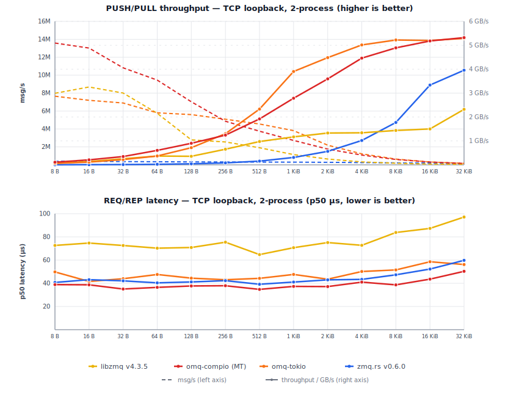

# Benchmarks

Linux 6.12 (Debian 13) VM on an Intel Mac Mini 2018 (i7-8700B, 3.2 GHz
base, turbo disabled, governor=performance, 6 vCPU), Rust 1.95.0,
default features.

Each cell is the **min wall time** across multiple runs with warmup.
Sources: `omq-compio/benches/` and `omq-tokio/benches/`.

> **Compio bench topology.** `inproc`: single runtime, single thread
> (sender + receiver cooperatively scheduled). `inproc-mt`:
> multi-runtime inproc: PULL on its own thread/runtime, PUSHes on
> another. Wire transports (TCP/IPC): same multi-runtime shape as
> inproc-mt. omq-tokio uses a multi-thread runtime across all
> available cores throughout.

## PUSH/PULL throughput, single peer

Cells show `msgs/s / MB/s`.

**omq-compio:**

<!-- BEGIN push_pull_1peer_compio -->
| Size | inproc | inproc-mt | ipc | tcp |
|---|---|---|---|---|
| 8 B | 3.98M / 31.8 MB/s | 14.85M / 119 MB/s | 15.02M / 120 MB/s | 15.73M / 126 MB/s |
| 32 B | 3.80M / 122 MB/s | 15.38M / 492 MB/s | 12.44M / 398 MB/s | 12.56M / 402 MB/s |
| 64 B | 3.93M / 252 MB/s | 12.04M / 770 MB/s | 10.63M / 680 MB/s | 10.32M / 661 MB/s |
| 128 B | 3.94M / 504 MB/s | 11.14M / 1.43 GB/s | 8.32M / 1.07 GB/s | 7.33M / 938 MB/s |
| 256 B | 3.87M / 991 MB/s | 11.98M / 3.07 GB/s | 6.24M / 1.60 GB/s | 5.75M / 1.47 GB/s |
| 512 B | 3.78M / 1.94 GB/s | 10.28M / 5.27 GB/s | 4.37M / 2.24 GB/s | 3.98M / 2.04 GB/s |
| 1 KiB | 3.74M / 3.83 GB/s | 10.83M / 11.1 GB/s | 3.16M / 3.23 GB/s | 2.87M / 2.94 GB/s |
| 2 KiB | 3.69M / 7.56 GB/s | 14.18M / 29.0 GB/s | 395k / 810 MB/s | 1.85M / 3.79 GB/s |
| 4 KiB | 3.74M / 15.3 GB/s | 15.12M / 61.9 GB/s | 1.40M / 5.72 GB/s | 1.14M / 4.65 GB/s |
| 8 KiB | 3.74M / 30.7 GB/s | 15.36M / 125.8 GB/s | 759k / 6.21 GB/s | 619k / 5.07 GB/s |
| 32 KiB | 3.74M / 122.6 GB/s | 14.89M / 487.9 GB/s | 193k / 6.32 GB/s | 189k / 6.21 GB/s |
| 128 KiB | 3.75M / 490.9 GB/s | 8.97M / 1175.4 GB/s | 57.0k / 7.47 GB/s | 58.1k / 7.61 GB/s |
| 512 KiB | — | — | — | 16.7k / 8.76 GB/s |

<!-- END push_pull_1peer_compio -->

**omq-tokio:**

<!-- BEGIN push_pull_1peer_tokio -->
| Size | inproc | ipc | tcp |
|---|---|---|---|
| 8 B | 3.52M / 28.2 MB/s | 6.29M / 50.3 MB/s | 6.49M / 51.9 MB/s |
| 32 B | 4.10M / 131 MB/s | 6.41M / 205 MB/s | 6.94M / 222 MB/s |
| 64 B | 3.71M / 237 MB/s | 5.83M / 373 MB/s | 5.28M / 338 MB/s |
| 128 B | 3.10M / 397 MB/s | 4.98M / 638 MB/s | 6.57M / 841 MB/s |
| 256 B | 3.41M / 874 MB/s | 4.39M / 1.12 GB/s | 5.42M / 1.39 GB/s |
| 512 B | 3.28M / 1.68 GB/s | 4.06M / 2.08 GB/s | 4.28M / 2.19 GB/s |
| 1 KiB | 3.45M / 3.54 GB/s | 3.35M / 3.43 GB/s | 2.86M / 2.93 GB/s |
| 2 KiB | 3.92M / 8.02 GB/s | 1.75M / 3.59 GB/s | 1.73M / 3.54 GB/s |
| 4 KiB | 4.01M / 16.4 GB/s | 961k / 3.94 GB/s | 1.16M / 4.74 GB/s |
| 8 KiB | 3.57M / 29.2 GB/s | 641k / 5.25 GB/s | 588k / 4.82 GB/s |
| 32 KiB | 4.04M / 132.4 GB/s | 127k / 4.15 GB/s | 156k / 5.13 GB/s |
| 128 KiB | 3.88M / 509.2 GB/s | 29.8k / 3.91 GB/s | 43.2k / 5.67 GB/s |

<!-- END push_pull_1peer_tokio -->

Inproc "GB/s" at large payloads reflects zero-copy Arc-clone: no kernel
traversal.

## PUSH/PULL throughput, 8 peers

8 PUSH peers -> 1 PULL. Cells show `msgs/s / MB/s`.

**omq-compio:**

<!-- BEGIN push_pull_8peer_compio -->
| Size | inproc | ipc | tcp |
|---|---|---|---|
| 8 B | 3.80M / 30.4 MB/s | 6.71M / 53.7 MB/s | 6.88M / 55.0 MB/s |
| 32 B | 3.79M / 121 MB/s | 6.57M / 210 MB/s | 7.11M / 228 MB/s |
| 64 B | 3.73M / 239 MB/s | 5.00M / 320 MB/s | 5.14M / 329 MB/s |
| 128 B | 3.72M / 477 MB/s | 4.78M / 612 MB/s | 4.85M / 620 MB/s |
| 256 B | 3.73M / 956 MB/s | 4.24M / 1.08 GB/s | 3.84M / 984 MB/s |
| 512 B | 3.72M / 1.91 GB/s | 3.49M / 1.78 GB/s | 3.51M / 1.80 GB/s |
| 1 KiB | 3.71M / 3.80 GB/s | 2.60M / 2.66 GB/s | 2.26M / 2.31 GB/s |
| 2 KiB | 3.71M / 7.60 GB/s | 1.53M / 3.13 GB/s | 1.34M / 2.75 GB/s |
| 4 KiB | 3.69M / 15.1 GB/s | 807k / 3.30 GB/s | 730k / 2.99 GB/s |
| 8 KiB | 3.73M / 30.6 GB/s | 421k / 3.45 GB/s | 389k / 3.18 GB/s |
| 32 KiB | 3.69M / 121.1 GB/s | 144k / 4.72 GB/s | 136k / 4.46 GB/s |
| 128 KiB | 3.66M / 480.4 GB/s | 31.6k / 4.15 GB/s | 33.2k / 4.35 GB/s |

<!-- END push_pull_8peer_compio -->

**omq-tokio:**

<!-- BEGIN push_pull_8peer_tokio -->
| Size | inproc | ipc | tcp |
|---|---|---|---|
| 8 B | 3.44M / 27.5 MB/s | 5.99M / 48.0 MB/s | 3.35M / 26.8 MB/s |
| 32 B | 3.51M / 112 MB/s | 6.60M / 211 MB/s | 6.82M / 218 MB/s |
| 64 B | 3.39M / 217 MB/s | 6.55M / 419 MB/s | 5.76M / 369 MB/s |
| 128 B | 3.33M / 426 MB/s | 5.84M / 747 MB/s | 7.33M / 938 MB/s |
| 256 B | 3.33M / 853 MB/s | 6.98M / 1.79 GB/s | 4.95M / 1.27 GB/s |
| 512 B | 3.34M / 1.71 GB/s | 4.73M / 2.42 GB/s | 6.66M / 3.41 GB/s |
| 1 KiB | 3.35M / 3.43 GB/s | 5.96M / 6.10 GB/s | 4.60M / 4.71 GB/s |
| 2 KiB | 3.30M / 6.77 GB/s | 3.38M / 6.93 GB/s | 2.59M / 5.30 GB/s |
| 4 KiB | 3.35M / 13.7 GB/s | 1.23M / 5.05 GB/s | 1.13M / 4.62 GB/s |
| 8 KiB | 3.28M / 26.9 GB/s | 624k / 5.11 GB/s | 680k / 5.57 GB/s |
| 32 KiB | 3.35M / 109.9 GB/s | 183k / 5.99 GB/s | 200k / 6.57 GB/s |
| 128 KiB | 3.31M / 433.2 GB/s | 75.0k / 9.82 GB/s | 63.0k / 8.26 GB/s |

<!-- END push_pull_8peer_tokio -->

## PUSH/PULL fan-out throughput, 8 peers

1 PUSH -> 8 PULL. Cells show `msgs/s / MB/s`.

**omq-compio:**

<!-- BEGIN push_pull_fanout_8peer_compio -->
| Size | ipc | tcp |
|---|---|---|
| 8 B | 4.12M / 33.0 MB/s | 4.26M / 34.1 MB/s |
| 32 B | 4.10M / 131 MB/s | 4.08M / 130 MB/s |
| 64 B | 4.08M / 261 MB/s | 4.13M / 264 MB/s |
| 128 B | 3.93M / 503 MB/s | 3.94M / 504 MB/s |
| 256 B | 3.65M / 934 MB/s | 3.53M / 903 MB/s |
| 512 B | 3.36M / 1.72 GB/s | 3.17M / 1.62 GB/s |
| 1 KiB | 2.39M / 2.45 GB/s | 2.51M / 2.57 GB/s |
| 2 KiB | 1.36M / 2.79 GB/s | 1.73M / 3.53 GB/s |
| 4 KiB | 737k / 3.02 GB/s | 851k / 3.48 GB/s |
| 8 KiB | 401k / 3.29 GB/s | 382k / 3.13 GB/s |
| 32 KiB | 281k / 9.21 GB/s | 241k / 7.90 GB/s |
| 128 KiB | 61.8k / 8.09 GB/s | 65.3k / 8.56 GB/s |

<!-- END push_pull_fanout_8peer_compio -->

**omq-tokio:**

<!-- BEGIN push_pull_fanout_8peer_tokio -->
| Size | inproc | ipc | tcp |
|---|---|---|---|
| 8 B | 1.71M / 13.7 MB/s | 5.42M / 43.4 MB/s | 6.11M / 48.9 MB/s |
| 32 B | 1.78M / 57.0 MB/s | 3.59M / 115 MB/s | 5.79M / 185 MB/s |
| 64 B | 1.83M / 117 MB/s | 3.81M / 244 MB/s | 5.37M / 344 MB/s |
| 128 B | 1.67M / 214 MB/s | 4.13M / 528 MB/s | 5.68M / 727 MB/s |
| 256 B | 1.76M / 450 MB/s | 5.02M / 1.29 GB/s | 5.50M / 1.41 GB/s |
| 512 B | 1.76M / 899 MB/s | 5.22M / 2.67 GB/s | 6.06M / 3.10 GB/s |
| 1 KiB | 1.72M / 1.76 GB/s | 5.96M / 6.11 GB/s | 3.84M / 3.93 GB/s |
| 2 KiB | 1.73M / 3.53 GB/s | 3.30M / 6.76 GB/s | 2.51M / 5.15 GB/s |
| 4 KiB | 1.84M / 7.54 GB/s | 2.00M / 8.17 GB/s | 1.22M / 4.98 GB/s |
| 8 KiB | 1.60M / 13.1 GB/s | 778k / 6.38 GB/s | 561k / 4.59 GB/s |
| 32 KiB | 1.82M / 59.6 GB/s | 211k / 6.91 GB/s | 164k / 5.38 GB/s |
| 128 KiB | 1.73M / 226.8 GB/s | 97.1k / 12.7 GB/s | 68.2k / 8.94 GB/s |

<!-- END push_pull_fanout_8peer_tokio -->

<p align="center">
  
</p>

## REQ/REP latency (single peer)

Serial ping-pong: 1 000 warmup + 10 000 measured iterations per cell.
All values are wall time.

<!-- BEGIN latency_percentiles -->
| transport | size | compio p50 | compio p99 | tokio p50 | tokio p99 |
|---|---|---|---|---|---|
| inproc | 8 B | 2.61 µs | 4.69 µs | 15.2 µs | 31.3 µs |
| inproc | 32 B | 2.66 µs | 2.78 µs | 16.3 µs | 31.6 µs |
| inproc | 64 B | 2.67 µs | 2.76 µs | 15.4 µs | 38.9 µs |
| inproc | 128 B | 2.70 µs | 2.79 µs | 15.3 µs | 25.3 µs |
| inproc | 256 B | 2.63 µs | 2.77 µs | 15.1 µs | 33.4 µs |
| inproc | 512 B | 2.68 µs | 2.74 µs | 15.4 µs | 34.5 µs |
| inproc | 1 KiB | 2.68 µs | 2.78 µs | 15.6 µs | 32.5 µs |
| inproc | 2 KiB | 2.67 µs | 2.76 µs | 15.8 µs | 39.7 µs |
| inproc | 4 KiB | 2.67 µs | 2.79 µs | 15.6 µs | 37.1 µs |
| inproc | 8 KiB | 2.69 µs | 4.78 µs | 15.6 µs | 35.6 µs |
| inproc | 32 KiB | 2.69 µs | 2.75 µs | 18.3 µs | 37.4 µs |
| inproc | 128 KiB | 2.68 µs | 2.77 µs | 15.6 µs | 31.1 µs |
| ipc | 8 B | 14.7 µs | 20.9 µs | 41.2 µs | 87.4 µs |
| ipc | 32 B | 14.9 µs | 21.5 µs | 45.0 µs | 94.8 µs |
| ipc | 64 B | 14.9 µs | 21.7 µs | 45.6 µs | 93.1 µs |
| ipc | 128 B | 14.8 µs | 23.0 µs | 45.0 µs | 761 µs |
| ipc | 256 B | 15.0 µs | 21.3 µs | 42.7 µs | 83.4 µs |
| ipc | 512 B | 15.1 µs | 22.1 µs | 44.0 µs | 83.7 µs |
| ipc | 1 KiB | 15.9 µs | 22.2 µs | 44.6 µs | 90.1 µs |
| ipc | 2 KiB | 16.3 µs | 23.3 µs | 44.1 µs | 62.4 µs |
| ipc | 4 KiB | 18.4 µs | 25.1 µs | 49.9 µs | 66.1 µs |
| ipc | 8 KiB | 19.8 µs | 25.7 µs | 51.3 µs | 622 µs |
| ipc | 32 KiB | 26.4 µs | 35.5 µs | 54.7 µs | 78.4 µs |
| ipc | 128 KiB | 187 µs | 255 µs | 150 µs | 1.4 ms |
| tcp | 8 B | 21.6 µs | 38.6 µs | 48.4 µs | 64.2 µs |
| tcp | 32 B | 22.0 µs | 34.8 µs | 47.2 µs | 66.5 µs |
| tcp | 64 B | 22.3 µs | 35.1 µs | 47.1 µs | 806 µs |
| tcp | 128 B | 22.3 µs | 38.2 µs | 45.4 µs | 63.3 µs |
| tcp | 256 B | 22.3 µs | 34.8 µs | 46.6 µs | 64.5 µs |
| tcp | 512 B | 22.5 µs | 37.1 µs | 47.5 µs | 63.8 µs |
| tcp | 1 KiB | 22.8 µs | 35.7 µs | 47.4 µs | 62.9 µs |
| tcp | 2 KiB | 23.5 µs | 36.8 µs | 49.5 µs | 823 µs |
| tcp | 4 KiB | 24.5 µs | 37.6 µs | 52.8 µs | 110 µs |
| tcp | 8 KiB | 26.2 µs | 39.5 µs | 56.6 µs | 114 µs |
| tcp | 32 KiB | 34.4 µs | 51.1 µs | 64.7 µs | 114 µs |
| tcp | 128 KiB | 202 µs | 264 µs | 110 µs | 1.3 ms |

<!-- END latency_percentiles -->

## CLIENT/SERVER latency percentiles

Same methodology as above, using CLIENT/SERVER sockets instead of REQ/REP.

<!-- BEGIN client_server_latency_percentiles -->
| transport | size | compio p50 | compio p99 | tokio p50 | tokio p99 |
|---|---|---|---|---|---|
| inproc | 8 B | 2.35 µs | 2.41 µs | 14.9 µs | 33.0 µs |
| inproc | 32 B | 2.34 µs | 2.40 µs | 15.2 µs | 29.6 µs |
| inproc | 64 B | 2.24 µs | 2.37 µs | 15.1 µs | 39.8 µs |
| inproc | 128 B | 2.28 µs | 2.36 µs | 15.0 µs | 27.8 µs |
| inproc | 256 B | 2.27 µs | 2.36 µs | 15.1 µs | 28.3 µs |
| inproc | 512 B | 2.28 µs | 2.37 µs | 15.3 µs | 33.9 µs |
| inproc | 1 KiB | 2.30 µs | 2.39 µs | 15.3 µs | 31.5 µs |
| inproc | 2 KiB | 2.31 µs | 2.47 µs | 15.3 µs | 33.3 µs |
| inproc | 4 KiB | 2.29 µs | 2.40 µs | 15.1 µs | 35.0 µs |
| inproc | 8 KiB | 2.31 µs | 2.40 µs | 15.1 µs | 24.1 µs |
| inproc | 32 KiB | 2.32 µs | 2.41 µs | 15.1 µs | 32.6 µs |
| inproc | 128 KiB | 2.33 µs | 2.39 µs | 14.9 µs | 31.3 µs |
| ipc | 8 B | 14.9 µs | 21.7 µs | 42.8 µs | 76.8 µs |
| ipc | 32 B | 14.9 µs | 16.6 µs | 44.5 µs | 87.0 µs |
| ipc | 64 B | 15.1 µs | 21.0 µs | 45.2 µs | 72.6 µs |
| ipc | 128 B | 15.1 µs | 17.0 µs | 45.2 µs | 68.9 µs |
| ipc | 256 B | 15.3 µs | 21.2 µs | 45.4 µs | 73.3 µs |
| ipc | 512 B | 15.3 µs | 21.4 µs | 45.2 µs | 69.6 µs |
| ipc | 1 KiB | 15.7 µs | 21.5 µs | 44.3 µs | 65.0 µs |
| ipc | 2 KiB | 16.7 µs | 22.4 µs | 45.5 µs | 72.1 µs |
| ipc | 4 KiB | 18.4 µs | 24.0 µs | 45.5 µs | 84.6 µs |
| ipc | 8 KiB | 19.9 µs | 25.5 µs | 48.3 µs | 763 µs |
| ipc | 32 KiB | 26.3 µs | 34.5 µs | 53.8 µs | 73.5 µs |
| ipc | 128 KiB | 205 µs | 273 µs | 115 µs | 207 µs |
| tcp | 8 B | 20.5 µs | 27.3 µs | 44.9 µs | 63.4 µs |
| tcp | 32 B | 20.2 µs | 33.4 µs | 46.4 µs | 65.8 µs |
| tcp | 64 B | 20.5 µs | 34.0 µs | 45.9 µs | 65.1 µs |
| tcp | 128 B | 20.6 µs | 30.4 µs | 46.5 µs | 65.9 µs |
| tcp | 256 B | 20.6 µs | 29.8 µs | 47.8 µs | 776 µs |
| tcp | 512 B | 20.7 µs | 28.5 µs | 47.5 µs | 65.1 µs |
| tcp | 1 KiB | 21.2 µs | 37.2 µs | 48.7 µs | 67.8 µs |
| tcp | 2 KiB | 21.7 µs | 29.4 µs | 51.6 µs | 111 µs |
| tcp | 4 KiB | 22.6 µs | 35.9 µs | 54.0 µs | 113 µs |
| tcp | 8 KiB | 24.6 µs | 33.2 µs | 54.6 µs | 110 µs |
| tcp | 32 KiB | 32.1 µs | 46.2 µs | 64.2 µs | 848 µs |
| tcp | 128 KiB | 216 µs | 273 µs | 99.9 µs | 1.3 ms |

<!-- END client_server_latency_percentiles -->

## REQ/REP throughput (single peer)

Cells show `msgs/s / MB/s`.

**omq-compio:**

<!-- BEGIN req_rep_compio -->
| Size | inproc | ipc | tcp |
|---|---|---|---|
| 8 B | 411k / 3.29 MB/s | 69.5k / 0.56 MB/s | 47.6k / 0.38 MB/s |
| 32 B | 411k / 13.2 MB/s | 69.1k / 2.21 MB/s | 47.8k / 1.53 MB/s |
| 64 B | 414k / 26.5 MB/s | 68.9k / 4.41 MB/s | 45.2k / 2.89 MB/s |
| 128 B | 410k / 52.5 MB/s | 68.9k / 8.82 MB/s | 45.5k / 5.82 MB/s |
| 256 B | 410k / 105 MB/s | 68.5k / 17.5 MB/s | 45.1k / 11.5 MB/s |
| 512 B | 410k / 210 MB/s | 68.3k / 35.0 MB/s | 45.0k / 23.1 MB/s |
| 1 KiB | 412k / 422 MB/s | 66.7k / 68.3 MB/s | 44.2k / 45.2 MB/s |
| 2 KiB | 387k / 792 MB/s | 60.8k / 125 MB/s | 42.8k / 87.7 MB/s |
| 4 KiB | 388k / 1.59 GB/s | 53.6k / 220 MB/s | 41.2k / 169 MB/s |
| 8 KiB | 387k / 3.17 GB/s | 49.7k / 407 MB/s | 38.5k / 315 MB/s |
| 32 KiB | 386k / 12.7 GB/s | 38.2k / 1.25 GB/s | 29.2k / 958 MB/s |
| 128 KiB | 389k / 51.0 GB/s | 6.0k / 793 MB/s | 5.5k / 721 MB/s |

<!-- END req_rep_compio -->

**omq-tokio:**

<!-- BEGIN req_rep_tokio -->
| Size | inproc | ipc | tcp |
|---|---|---|---|
| 8 B | 63.1k / 0.51 MB/s | 23.8k / 0.19 MB/s | 20.0k / 0.16 MB/s |
| 32 B | 62.9k / 2.01 MB/s | 21.4k / 0.68 MB/s | 20.8k / 0.67 MB/s |
| 64 B | 62.5k / 4.00 MB/s | 22.1k / 1.42 MB/s | 20.1k / 1.29 MB/s |
| 128 B | 62.5k / 8.00 MB/s | 22.4k / 2.87 MB/s | 20.2k / 2.59 MB/s |
| 256 B | 61.5k / 15.7 MB/s | 21.9k / 5.61 MB/s | 20.6k / 5.28 MB/s |
| 512 B | 59.9k / 30.7 MB/s | 22.0k / 11.3 MB/s | 19.9k / 10.2 MB/s |
| 1 KiB | 61.2k / 62.7 MB/s | 22.3k / 22.8 MB/s | 19.2k / 19.7 MB/s |
| 2 KiB | 59.2k / 121 MB/s | 21.5k / 44.1 MB/s | 18.1k / 37.1 MB/s |
| 4 KiB | 60.4k / 247 MB/s | 20.3k / 83.3 MB/s | 17.8k / 73.1 MB/s |
| 8 KiB | 60.5k / 496 MB/s | 20.7k / 170 MB/s | 16.4k / 134 MB/s |
| 32 KiB | 61.4k / 2.01 GB/s | 17.8k / 584 MB/s | 15.3k / 503 MB/s |
| 128 KiB | 61.3k / 8.04 GB/s | 10.3k / 1.35 GB/s | 8.2k / 1.08 GB/s |

<!-- END req_rep_tokio -->

## PUB/SUB throughput (3 peers)

1 PUB -> 3 SUB. Cells show `msgs/s / MB/s`.

**omq-compio:**

<!-- BEGIN pub_sub_compio -->
| Size | inproc | ipc | tcp |
|---|---|---|---|
| 8 B | 1.27M / 10.1 MB/s | 1.54M / 12.3 MB/s | 1.51M / 12.1 MB/s |
| 32 B | 1.21M / 38.7 MB/s | 1.52M / 48.8 MB/s | 1.48M / 47.5 MB/s |
| 64 B | 1.16M / 74.1 MB/s | 1.38M / 88.4 MB/s | 1.38M / 88.3 MB/s |
| 128 B | 1.16M / 149 MB/s | 1.38M / 176 MB/s | 1.36M / 174 MB/s |
| 256 B | 1.23M / 314 MB/s | 1.21M / 310 MB/s | 1.21M / 309 MB/s |
| 512 B | 1.21M / 622 MB/s | 1.09M / 557 MB/s | 1.05M / 538 MB/s |
| 1 KiB | 1.22M / 1.25 GB/s | 163k / 167 MB/s | 804k / 823 MB/s |
| 2 KiB | 1.20M / 2.46 GB/s | 530k / 1.08 GB/s | 491k / 1.00 GB/s |
| 4 KiB | 1.20M / 4.92 GB/s | 313k / 1.28 GB/s | 295k / 1.21 GB/s |
| 8 KiB | 1.22M / 9.98 GB/s | 172k / 1.41 GB/s | 167k / 1.37 GB/s |
| 32 KiB | 1.22M / 40.1 GB/s | 98.9k / 3.24 GB/s | 73.3k / 2.40 GB/s |
| 128 KiB | 1.22M / 159.3 GB/s | 24.8k / 3.25 GB/s | 20.5k / 2.68 GB/s |

<!-- END pub_sub_compio -->

**omq-tokio:**

<!-- BEGIN pub_sub_tokio -->
| Size | inproc | ipc | tcp |
|---|---|---|---|
| 8 B | 997k / 7.97 MB/s | 1.17M / 9.34 MB/s | 1.04M / 8.29 MB/s |
| 32 B | 875k / 28.0 MB/s | 1.60M / 51.2 MB/s | 1.19M / 38.2 MB/s |
| 64 B | 1.31M / 83.7 MB/s | 1.51M / 96.6 MB/s | 1.35M / 86.5 MB/s |
| 128 B | 1.32M / 169 MB/s | 1.44M / 185 MB/s | 1.41M / 181 MB/s |
| 256 B | 1.32M / 337 MB/s | 1.44M / 368 MB/s | 1.39M / 356 MB/s |
| 512 B | 1.33M / 683 MB/s | 1.36M / 697 MB/s | 1.35M / 691 MB/s |
| 1 KiB | 1.31M / 1.34 GB/s | 1.27M / 1.30 GB/s | 1.09M / 1.12 GB/s |
| 2 KiB | 1.13M / 2.32 GB/s | 868k / 1.78 GB/s | 1.26M / 2.58 GB/s |
| 4 KiB | 1.28M / 5.23 GB/s | 873k / 3.57 GB/s | 760k / 3.11 GB/s |
| 8 KiB | 1.26M / 10.3 GB/s | 478k / 3.92 GB/s | 428k / 3.51 GB/s |
| 32 KiB | 1.17M / 38.3 GB/s | 88.1k / 2.89 GB/s | 86.2k / 2.83 GB/s |
| 128 KiB | 855k / 112.0 GB/s | 37.5k / 4.91 GB/s | 12.8k / 1.68 GB/s |

<!-- END pub_sub_tokio -->

## ROUTER/DEALER throughput (3 peers)

3 DEALER -> 1 ROUTER. Cells show `msgs/s / MB/s`.

**omq-compio:**

<!-- BEGIN router_dealer_compio -->
| Size | inproc | ipc | tcp |
|---|---|---|---|
| 8 B | 3.51M / 28.1 MB/s | 3.25M / 26.0 MB/s | 3.31M / 26.5 MB/s |
| 32 B | 3.48M / 111 MB/s | 3.37M / 108 MB/s | 3.23M / 103 MB/s |
| 64 B | 3.59M / 230 MB/s | 2.91M / 186 MB/s | 2.92M / 187 MB/s |
| 128 B | 3.59M / 460 MB/s | 2.93M / 375 MB/s | 2.91M / 373 MB/s |
| 256 B | 3.63M / 930 MB/s | 2.62M / 670 MB/s | 2.58M / 660 MB/s |
| 512 B | 3.62M / 1.85 GB/s | 2.35M / 1.20 GB/s | 2.33M / 1.19 GB/s |
| 1 KiB | 3.57M / 3.65 GB/s | 1.89M / 1.93 GB/s | 1.84M / 1.88 GB/s |
| 2 KiB | 3.58M / 7.33 GB/s | 1.33M / 2.72 GB/s | 1.22M / 2.51 GB/s |
| 4 KiB | 3.51M / 14.4 GB/s | 842k / 3.45 GB/s | 881k / 3.61 GB/s |
| 8 KiB | 3.65M / 29.9 GB/s | 487k / 3.99 GB/s | 481k / 3.94 GB/s |
| 32 KiB | 3.64M / 119.3 GB/s | 161k / 5.28 GB/s | 108k / 3.52 GB/s |
| 128 KiB | 3.56M / 466.4 GB/s | 40.7k / 5.34 GB/s | 23.4k / 3.06 GB/s |

<!-- END router_dealer_compio -->

**omq-tokio:**

<!-- BEGIN router_dealer_tokio -->
| Size | inproc | ipc | tcp |
|---|---|---|---|
| 8 B | 935k / 7.48 MB/s | 1.27M / 10.1 MB/s | 1.25M / 10.0 MB/s |
| 32 B | 922k / 29.5 MB/s | 1.21M / 38.7 MB/s | 1.16M / 37.0 MB/s |
| 64 B | 974k / 62.3 MB/s | 1.19M / 76.0 MB/s | 1.16M / 74.1 MB/s |
| 128 B | 870k / 111 MB/s | 1.20M / 154 MB/s | 1.27M / 162 MB/s |
| 256 B | 877k / 224 MB/s | 1.25M / 320 MB/s | 1.22M / 313 MB/s |
| 512 B | 948k / 485 MB/s | 1.21M / 621 MB/s | 1.22M / 625 MB/s |
| 1 KiB | 913k / 935 MB/s | 1.20M / 1.23 GB/s | 1.25M / 1.28 GB/s |
| 2 KiB | 923k / 1.89 GB/s | 1.20M / 2.46 GB/s | 1.07M / 2.19 GB/s |
| 4 KiB | 933k / 3.82 GB/s | 1.19M / 4.86 GB/s | 909k / 3.72 GB/s |
| 8 KiB | 967k / 7.92 GB/s | 707k / 5.79 GB/s | 512k / 4.20 GB/s |
| 32 KiB | 905k / 29.7 GB/s | 219k / 7.18 GB/s | 171k / 5.61 GB/s |
| 128 KiB | 957k / 125.4 GB/s | 74.5k / 9.76 GB/s | 57.3k / 7.52 GB/s |

<!-- END router_dealer_tokio -->

## PAIR throughput (single peer)

Cells show `msgs/s / MB/s`.

**omq-compio:**

<!-- BEGIN pair_compio -->
| Size | inproc | ipc | tcp |
|---|---|---|---|
| 8 B | 3.88M / 31.0 MB/s | 6.91M / 55.3 MB/s | 6.62M / 53.0 MB/s |
| 32 B | 3.94M / 126 MB/s | 6.64M / 213 MB/s | 6.40M / 205 MB/s |
| 64 B | 3.72M / 238 MB/s | 5.21M / 334 MB/s | 5.16M / 330 MB/s |
| 128 B | 3.76M / 482 MB/s | 4.96M / 635 MB/s | 4.62M / 592 MB/s |
| 256 B | 3.85M / 985 MB/s | 4.22M / 1.08 GB/s | 4.13M / 1.06 GB/s |
| 512 B | 3.75M / 1.92 GB/s | 3.66M / 1.87 GB/s | 3.28M / 1.68 GB/s |
| 1 KiB | 3.76M / 3.85 GB/s | 2.80M / 2.87 GB/s | 2.78M / 2.85 GB/s |
| 2 KiB | 3.76M / 7.70 GB/s | 1.93M / 3.96 GB/s | 1.87M / 3.82 GB/s |
| 4 KiB | 4.00M / 16.4 GB/s | 1.19M / 4.87 GB/s | 747k / 3.06 GB/s |
| 8 KiB | 3.98M / 32.6 GB/s | 646k / 5.29 GB/s | 642k / 5.26 GB/s |
| 32 KiB | 4.00M / 130.9 GB/s | 185k / 6.06 GB/s | 171k / 5.62 GB/s |
| 128 KiB | 4.00M / 523.9 GB/s | 57.4k / 7.53 GB/s | 59.1k / 7.74 GB/s |

<!-- END pair_compio -->

**omq-tokio:**

<!-- BEGIN pair_tokio -->
| Size | inproc | ipc | tcp |
|---|---|---|---|
| 8 B | 614k / 4.91 MB/s | 6.31M / 50.5 MB/s | 6.31M / 50.5 MB/s |
| 32 B | 421k / 13.5 MB/s | 5.89M / 189 MB/s | 7.18M / 230 MB/s |
| 64 B | 427k / 27.3 MB/s | 6.00M / 384 MB/s | 6.23M / 399 MB/s |
| 128 B | 436k / 55.8 MB/s | 5.83M / 746 MB/s | 6.38M / 817 MB/s |
| 256 B | 433k / 111 MB/s | 4.53M / 1.16 GB/s | 5.65M / 1.45 GB/s |
| 512 B | 444k / 227 MB/s | 4.09M / 2.10 GB/s | 4.28M / 2.19 GB/s |
| 1 KiB | 433k / 443 MB/s | 3.32M / 3.40 GB/s | 2.92M / 2.99 GB/s |
| 2 KiB | 457k / 935 MB/s | 1.75M / 3.58 GB/s | 1.96M / 4.01 GB/s |
| 4 KiB | 438k / 1.79 GB/s | 936k / 3.83 GB/s | 1.17M / 4.78 GB/s |
| 8 KiB | 452k / 3.70 GB/s | 632k / 5.18 GB/s | 612k / 5.02 GB/s |
| 32 KiB | 339k / 11.1 GB/s | 126k / 4.14 GB/s | 166k / 5.45 GB/s |
| 128 KiB | 456k / 59.8 GB/s | 30.7k / 4.02 GB/s | 44.1k / 5.78 GB/s |

<!-- END pair_tokio -->

## Cross-library comparisons

See [COMPARISONS.md](COMPARISONS.md) for two-process TCP benchmarks against
libzmq and zmq.rs. Run `python3 scripts/run_comparisons.py --update-markdown`
to refresh those tables.

## Compression transport benchmarks

See [BENCHMARKS_COMPRESSION.md](BENCHMARKS_COMPRESSION.md) for bandwidth-limited throughput charts
and compression ratio tables. Those benchmarks use structured JSON payloads
over `tc`-rate-limited loopback and are run separately from the tables above.

## PUSH/PULL throughput, priority routing (single peer)

Same topology as the single-peer table but with `priority` feature (strict
per-pipe queues). Run with `bench_run.rb --with-priority` to update.

**omq-compio:**

<!-- BEGIN push_pull_priority_compio -->
| Size | inproc | ipc | tcp |
|---|---|---|---|
| 32 B | 4.47M | 4.13M | 4.18M |
| 128 B | 4.14M | 3.70M | 3.65M |
| 512 B | 4.19M | 2.99M | 2.95M |
| 2 KiB | 4.08M | 1.74M | 1.58M |
| 8 KiB | 4.17M | 669k | 575k |
| 32 KiB | 4.17M | 176k | 162k |
| 128 KiB | 4.19M | 59.6k | 61.2k |

<!-- END push_pull_priority_compio -->

**omq-tokio:**

<!-- BEGIN push_pull_priority_tokio -->
| Size | inproc | ipc | tcp |
|---|---|---|---|
| 32 B | 3.49M | 4.01M | 3.83M |
| 128 B | 4.30M | 3.26M | 3.17M |
| 512 B | 3.46M | 2.81M | 2.50M |
| 2 KiB | 4.23M | 1.17M | 1.51M |
| 8 KiB | 3.93M | 522k | 461k |
| 32 KiB | 4.16M | 115k | 167k |
| 128 KiB | 3.80M | 35.1k | 43.7k |

<!-- END push_pull_priority_tokio -->

## Mechanism overhead (PUSH/PULL over TCP)

End-to-end throughput with NULL (no crypto), CURVE (XSalsa20-Poly1305), and
BLAKE3ZMQ (ChaCha20-BLAKE3) over loopback TCP. Higher is better. omq-proto
pins a `chacha20-blake3` fork with `#[target_feature(enable = "avx2")]`;
without it BLAKE3ZMQ drops to ~50 MiB/s at bulk sizes. CURVE plateaus at
~557 MB/s (salsa20 has no SIMD path).

> **BLAKE3ZMQ is not independently audited.** Use **CURVE** (RFC 26) for
> production.

<!-- BEGIN mechanism_frame -->
| Size | NULL | CURVE | BLAKE3ZMQ |
|---|---:|---:|---:|
| 8 B | 119 MB/s | 5.30 MB/s | 8.75 MB/s |
| 32 B | 384 MB/s | 19.2 MB/s | 36.0 MB/s |
| 64 B | 658 MB/s | 32.2 MB/s | 66.3 MB/s |
| 128 B | 983 MB/s | 60.1 MB/s | 114 MB/s |
| 256 B | 1.39 GB/s | 111 MB/s | 206 MB/s |
| 512 B | 1.95 GB/s | 178 MB/s | 350 MB/s |
| 1 KiB | 2.68 GB/s | 255 MB/s | 450 MB/s |
| 2 KiB | 3.36 GB/s | 325 MB/s | 515 MB/s |
| 4 KiB | 4.44 GB/s | 407 MB/s | 684 MB/s |
| 8 KiB | 4.55 GB/s | 414 MB/s | 792 MB/s |
| 32 KiB | 4.35 GB/s | 430 MB/s | 926 MB/s |
| 128 KiB | 7.60 GB/s | 489 MB/s | 1.11 GB/s |

<!-- END mechanism_frame -->

<p align="center">
  
</p>

## Reproducing

```sh
cargo bench -p omq-compio --bench push_pull
cargo bench -p omq-tokio  --bench push_pull
cargo bench -p omq-compio --bench req_rep

# Convenience:
./scripts/bench_run.rb [--all-features] [--all-sizes]    # adds results to JSONL
./scripts/bench_run.rb --chart-sizes                     # dense ×2 sweep for charts
./scripts/bench_run.rb --with-priority [--all-sizes]     # priority feature only
./scripts/bench_report.rb [--update-benchmarks]          # regenerates tables

# WebSocket transport (requires ws feature):
OMQ_BENCH_TRANSPORTS=ws cargo bench -p omq-compio --features ws --bench push_pull
OMQ_BENCH_TRANSPORTS=ws cargo bench -p omq-tokio  --features ws --bench push_pull

# Override transports / sizes / peer counts via env:
OMQ_BENCH_TRANSPORTS=tcp OMQ_BENCH_PEERS=3 OMQ_BENCH_SIZES=128,2048,32768 cargo bench -p omq-compio --bench push_pull

# Two-process comparison (requires libzmq installed for --scope all):
python3 scripts/run_comparisons.py               # full sweep, all impls
python3 scripts/run_comparisons.py --quick-run    # 3 sizes only
python3 scripts/run_comparisons.py --scope omq    # omq-only refresh

# Charts (SVG, generated from JSONL data):
python3 scripts/gen_comparison_chart.py          # doc/charts/comparison_tcp.svg + comparison_inproc.svg
python3 scripts/gen_mechanism_chart.py            # doc/charts/mechanism.svg

# Compression charts require a bench run first (writes JSONL):
#   1. Rate-limit loopback:
#      sudo tc qdisc replace dev lo root tbf rate 1gbit burst 512kb latency 50ms
#   2. Run bench:
#      cargo bench -p omq-compio --features lz4,zstd --bench compression
#   3. Generate chart:
python3 scripts/gen_compression_chart.py --link 1g    # doc/charts/compression_1g.svg
python3 scripts/gen_compression_chart.py --link 100m  # doc/charts/compression_100m.svg
#   Use --run-prefix ts-NNNNN to select a specific bench run from the JSONL.
#   Use --tput-max N (MB/s) to override the right-axis scale.
#   4. Remove rate limit: sudo tc qdisc del dev lo root
```
