# Benchmarks

Linux 6.12 (Debian 13) VM on an Intel Mac Mini 2018 (i7-8700B, 3.2 GHz
base, turbo disabled, governor=performance, 6 vCPU), Rust 1.95.0,
default features.

Wire transports (TCP, IPC): 2-process setup. Sender and receiver run as
separate OS processes. Inproc is always single-process (in-process memory
passing, no kernel traversal).

Charts compare omq-compio (io_uring) vs omq-tokio across transports.
Sources: `omq-compio/benches/` and `omq-tokio/benches/`.

## PUSH/PULL throughput, single peer

<p align="center">
  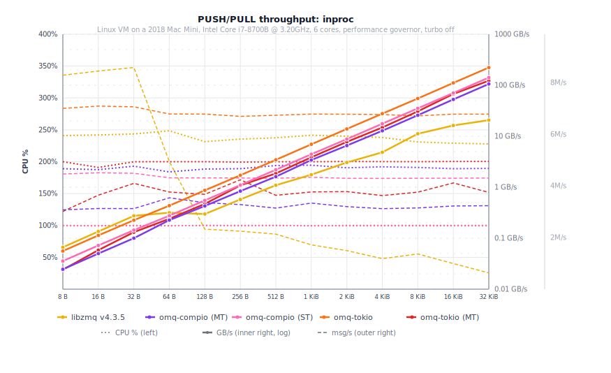
  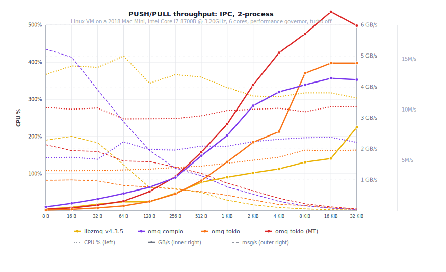
  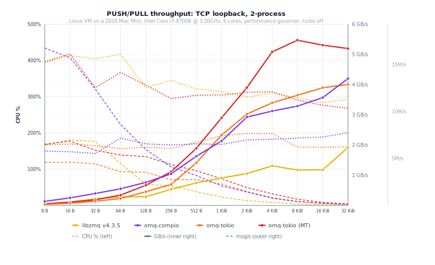
</p>

Inproc "GB/s" at large payloads reflects zero-copy Arc-clone: no kernel
traversal.

## PUSH/PULL throughput, fan-in (8 PUSH -> 1 PULL)

<p align="center">
  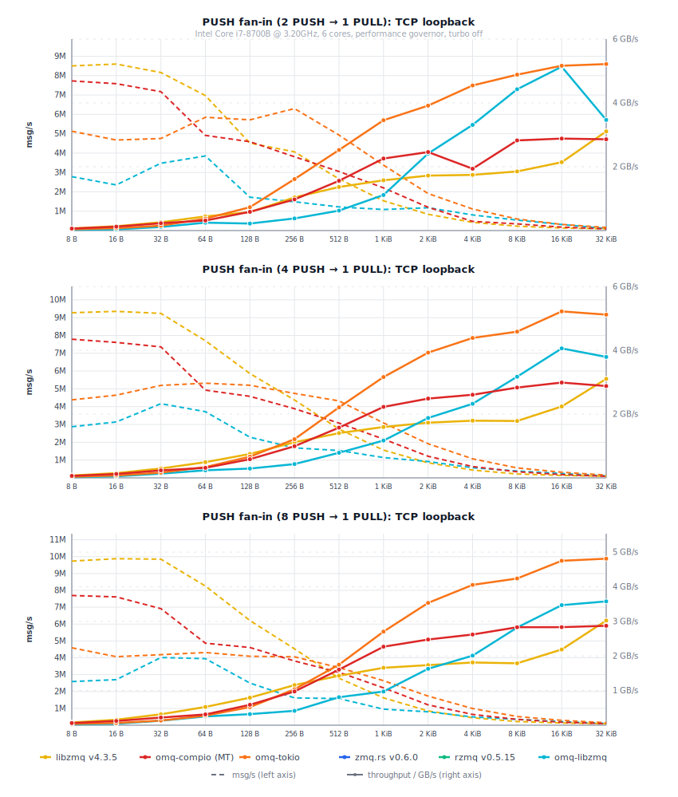
</p>

## PUSH/PULL throughput, fan-out (1 PUSH -> 8 PULL)

<p align="center">
  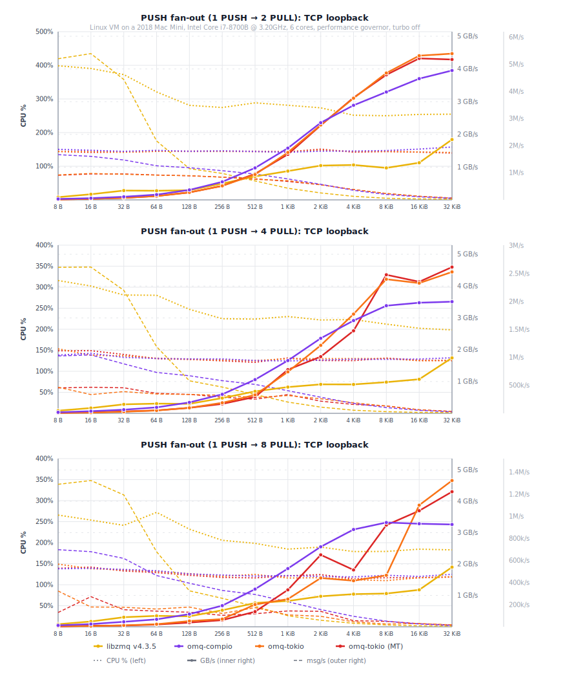
</p>

## REQ/REP latency (single peer)

Serial ping-pong: 1 000 warmup + 10 000 measured iterations. All values are
wall time.

<p align="center">
  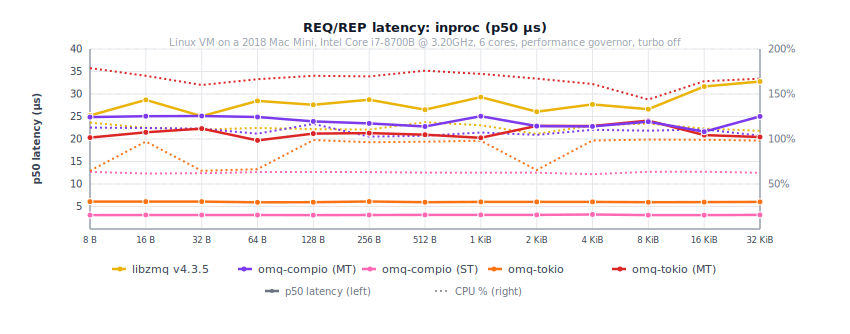
  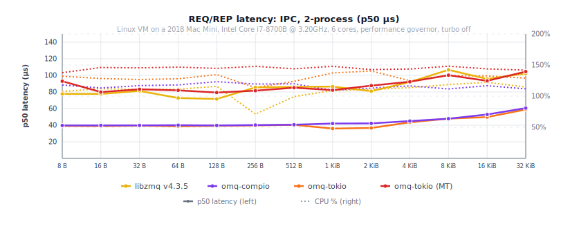
  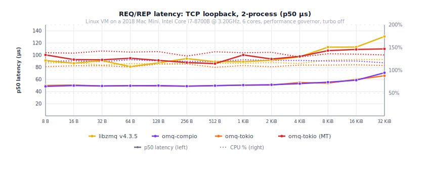
</p>

## PUB/SUB throughput (3 peers)

1 PUB -> 3 SUB.

<p align="center">
  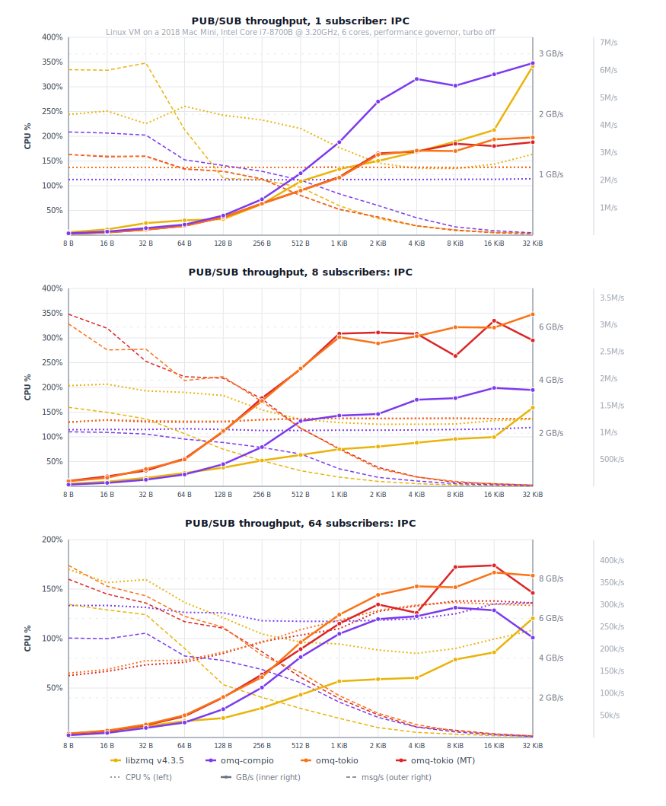
  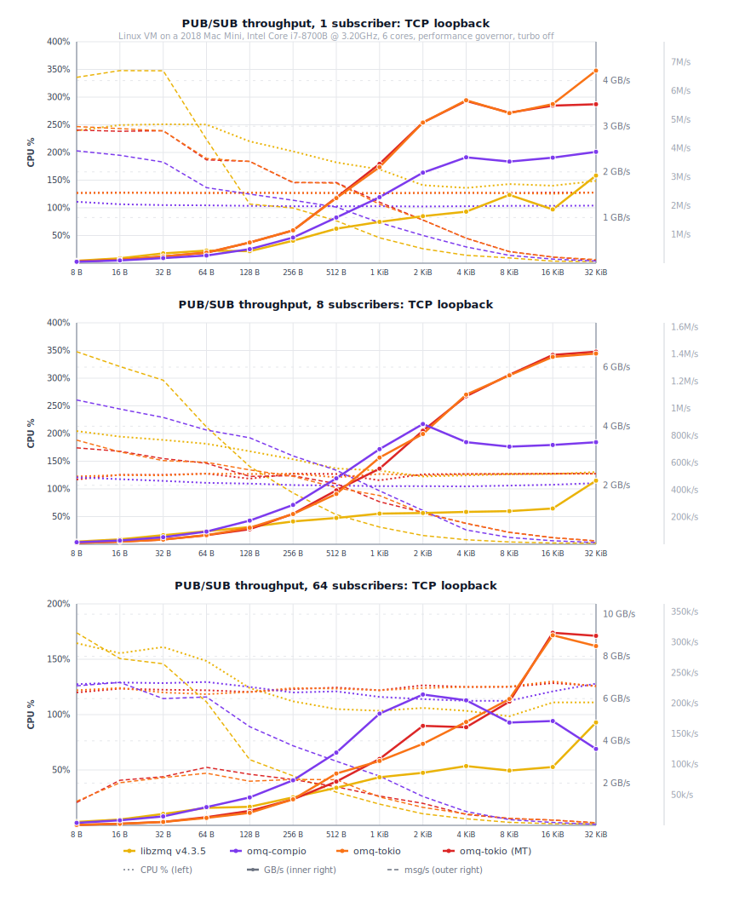
</p>

## Mechanism overhead (PUSH/PULL over TCP)

End-to-end throughput with NULL (no crypto), CURVE (XSalsa20-Poly1305), and
BLAKE3ZMQ (ChaCha20-BLAKE3) over loopback TCP. Higher is better. omq-proto
pins a `chacha20-blake3` fork with `#[target_feature(enable = "avx2")]`;
without it BLAKE3ZMQ drops to ~50 MiB/s at bulk sizes. CURVE plateaus at
~557 MB/s (salsa20 has no SIMD path).

> **BLAKE3ZMQ is not independently audited.** Use **CURVE** (RFC 26) for
> production.

<p align="center">
  
  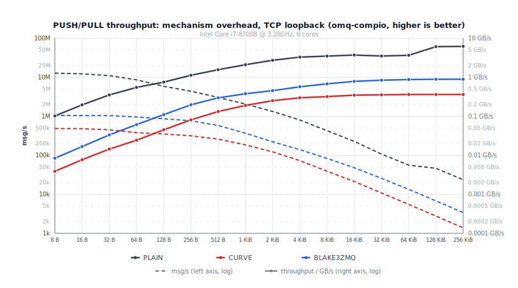
</p>

## Compression transport benchmarks

See [BENCHMARKS_COMPRESSION.md](BENCHMARKS_COMPRESSION.md) for bandwidth-limited throughput charts
and compression ratio tables. Those benchmarks use structured JSON payloads
and are run separately from the charts above.

## Reproducing

```sh
cargo bench -p omq-tokio  --bench push_pull
cargo bench -p omq-compio --bench push_pull
cargo bench -p omq-tokio  --bench req_rep
cargo bench -p omq-compio --bench req_rep

# Convenience:
./scripts/bench_run.rb [--all-features] [--all-sizes]    # adds results to JSONL
./scripts/bench_run.rb --chart-sizes                     # dense ×2 sweep for charts

# WebSocket transport (requires ws feature):
OMQ_BENCH_TRANSPORTS=ws cargo bench -p omq-tokio  --features ws --bench push_pull
OMQ_BENCH_TRANSPORTS=ws cargo bench -p omq-compio --features ws --bench push_pull

# Override transports / sizes / peer counts via env:
OMQ_BENCH_TRANSPORTS=tcp OMQ_BENCH_PEERS=3 OMQ_BENCH_SIZES=128,2048,32768 cargo bench -p omq-compio --bench push_pull

# Two-process comparison (requires libzmq installed for --scope all):
python3 scripts/run_comparisons.py               # full sweep, all impls
python3 scripts/run_comparisons.py --quick-run    # 3 sizes only
python3 scripts/run_comparisons.py --impl omq-tokio --impl omq-compio  # omq-only refresh

# Charts (SVG, generated from JSONL data):
python3 scripts/gen_comparison_chart.py          # doc/charts/pushpull/ + reqrep/ + pubsub/
python3 scripts/gen_mechanism_chart.py            # doc/charts/mechanism/{compio,tokio}.svg

# Compression charts require a bench run first (writes JSONL):
#   1. Run bench:
#      cargo bench -p omq-tokio  --features lz4 --bench compression
#      cargo bench -p omq-compio --features lz4 --bench compression
#   2. Generate chart:
python3 scripts/gen_compression_chart.py --backend tokio     # doc/charts/pubsub/lz4_tcp.svg
python3 scripts/gen_compression_chart.py --backend compio    # doc/charts/pubsub/lz4_tcp.svg
```
