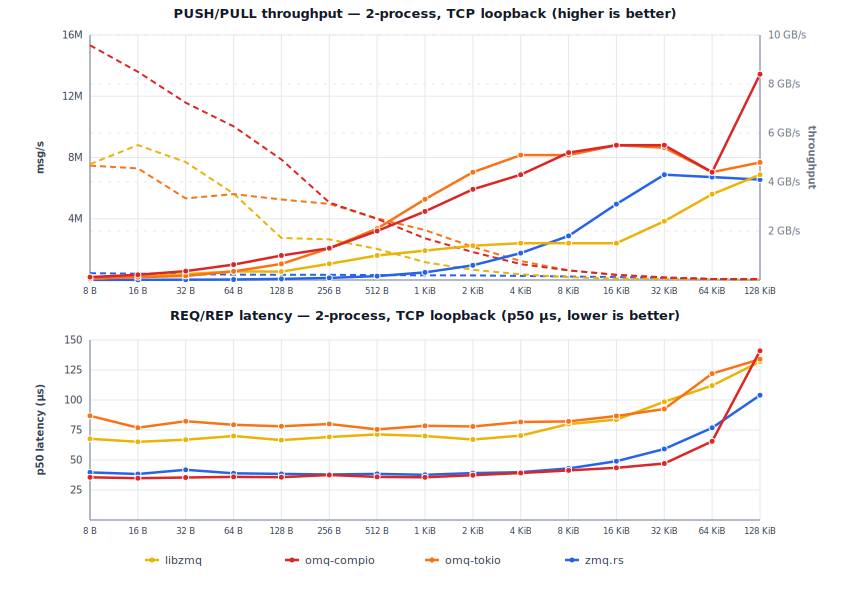
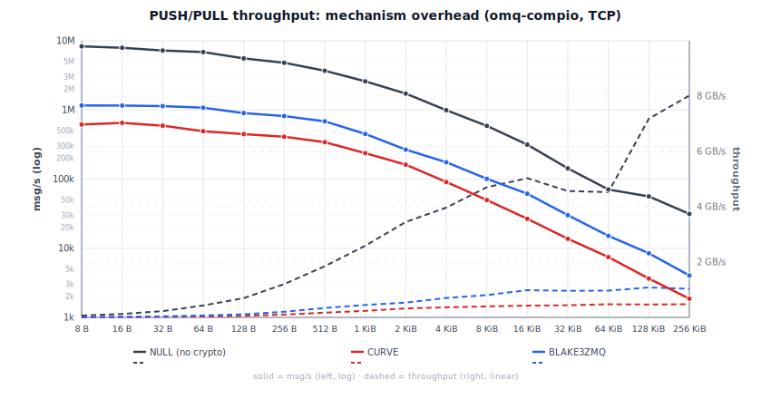

# Benchmarks

Linux 6.12 (Debian 13) VM on an Intel Mac Mini 2018 (i7-8700B, 3.2 GHz
base, turbo disabled, governor=performance, 6 vCPU), Rust 1.95.0,
default features.

Each cell is the **min wall time** across multiple runs with warmup.
Sources: `omq-compio/benches/` and `omq-tokio/benches/`.

> **Compio bench topology.** `inproc`: single runtime, single thread
> (sender + receiver cooperatively scheduled). `inproc-mt`:
> multi-runtime inproc: PULL on its own thread/runtime, PUSHes on
> another. Wire transports (TCP/IPC): same multi-runtime shape as
> inproc-mt. omq-tokio uses a multi-thread runtime across all
> available cores throughout.

## PUSH/PULL throughput, single peer

Cells show `msgs/s / MB/s`.

**omq-compio:**

<!-- BEGIN push_pull_1peer_compio -->
| Size | inproc | inproc-mt | ipc | tcp |
|---|---|---|---|---|
| 8 B | 3.74M / 29.9 MB/s | 14.01M / 112 MB/s | 15.46M / 124 MB/s | 15.90M / 127 MB/s |
| 32 B | 3.55M / 114 MB/s | 14.01M / 448 MB/s | 12.14M / 389 MB/s | 12.70M / 406 MB/s |
| 64 B | 3.72M / 238 MB/s | 11.13M / 712 MB/s | 10.79M / 691 MB/s | 9.85M / 630 MB/s |
| 128 B | 3.71M / 475 MB/s | 13.96M / 1.79 GB/s | 8.50M / 1.09 GB/s | 7.82M / 1.00 GB/s |
| 256 B | 3.69M / 946 MB/s | 9.73M / 2.49 GB/s | 6.20M / 1.59 GB/s | 5.56M / 1.42 GB/s |
| 512 B | 3.73M / 1.91 GB/s | 10.21M / 5.23 GB/s | 4.38M / 2.24 GB/s | 4.00M / 2.05 GB/s |
| 1 KiB | 3.72M / 3.81 GB/s | 16.10M / 16.5 GB/s | 3.20M / 3.28 GB/s | 2.79M / 2.86 GB/s |
| 2 KiB | 3.75M / 7.69 GB/s | 10.95M / 22.4 GB/s | 2.16M / 4.42 GB/s | 1.82M / 3.72 GB/s |
| 4 KiB | 3.95M / 16.2 GB/s | 14.48M / 59.3 GB/s | 1.37M / 5.62 GB/s | 1.10M / 4.49 GB/s |
| 8 KiB | 3.94M / 32.3 GB/s | 13.58M / 111.3 GB/s | 147k / 1.20 GB/s | 623k / 5.11 GB/s |
| 32 KiB | 3.94M / 129.0 GB/s | 11.02M / 361.1 GB/s | 186k / 6.11 GB/s | 188k / 6.17 GB/s |
| 128 KiB | 3.95M / 517.5 GB/s | 15.03M / 1969.7 GB/s | 57.4k / 7.53 GB/s | 55.6k / 7.29 GB/s |
| 512 KiB | — | — | — | 16.7k / 8.76 GB/s |

<!-- END push_pull_1peer_compio -->

**omq-tokio:**

<!-- BEGIN push_pull_1peer_tokio -->
| Size | inproc | ipc | tcp |
|---|---|---|---|
| 8 B | 4.51M / 36.1 MB/s | 5.54M / 44.3 MB/s | 4.47M / 35.7 MB/s |
| 32 B | 4.44M / 142 MB/s | 6.63M / 212 MB/s | 6.76M / 216 MB/s |
| 64 B | 4.12M / 263 MB/s | 5.58M / 357 MB/s | 6.24M / 399 MB/s |
| 128 B | 3.77M / 483 MB/s | 5.55M / 710 MB/s | 5.98M / 765 MB/s |
| 256 B | 4.07M / 1.04 GB/s | 4.45M / 1.14 GB/s | 5.30M / 1.36 GB/s |
| 512 B | 4.09M / 2.10 GB/s | 4.07M / 2.08 GB/s | 4.13M / 2.12 GB/s |
| 1 KiB | 3.54M / 3.62 GB/s | 3.02M / 3.09 GB/s | 2.77M / 2.83 GB/s |
| 2 KiB | 4.29M / 8.79 GB/s | 1.72M / 3.52 GB/s | 1.97M / 4.03 GB/s |
| 4 KiB | 4.01M / 16.4 GB/s | 848k / 3.47 GB/s | 1.14M / 4.67 GB/s |
| 8 KiB | 3.57M / 29.2 GB/s | 469k / 3.84 GB/s | 589k / 4.83 GB/s |
| 32 KiB | 4.01M / 131.3 GB/s | 109k / 3.56 GB/s | 164k / 5.36 GB/s |
| 128 KiB | 4.12M / 539.4 GB/s | 26.8k / 3.52 GB/s | 37.3k / 4.89 GB/s |

<!-- END push_pull_1peer_tokio -->

Inproc "GB/s" at large payloads reflects zero-copy Arc-clone: no kernel
traversal.

## PUSH/PULL throughput, 8 peers

8 PUSH peers -> 1 PULL. Cells show `msgs/s / MB/s`.

**omq-compio:**

<!-- BEGIN push_pull_8peer_compio -->
| Size | inproc | ipc | tcp |
|---|---|---|---|
| 8 B | 4.01M / 32.1 MB/s | 6.16M / 49.3 MB/s | 6.04M / 48.3 MB/s |
| 32 B | 3.78M / 121 MB/s | 6.73M / 215 MB/s | 6.56M / 210 MB/s |
| 64 B | 3.70M / 237 MB/s | 4.78M / 306 MB/s | 5.20M / 333 MB/s |
| 128 B | 3.72M / 476 MB/s | 4.68M / 599 MB/s | 4.74M / 607 MB/s |
| 256 B | 3.71M / 950 MB/s | 4.15M / 1.06 GB/s | 3.99M / 1.02 GB/s |
| 512 B | 3.70M / 1.90 GB/s | 3.49M / 1.79 GB/s | 3.36M / 1.72 GB/s |
| 1 KiB | 3.70M / 3.79 GB/s | 2.53M / 2.59 GB/s | 2.19M / 2.25 GB/s |
| 2 KiB | 3.68M / 7.54 GB/s | 1.47M / 3.01 GB/s | 1.34M / 2.74 GB/s |
| 4 KiB | 3.72M / 15.2 GB/s | 801k / 3.28 GB/s | 736k / 3.02 GB/s |
| 8 KiB | 3.95M / 32.4 GB/s | 409k / 3.35 GB/s | 393k / 3.22 GB/s |
| 32 KiB | 3.95M / 129.3 GB/s | 145k / 4.74 GB/s | 135k / 4.42 GB/s |
| 128 KiB | 3.90M / 510.5 GB/s | 31.3k / 4.11 GB/s | 29.3k / 3.85 GB/s |

<!-- END push_pull_8peer_compio -->

**omq-tokio:**

<!-- BEGIN push_pull_8peer_tokio -->
| Size | inproc | ipc | tcp |
|---|---|---|---|
| 8 B | 3.53M / 28.2 MB/s | 6.82M / 54.5 MB/s | 7.82M / 62.6 MB/s |
| 32 B | 3.41M / 109 MB/s | 7.23M / 231 MB/s | 6.11M / 196 MB/s |
| 64 B | 3.30M / 211 MB/s | 6.13M / 393 MB/s | 6.93M / 444 MB/s |
| 128 B | 3.38M / 432 MB/s | 5.74M / 735 MB/s | 7.31M / 936 MB/s |
| 256 B | 3.46M / 885 MB/s | 6.09M / 1.56 GB/s | 6.19M / 1.58 GB/s |
| 512 B | 3.41M / 1.75 GB/s | 5.39M / 2.76 GB/s | 6.22M / 3.19 GB/s |
| 1 KiB | 3.45M / 3.54 GB/s | 4.91M / 5.03 GB/s | 4.08M / 4.18 GB/s |
| 2 KiB | 3.40M / 6.97 GB/s | 2.98M / 6.11 GB/s | 2.73M / 5.60 GB/s |
| 4 KiB | 3.28M / 13.4 GB/s | 1.19M / 4.87 GB/s | 1.20M / 4.94 GB/s |
| 8 KiB | 3.38M / 27.7 GB/s | 600k / 4.92 GB/s | 643k / 5.27 GB/s |
| 32 KiB | 3.49M / 114.4 GB/s | 149k / 4.89 GB/s | 166k / 5.45 GB/s |
| 128 KiB | 3.47M / 454.4 GB/s | 90.3k / 11.8 GB/s | 63.2k / 8.29 GB/s |

<!-- END push_pull_8peer_tokio -->

## PUSH/PULL fan-out throughput, 8 peers

1 PUSH -> 8 PULL. Cells show `msgs/s / MB/s`.

**omq-compio:**

<!-- BEGIN push_pull_fanout_8peer_compio -->
| Size | ipc | tcp |
|---|---|---|
| 8 B | 4.06M / 32.4 MB/s | 4.18M / 33.5 MB/s |
| 32 B | 4.21M / 135 MB/s | 4.01M / 128 MB/s |
| 64 B | 4.14M / 265 MB/s | 3.94M / 252 MB/s |
| 128 B | 3.97M / 508 MB/s | 3.74M / 479 MB/s |
| 256 B | 3.63M / 930 MB/s | 3.49M / 893 MB/s |
| 512 B | 3.31M / 1.70 GB/s | 3.11M / 1.59 GB/s |
| 1 KiB | 2.64M / 2.70 GB/s | 2.46M / 2.52 GB/s |
| 2 KiB | 1.38M / 2.83 GB/s | 1.69M / 3.46 GB/s |
| 4 KiB | 680k / 2.78 GB/s | 824k / 3.38 GB/s |
| 8 KiB | 415k / 3.40 GB/s | 386k / 3.17 GB/s |
| 32 KiB | 267k / 8.76 GB/s | 236k / 7.72 GB/s |
| 128 KiB | 63.4k / 8.32 GB/s | 66.1k / 8.66 GB/s |

<!-- END push_pull_fanout_8peer_compio -->

**omq-tokio:**

<!-- BEGIN push_pull_fanout_8peer_tokio -->
| Size | inproc | ipc | tcp |
|---|---|---|---|
| 8 B | 1.64M / 13.1 MB/s | 6.03M / 48.2 MB/s | 6.54M / 52.3 MB/s |
| 32 B | 1.98M / 63.5 MB/s | 5.78M / 185 MB/s | 6.37M / 204 MB/s |
| 64 B | 1.84M / 117 MB/s | 3.20M / 205 MB/s | 5.56M / 356 MB/s |
| 128 B | 1.64M / 211 MB/s | 4.49M / 574 MB/s | 5.20M / 666 MB/s |
| 256 B | 1.81M / 463 MB/s | 4.02M / 1.03 GB/s | 5.93M / 1.52 GB/s |
| 512 B | 1.81M / 925 MB/s | 5.87M / 3.00 GB/s | 6.78M / 3.47 GB/s |
| 1 KiB | 1.74M / 1.78 GB/s | 5.42M / 5.55 GB/s | 3.94M / 4.04 GB/s |
| 2 KiB | 1.60M / 3.28 GB/s | 3.50M / 7.17 GB/s | 2.74M / 5.61 GB/s |
| 4 KiB | 1.70M / 6.95 GB/s | 1.91M / 7.81 GB/s | 1.27M / 5.19 GB/s |
| 8 KiB | 1.87M / 15.3 GB/s | 699k / 5.73 GB/s | 562k / 4.60 GB/s |
| 32 KiB | 1.89M / 61.9 GB/s | 217k / 7.11 GB/s | 166k / 5.45 GB/s |
| 128 KiB | 1.63M / 213.7 GB/s | 116k / 15.2 GB/s | 68.3k / 8.95 GB/s |

<!-- END push_pull_fanout_8peer_tokio -->

<p align="center">
  
</p>

## REQ/REP latency (single peer)

Serial ping-pong: 1 000 warmup + 10 000 measured iterations per cell.
All values are wall time.

<!-- BEGIN latency_percentiles -->
| transport | size | compio p50 | compio p99 | tokio p50 | tokio p99 |
|---|---|---|---|---|---|
| inproc | 8 B | 2.55 µs | 2.62 µs | 24.7 µs | 37.8 µs |
| inproc | 32 B | 2.56 µs | 2.62 µs | 26.4 µs | 76.3 µs |
| inproc | 64 B | 2.55 µs | 2.65 µs | 24.5 µs | 38.3 µs |
| inproc | 128 B | 2.58 µs | 2.65 µs | 24.0 µs | 124 µs |
| inproc | 256 B | 2.59 µs | 2.69 µs | 98.6 µs | 309 µs |
| inproc | 512 B | 2.59 µs | 2.68 µs | 23.2 µs | 31.4 µs |
| inproc | 1 KiB | 2.59 µs | 2.68 µs | 24.4 µs | 76.8 µs |
| inproc | 2 KiB | 2.61 µs | 2.69 µs | 24.5 µs | 73.6 µs |
| inproc | 4 KiB | 2.60 µs | 2.69 µs | 24.2 µs | 75.9 µs |
| inproc | 8 KiB | 2.60 µs | 2.70 µs | 24.9 µs | 283 µs |
| inproc | 32 KiB | 2.61 µs | 2.74 µs | 24.9 µs | 78.7 µs |
| inproc | 128 KiB | 2.60 µs | 2.73 µs | 25.3 µs | 80.5 µs |
| ipc | 8 B | 14.4 µs | 28.4 µs | 52.9 µs | 71.1 µs |
| ipc | 32 B | 14.8 µs | 19.0 µs | 52.7 µs | 66.6 µs |
| ipc | 64 B | 14.7 µs | 24.3 µs | 53.0 µs | 66.3 µs |
| ipc | 128 B | 14.6 µs | 23.6 µs | 52.9 µs | 68.0 µs |
| ipc | 256 B | 14.7 µs | 28.4 µs | 52.8 µs | 66.5 µs |
| ipc | 512 B | 14.9 µs | 29.1 µs | 53.1 µs | 66.3 µs |
| ipc | 1 KiB | 15.3 µs | 28.5 µs | 52.2 µs | 65.8 µs |
| ipc | 2 KiB | 16.5 µs | 48.2 µs | 51.6 µs | 69.0 µs |
| ipc | 4 KiB | 18.0 µs | 28.0 µs | 52.8 µs | 69.0 µs |
| ipc | 8 KiB | 19.2 µs | 27.3 µs | 55.0 µs | 72.4 µs |
| ipc | 32 KiB | 25.2 µs | 43.7 µs | 70.9 µs | 115 µs |
| ipc | 128 KiB | 185 µs | 231 µs | 96.9 µs | 127 µs |
| tcp | 8 B | 21.6 µs | 32.7 µs | 58.7 µs | 84.5 µs |
| tcp | 32 B | 21.5 µs | 40.6 µs | 57.8 µs | 79.3 µs |
| tcp | 64 B | 21.5 µs | 34.9 µs | 61.4 µs | 77.7 µs |
| tcp | 128 B | 21.6 µs | 40.4 µs | 58.2 µs | 831 µs |
| tcp | 256 B | 21.6 µs | 35.2 µs | 59.4 µs | 106 µs |
| tcp | 512 B | 21.6 µs | 35.4 µs | 59.9 µs | 106 µs |
| tcp | 1 KiB | 22.2 µs | 35.6 µs | 59.0 µs | 98.3 µs |
| tcp | 2 KiB | 22.9 µs | 37.5 µs | 60.7 µs | 123 µs |
| tcp | 4 KiB | 23.7 µs | 37.3 µs | 60.9 µs | 117 µs |
| tcp | 8 KiB | 25.6 µs | 39.5 µs | 63.5 µs | 117 µs |
| tcp | 32 KiB | 33.9 µs | 52.8 µs | 75.5 µs | 117 µs |
| tcp | 128 KiB | 207 µs | 565 µs | 113 µs | 141 µs |

<!-- END latency_percentiles -->

## CLIENT/SERVER latency percentiles

Same methodology as above, using CLIENT/SERVER sockets instead of REQ/REP.

<!-- BEGIN client_server_latency_percentiles -->
| transport | size | compio p50 | compio p99 | tokio p50 | tokio p99 |
|---|---|---|---|---|---|
| inproc | 8 B | 2.35 µs | 2.42 µs | 15.2 µs | 27.3 µs |
| inproc | 32 B | 2.33 µs | 2.42 µs | 15.1 µs | 28.9 µs |
| inproc | 64 B | 2.38 µs | 2.45 µs | 15.2 µs | 59.2 µs |
| inproc | 128 B | 2.39 µs | 2.47 µs | 15.4 µs | 256 µs |
| inproc | 256 B | 2.39 µs | 2.49 µs | 15.6 µs | 24.3 µs |
| inproc | 512 B | 2.41 µs | 2.49 µs | 15.3 µs | 29.7 µs |
| inproc | 1 KiB | 2.44 µs | 2.51 µs | 15.0 µs | 27.9 µs |
| inproc | 2 KiB | 2.44 µs | 2.50 µs | 15.2 µs | 27.6 µs |
| inproc | 4 KiB | 2.44 µs | 2.51 µs | 15.2 µs | 25.0 µs |
| inproc | 8 KiB | 2.44 µs | 2.50 µs | 15.2 µs | 28.7 µs |
| inproc | 32 KiB | 2.43 µs | 2.51 µs | 81.7 µs | 229 µs |
| inproc | 128 KiB | 2.45 µs | 2.55 µs | 14.9 µs | 36.5 µs |
| ipc | 8 B | 14.2 µs | 19.6 µs | 41.4 µs | 77.6 µs |
| ipc | 32 B | 14.3 µs | 27.3 µs | 41.2 µs | 70.7 µs |
| ipc | 64 B | 14.5 µs | 27.5 µs | 42.3 µs | 84.3 µs |
| ipc | 128 B | 14.4 µs | 22.2 µs | 42.6 µs | 86.3 µs |
| ipc | 256 B | 14.5 µs | 27.7 µs | 42.1 µs | 87.3 µs |
| ipc | 512 B | 14.6 µs | 28.0 µs | 42.3 µs | 83.2 µs |
| ipc | 1 KiB | 15.5 µs | 28.7 µs | 43.0 µs | 93.0 µs |
| ipc | 2 KiB | 15.7 µs | 29.3 µs | 43.8 µs | 90.8 µs |
| ipc | 4 KiB | 18.0 µs | 34.9 µs | 46.6 µs | 93.8 µs |
| ipc | 8 KiB | 19.6 µs | 38.6 µs | 50.7 µs | 62.9 µs |
| ipc | 32 KiB | 25.7 µs | 42.1 µs | 58.6 µs | 75.9 µs |
| ipc | 128 KiB | 203 µs | 270 µs | 100 µs | 123 µs |
| tcp | 8 B | 20.8 µs | 28.6 µs | 48.5 µs | 65.0 µs |
| tcp | 32 B | 21.2 µs | 34.0 µs | 46.4 µs | 65.5 µs |
| tcp | 64 B | 21.5 µs | 34.1 µs | 47.3 µs | 62.9 µs |
| tcp | 128 B | 21.5 µs | 34.3 µs | 46.4 µs | 62.8 µs |
| tcp | 256 B | 21.6 µs | 33.8 µs | 47.1 µs | 64.8 µs |
| tcp | 512 B | 21.7 µs | 34.5 µs | 46.9 µs | 64.7 µs |
| tcp | 1 KiB | 22.1 µs | 34.4 µs | 49.4 µs | 88.1 µs |
| tcp | 2 KiB | 23.1 µs | 36.3 µs | 51.7 µs | 803 µs |
| tcp | 4 KiB | 24.1 µs | 36.4 µs | 52.7 µs | 108 µs |
| tcp | 8 KiB | 26.0 µs | 39.2 µs | 56.4 µs | 115 µs |
| tcp | 32 KiB | 33.6 µs | 49.9 µs | 67.5 µs | 110 µs |
| tcp | 128 KiB | 218 µs | 297 µs | 96.0 µs | 167 µs |

<!-- END client_server_latency_percentiles -->

## REQ/REP throughput (single peer)

Cells show `msgs/s / MB/s`.

**omq-compio:**

<!-- BEGIN req_rep_compio -->
| Size | inproc | ipc | tcp |
|---|---|---|---|
| 8 B | 398k / 3.18 MB/s | 63.9k / 0.51 MB/s | 43.8k / 0.35 MB/s |
| 32 B | 389k / 12.5 MB/s | 64.6k / 2.07 MB/s | 43.7k / 1.40 MB/s |
| 64 B | 379k / 24.3 MB/s | 64.4k / 4.12 MB/s | 42.5k / 2.72 MB/s |
| 128 B | 378k / 48.4 MB/s | 64.6k / 8.27 MB/s | 42.5k / 5.45 MB/s |
| 256 B | 377k / 96.5 MB/s | 63.7k / 16.3 MB/s | 42.5k / 10.9 MB/s |
| 512 B | 378k / 193 MB/s | 64.1k / 32.8 MB/s | 42.3k / 21.7 MB/s |
| 1 KiB | 379k / 388 MB/s | 62.7k / 64.2 MB/s | 41.4k / 42.3 MB/s |
| 2 KiB | 377k / 771 MB/s | 58.8k / 120 MB/s | 39.7k / 81.2 MB/s |
| 4 KiB | 379k / 1.55 GB/s | 52.4k / 215 MB/s | 38.4k / 157 MB/s |
| 8 KiB | 379k / 3.11 GB/s | 48.8k / 400 MB/s | 36.0k / 295 MB/s |
| 32 KiB | 402k / 13.2 GB/s | 37.6k / 1.23 GB/s | 29.3k / 961 MB/s |
| 128 KiB | 400k / 52.4 GB/s | 5.9k / 771 MB/s | 5.6k / 731 MB/s |

<!-- END req_rep_compio -->

**omq-tokio:**

<!-- BEGIN req_rep_tokio -->
| Size | inproc | ipc | tcp |
|---|---|---|---|
| 8 B | 39.6k / 0.32 MB/s | 19.2k / 0.15 MB/s | 16.3k / 0.13 MB/s |
| 32 B | 38.4k / 1.23 MB/s | 20.3k / 0.65 MB/s | 16.2k / 0.52 MB/s |
| 64 B | 38.3k / 2.45 MB/s | 19.8k / 1.26 MB/s | 16.3k / 1.05 MB/s |
| 128 B | 39.8k / 5.09 MB/s | 19.3k / 2.47 MB/s | 16.4k / 2.09 MB/s |
| 256 B | 39.0k / 9.99 MB/s | 19.2k / 4.91 MB/s | 16.0k / 4.10 MB/s |
| 512 B | 39.0k / 20.0 MB/s | 19.3k / 9.88 MB/s | 16.0k / 8.18 MB/s |
| 1 KiB | 38.5k / 39.4 MB/s | 19.9k / 20.4 MB/s | 16.1k / 16.5 MB/s |
| 2 KiB | 37.6k / 77.0 MB/s | 18.8k / 38.5 MB/s | 15.1k / 31.0 MB/s |
| 4 KiB | 40.0k / 164 MB/s | 18.2k / 74.4 MB/s | 15.1k / 61.8 MB/s |
| 8 KiB | 37.4k / 306 MB/s | 18.3k / 150 MB/s | 14.8k / 122 MB/s |
| 32 KiB | 37.3k / 1.22 GB/s | 14.2k / 465 MB/s | 13.1k / 429 MB/s |
| 128 KiB | 37.0k / 4.85 GB/s | 10.3k / 1.35 GB/s | 8.8k / 1.15 GB/s |

<!-- END req_rep_tokio -->

## PUB/SUB throughput (3 peers)

1 PUB -> 3 SUB. Cells show `msgs/s / MB/s`.

**omq-compio:**

<!-- BEGIN pub_sub_compio -->
| Size | inproc | ipc | tcp |
|---|---|---|---|
| 8 B | 1.25M / 9.96 MB/s | 1.52M / 12.1 MB/s | 1.54M / 12.3 MB/s |
| 32 B | 1.24M / 39.6 MB/s | 1.48M / 47.5 MB/s | 1.50M / 47.9 MB/s |
| 64 B | 1.19M / 76.1 MB/s | 1.38M / 88.2 MB/s | 1.34M / 85.8 MB/s |
| 128 B | 1.19M / 153 MB/s | 1.38M / 177 MB/s | 1.36M / 175 MB/s |
| 256 B | 1.19M / 304 MB/s | 1.25M / 319 MB/s | 1.21M / 310 MB/s |
| 512 B | 1.20M / 614 MB/s | 1.09M / 558 MB/s | 1.06M / 540 MB/s |
| 1 KiB | 1.19M / 1.22 GB/s | 783k / 802 MB/s | 811k / 830 MB/s |
| 2 KiB | 1.14M / 2.34 GB/s | 529k / 1.08 GB/s | 482k / 987 MB/s |
| 4 KiB | 1.14M / 4.68 GB/s | 295k / 1.21 GB/s | 288k / 1.18 GB/s |
| 8 KiB | 1.15M / 9.43 GB/s | 172k / 1.41 GB/s | 165k / 1.35 GB/s |
| 32 KiB | 1.15M / 37.7 GB/s | 96.0k / 3.15 GB/s | 80.3k / 2.63 GB/s |
| 128 KiB | 1.15M / 150.9 GB/s | 19.3k / 2.53 GB/s | 20.1k / 2.63 GB/s |

<!-- END pub_sub_compio -->

**omq-tokio:**

<!-- BEGIN pub_sub_tokio -->
| Size | inproc | ipc | tcp |
|---|---|---|---|
| 8 B | 1.37M / 10.9 MB/s | 1.64M / 13.1 MB/s | 1.61M / 12.9 MB/s |
| 32 B | 1.48M / 47.3 MB/s | 1.62M / 51.9 MB/s | 1.60M / 51.2 MB/s |
| 64 B | 1.32M / 84.5 MB/s | 1.52M / 97.2 MB/s | 1.44M / 92.3 MB/s |
| 128 B | 1.24M / 159 MB/s | 1.46M / 187 MB/s | 1.39M / 177 MB/s |
| 256 B | 1.30M / 334 MB/s | 1.43M / 367 MB/s | 1.35M / 346 MB/s |
| 512 B | 1.28M / 656 MB/s | 1.42M / 725 MB/s | 1.41M / 721 MB/s |
| 1 KiB | 1.36M / 1.39 GB/s | 1.28M / 1.31 GB/s | 1.28M / 1.31 GB/s |
| 2 KiB | 1.33M / 2.73 GB/s | 1.11M / 2.28 GB/s | 1.14M / 2.34 GB/s |
| 4 KiB | 1.32M / 5.39 GB/s | 810k / 3.32 GB/s | 771k / 3.16 GB/s |
| 8 KiB | 888k / 7.28 GB/s | 443k / 3.63 GB/s | 430k / 3.52 GB/s |
| 32 KiB | 1.36M / 44.6 GB/s | 101k / 3.30 GB/s | 32.9k / 1.08 GB/s |
| 128 KiB | 764k / 100.2 GB/s | 34.0k / 4.46 GB/s | 9.9k / 1.30 GB/s |

<!-- END pub_sub_tokio -->

## ROUTER/DEALER throughput (3 peers)

3 DEALER -> 1 ROUTER. Cells show `msgs/s / MB/s`.

**omq-compio:**

<!-- BEGIN router_dealer_compio -->
| Size | inproc | ipc | tcp |
|---|---|---|---|
| 8 B | 3.60M / 28.8 MB/s | 3.28M / 26.2 MB/s | 3.39M / 27.1 MB/s |
| 32 B | 3.56M / 114 MB/s | 3.40M / 109 MB/s | 3.34M / 107 MB/s |
| 64 B | 3.69M / 236 MB/s | 2.84M / 182 MB/s | 2.84M / 182 MB/s |
| 128 B | 3.70M / 473 MB/s | 2.93M / 376 MB/s | 2.85M / 365 MB/s |
| 256 B | 3.68M / 942 MB/s | 2.46M / 630 MB/s | 2.51M / 643 MB/s |
| 512 B | 3.72M / 1.90 GB/s | 2.36M / 1.21 GB/s | 2.28M / 1.17 GB/s |
| 1 KiB | 3.60M / 3.69 GB/s | 1.77M / 1.81 GB/s | 1.76M / 1.80 GB/s |
| 2 KiB | 3.61M / 7.40 GB/s | 1.32M / 2.70 GB/s | 1.18M / 2.42 GB/s |
| 4 KiB | 3.63M / 14.9 GB/s | 803k / 3.29 GB/s | 831k / 3.40 GB/s |
| 8 KiB | 3.62M / 29.7 GB/s | 461k / 3.77 GB/s | 461k / 3.77 GB/s |
| 32 KiB | 3.61M / 118.4 GB/s | 155k / 5.07 GB/s | 111k / 3.65 GB/s |
| 128 KiB | 3.63M / 475.8 GB/s | 42.5k / 5.57 GB/s | 29.3k / 3.85 GB/s |

<!-- END router_dealer_compio -->

**omq-tokio:**

<!-- BEGIN router_dealer_tokio -->
| Size | inproc | ipc | tcp |
|---|---|---|---|
| 8 B | 941k / 7.53 MB/s | 1.16M / 9.30 MB/s | 1.15M / 9.23 MB/s |
| 32 B | 904k / 28.9 MB/s | 1.23M / 39.3 MB/s | 1.13M / 36.0 MB/s |
| 64 B | 876k / 56.1 MB/s | 1.15M / 73.6 MB/s | 1.25M / 80.0 MB/s |
| 128 B | 904k / 116 MB/s | 1.24M / 158 MB/s | 1.18M / 152 MB/s |
| 256 B | 880k / 225 MB/s | 1.16M / 296 MB/s | 1.15M / 295 MB/s |
| 512 B | 1.06M / 540 MB/s | 1.19M / 608 MB/s | 1.15M / 591 MB/s |
| 1 KiB | 950k / 973 MB/s | 1.11M / 1.14 GB/s | 1.24M / 1.26 GB/s |
| 2 KiB | 913k / 1.87 GB/s | 1.12M / 2.29 GB/s | 1.07M / 2.19 GB/s |
| 4 KiB | 893k / 3.66 GB/s | 1.04M / 4.28 GB/s | 850k / 3.48 GB/s |
| 8 KiB | 885k / 7.25 GB/s | 709k / 5.81 GB/s | 545k / 4.46 GB/s |
| 32 KiB | 944k / 30.9 GB/s | 210k / 6.87 GB/s | 154k / 5.06 GB/s |
| 128 KiB | 915k / 119.9 GB/s | 78.8k / 10.3 GB/s | 49.8k / 6.53 GB/s |

<!-- END router_dealer_tokio -->

## PAIR throughput (single peer)

Cells show `msgs/s / MB/s`.

**omq-compio:**

<!-- BEGIN pair_compio -->
| Size | inproc | ipc | tcp |
|---|---|---|---|
| 8 B | 3.89M / 31.1 MB/s | 7.20M / 57.6 MB/s | 7.09M / 56.7 MB/s |
| 32 B | 3.59M / 115 MB/s | 6.80M / 217 MB/s | 6.52M / 209 MB/s |
| 64 B | 3.61M / 231 MB/s | 5.20M / 333 MB/s | 5.13M / 328 MB/s |
| 128 B | 3.72M / 476 MB/s | 4.69M / 600 MB/s | 4.65M / 596 MB/s |
| 256 B | 3.74M / 956 MB/s | 4.26M / 1.09 GB/s | 4.10M / 1.05 GB/s |
| 512 B | 3.90M / 2.00 GB/s | 3.53M / 1.81 GB/s | 3.28M / 1.68 GB/s |
| 1 KiB | 3.72M / 3.81 GB/s | 2.82M / 2.89 GB/s | 2.84M / 2.91 GB/s |
| 2 KiB | 3.74M / 7.65 GB/s | 1.90M / 3.88 GB/s | 1.79M / 3.68 GB/s |
| 4 KiB | 3.79M / 15.5 GB/s | 1.17M / 4.81 GB/s | 1.10M / 4.49 GB/s |
| 8 KiB | 3.97M / 32.5 GB/s | 649k / 5.32 GB/s | 630k / 5.16 GB/s |
| 32 KiB | 3.96M / 129.6 GB/s | 178k / 5.83 GB/s | 173k / 5.67 GB/s |
| 128 KiB | 3.95M / 517.5 GB/s | 57.9k / 7.59 GB/s | 55.7k / 7.30 GB/s |

<!-- END pair_compio -->

**omq-tokio:**

<!-- BEGIN pair_tokio -->
| Size | inproc | ipc | tcp |
|---|---|---|---|
| 8 B | 528k / 4.23 MB/s | 5.55M / 44.4 MB/s | 4.84M / 38.8 MB/s |
| 32 B | 455k / 14.6 MB/s | 6.57M / 210 MB/s | 7.54M / 241 MB/s |
| 64 B | 415k / 26.5 MB/s | 5.74M / 367 MB/s | 5.62M / 359 MB/s |
| 128 B | 422k / 54.0 MB/s | 5.64M / 722 MB/s | 4.90M / 627 MB/s |
| 256 B | 441k / 113 MB/s | 4.66M / 1.19 GB/s | 4.61M / 1.18 GB/s |
| 512 B | 444k / 227 MB/s | 3.89M / 1.99 GB/s | 4.08M / 2.09 GB/s |
| 1 KiB | 92.7k / 95.0 MB/s | 2.81M / 2.87 GB/s | 2.80M / 2.87 GB/s |
| 2 KiB | 97.9k / 201 MB/s | 1.76M / 3.60 GB/s | 1.92M / 3.93 GB/s |
| 4 KiB | 97.2k / 398 MB/s | 864k / 3.54 GB/s | 1.14M / 4.68 GB/s |
| 8 KiB | 140k / 1.15 GB/s | 450k / 3.68 GB/s | 623k / 5.10 GB/s |
| 32 KiB | 469k / 15.4 GB/s | 107k / 3.52 GB/s | 168k / 5.51 GB/s |
| 128 KiB | 479k / 62.8 GB/s | 27.7k / 3.63 GB/s | 36.9k / 4.84 GB/s |

<!-- END pair_tokio -->

## Cross-library comparisons

See [COMPARISONS.md](COMPARISONS.md) for two-process TCP benchmarks against
libzmq and zmq.rs. Run `./scripts/compare_libzmq.sh --update-benchmarks` or
`./scripts/compare_zmqrs.sh --update-benchmarks` to refresh those tables.

## Compression transport benchmarks

See [BENCHMARKS_COMPRESSION.md](BENCHMARKS_COMPRESSION.md) for bandwidth-limited throughput charts
and compression ratio tables. Those benchmarks use structured JSON payloads
over `tc`-rate-limited loopback and are run separately from the tables above.

## PUSH/PULL throughput, priority routing (single peer)

Same topology as the single-peer table but with `priority` feature (strict
per-pipe queues). Run with `bench_run.rb --with-priority` to update.

**omq-compio:**

<!-- BEGIN push_pull_priority_compio -->
| Size | inproc | ipc | tcp |
|---|---|---|---|
| 32 B | 4.47M | 4.13M | 4.18M |
| 128 B | 4.14M | 3.70M | 3.65M |
| 512 B | 4.19M | 2.99M | 2.95M |
| 2 KiB | 4.08M | 1.74M | 1.58M |
| 8 KiB | 4.17M | 669k | 575k |
| 32 KiB | 4.17M | 176k | 162k |
| 128 KiB | 4.19M | 59.6k | 61.2k |

<!-- END push_pull_priority_compio -->

**omq-tokio:**

<!-- BEGIN push_pull_priority_tokio -->
| Size | inproc | ipc | tcp |
|---|---|---|---|
| 32 B | 3.49M | 4.01M | 3.83M |
| 128 B | 4.30M | 3.26M | 3.17M |
| 512 B | 3.46M | 2.81M | 2.50M |
| 2 KiB | 4.23M | 1.17M | 1.51M |
| 8 KiB | 3.93M | 522k | 461k |
| 32 KiB | 4.16M | 115k | 167k |
| 128 KiB | 3.80M | 35.1k | 43.7k |

<!-- END push_pull_priority_tokio -->

## Mechanism overhead (PUSH/PULL over TCP)

End-to-end throughput with NULL (no crypto), CURVE (XSalsa20-Poly1305), and
BLAKE3ZMQ (ChaCha20-BLAKE3) over loopback TCP. Higher is better. omq-proto
pins a `chacha20-blake3` fork with `#[target_feature(enable = "avx2")]`;
without it BLAKE3ZMQ drops to ~50 MiB/s at bulk sizes. CURVE plateaus at
~557 MB/s (salsa20 has no SIMD path).

> **BLAKE3ZMQ is not independently audited.** Use **CURVE** (RFC 26) for
> production.

<!-- BEGIN mechanism_frame -->
| Size | NULL | CURVE | BLAKE3ZMQ |
|---|---:|---:|---:|
| 8 B | 119 MB/s | 5.30 MB/s | 8.75 MB/s |
| 32 B | 384 MB/s | 19.2 MB/s | 36.0 MB/s |
| 64 B | 658 MB/s | 32.2 MB/s | 66.3 MB/s |
| 128 B | 983 MB/s | 60.1 MB/s | 114 MB/s |
| 256 B | 1.39 GB/s | 111 MB/s | 206 MB/s |
| 512 B | 1.95 GB/s | 178 MB/s | 350 MB/s |
| 1 KiB | 2.68 GB/s | 255 MB/s | 450 MB/s |
| 2 KiB | 3.58 GB/s | 339 MB/s | 559 MB/s |
| 4 KiB | 4.44 GB/s | 407 MB/s | 684 MB/s |
| 8 KiB | 4.82 GB/s | 429 MB/s | 844 MB/s |
| 32 KiB | 5.04 GB/s | 485 MB/s | 1.04 GB/s |
| 128 KiB | 7.60 GB/s | 489 MB/s | 1.11 GB/s |

<!-- END mechanism_frame -->

<p align="center">
  
</p>

## Reproducing

```sh
cargo bench -p omq-compio --bench push_pull
cargo bench -p omq-tokio  --bench push_pull
cargo bench -p omq-compio --bench req_rep

# Convenience:
./scripts/bench_run.rb [--all-features] [--all-sizes]    # adds results to JSONL
./scripts/bench_run.rb --chart-sizes                     # dense ×2 sweep for charts
./scripts/bench_run.rb --with-priority [--all-sizes]     # priority feature only
./scripts/bench_report.rb [--update-benchmarks]          # regenerates tables

# WebSocket transport (requires ws feature):
OMQ_BENCH_TRANSPORTS=ws cargo bench -p omq-compio --features ws --bench push_pull
OMQ_BENCH_TRANSPORTS=ws cargo bench -p omq-tokio  --features ws --bench push_pull

# Override transports / sizes / peer counts via env:
OMQ_BENCH_TRANSPORTS=tcp OMQ_BENCH_PEERS=3 OMQ_BENCH_SIZES=128,2048,32768 cargo bench -p omq-compio --bench push_pull

# Two-process libzmq vs omq comparison (requires libzmq installed):
# build: gcc scripts/libzmq_bench_peer.c -o scripts/libzmq_bench_peer -lzmq
# then run scripts/compare_libzmq.sh [--update-benchmarks]

# Two-process zmq.rs vs omq comparison (pure Rust, no system packages):
# ./scripts/compare_zmqrs.sh [--update-benchmarks]

# Charts (SVG, generated from COMPARISONS.md or JSONL data):
python3 scripts/gen_comparison_chart.py          # doc/charts/comparison.svg (from COMPARISONS.md)
python3 scripts/gen_mechanism_chart.py            # doc/charts/mechanism.svg (from BENCHMARKS.md)

# Compression charts require a bench run first (writes JSONL):
#   1. Rate-limit loopback:
#      sudo tc qdisc replace dev lo root tbf rate 1gbit burst 512kb latency 50ms
#   2. Run bench:
#      cargo bench -p omq-compio --features lz4,zstd --bench compression
#   3. Generate chart:
python3 scripts/gen_compression_chart.py --link 1g    # doc/charts/compression_1g.svg
python3 scripts/gen_compression_chart.py --link 100m  # doc/charts/compression_100m.svg
#   Use --run-prefix ts-NNNNN to select a specific bench run from the JSONL.
#   Use --tput-max N (MB/s) to override the right-axis scale.
#   4. Remove rate limit: sudo tc qdisc del dev lo root
```
