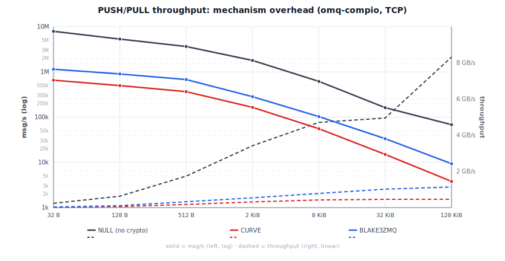

# Benchmarks

Linux 6.12 (Debian 13) VM on an Intel Mac Mini 2018 (i7-8700B, 3.2 GHz
base, turbo disabled, governor=performance, 6 vCPU), Rust 1.95.0,
default features. Each cell is the **min wall time** across 3 x 500 ms
timed rounds after a prime + 100 ms warmup: peak throughput, closest
to the hardware ceiling and least perturbed by scheduler/IRQ jitter.
Sources: `omq-tokio/benches/` and `omq-compio/benches/`.

> **Compio bench topology.** `inproc`: single runtime, single thread
> (sender + receiver cooperatively scheduled). `inproc-mt`:
> multi-runtime inproc: PULL on its own thread/runtime, PUSHes on
> another. Wire transports (TCP/IPC): same multi-runtime shape as
> inproc-mt. omq-tokio uses a multi-thread runtime across all
> available cores throughout.

## PUSH/PULL throughput, single peer

Cells show `msgs/s / MB/s`.

**omq-compio:**

<!-- BEGIN push_pull_1peer_compio -->
| Size | inproc | inproc-mt | ipc | tcp |
|---|---|---|---|---|
| 32 B | 3.89M / 125 MB/s | 13.85M / 443 MB/s | 7.32M / 234 MB/s | 7.22M / 231 MB/s |
| 128 B | 3.85M / 493 MB/s | 16.83M / 2.15 GB/s | 4.74M / 607 MB/s | 5.13M / 656 MB/s |
| 512 B | 3.80M / 1.95 GB/s | 11.81M / 6.04 GB/s | 3.48M / 1.78 GB/s | 3.51M / 1.80 GB/s |
| 2 KiB | 3.85M / 7.88 GB/s | 15.35M / 31.4 GB/s | 2.05M / 4.19 GB/s | 1.72M / 3.52 GB/s |
| 8 KiB | 3.86M / 31.6 GB/s | 11.50M / 94.2 GB/s | 732k / 6.00 GB/s | 619k / 5.07 GB/s |
| 32 KiB | 3.86M / 126.6 GB/s | 16.46M / 539.3 GB/s | 174k / 5.70 GB/s | 178k / 5.85 GB/s |
| 128 KiB | 3.68M / 482.3 GB/s | 12.53M / 1642.0 GB/s | 59.8k / 7.83 GB/s | 55.6k / 7.29 GB/s |

<!-- END push_pull_1peer_compio -->

**omq-tokio:**

<!-- BEGIN push_pull_1peer_tokio -->
| Size | inproc | ipc | tcp |
|---|---|---|---|
| 32 B | 4.51M / 144 MB/s | 4.10M / 131 MB/s | 4.25M / 136 MB/s |
| 128 B | 4.39M / 562 MB/s | 4.58M / 586 MB/s | 4.85M / 621 MB/s |
| 512 B | 3.74M / 1.92 GB/s | 2.35M / 1.20 GB/s | 3.47M / 1.78 GB/s |
| 2 KiB | 4.42M / 9.06 GB/s | 1.27M / 2.60 GB/s | 1.39M / 2.85 GB/s |
| 8 KiB | 4.19M / 34.4 GB/s | 420k / 3.44 GB/s | 458k / 3.75 GB/s |
| 32 KiB | 4.69M / 153.5 GB/s | 115k / 3.77 GB/s | 172k / 5.65 GB/s |
| 128 KiB | 4.54M / 595.2 GB/s | 33.8k / 4.42 GB/s | 36.5k / 4.78 GB/s |

<!-- END push_pull_1peer_tokio -->

Inproc "GB/s" at large payloads reflects zero-copy Arc-clone: no kernel
traversal.

## PUSH/PULL throughput, 8 peers

8 PUSH peers -> 1 PULL. Cells show `msgs/s / MB/s`.

**omq-compio:**

<!-- BEGIN push_pull_8peer_compio -->
| Size | inproc | ipc | tcp |
|---|---|---|---|
| 32 B | 3.73M / 119 MB/s | 5.62M / 180 MB/s | 5.52M / 177 MB/s |
| 128 B | 3.67M / 470 MB/s | 3.95M / 505 MB/s | 3.86M / 494 MB/s |
| 512 B | 3.69M / 1.89 GB/s | 2.87M / 1.47 GB/s | 2.34M / 1.20 GB/s |
| 2 KiB | 3.69M / 7.56 GB/s | 1.36M / 2.79 GB/s | 1.27M / 2.60 GB/s |
| 8 KiB | 3.69M / 30.2 GB/s | 443k / 3.63 GB/s | 390k / 3.20 GB/s |
| 32 KiB | 3.69M / 120.9 GB/s | 152k / 4.98 GB/s | 110k / 3.60 GB/s |
| 128 KiB | 3.69M / 483.6 GB/s | 36.8k / 4.83 GB/s | 25.7k / 3.37 GB/s |

<!-- END push_pull_8peer_compio -->

**omq-tokio:**

<!-- BEGIN push_pull_8peer_tokio -->
| Size | inproc | ipc | tcp |
|---|---|---|---|
| 32 B | 3.41M / 109 MB/s | 3.79M / 121 MB/s | 5.67M / 182 MB/s |
| 128 B | 3.46M / 442 MB/s | 4.05M / 518 MB/s | 4.15M / 531 MB/s |
| 512 B | 3.48M / 1.78 GB/s | 3.66M / 1.88 GB/s | 3.35M / 1.71 GB/s |
| 2 KiB | 3.45M / 7.08 GB/s | 1.83M / 3.74 GB/s | 2.12M / 4.33 GB/s |
| 8 KiB | 3.52M / 28.8 GB/s | 562k / 4.61 GB/s | 611k / 5.01 GB/s |
| 32 KiB | 3.54M / 116.0 GB/s | 150k / 4.93 GB/s | 179k / 5.87 GB/s |
| 128 KiB | 3.46M / 453.1 GB/s | 61.4k / 8.05 GB/s | 46.8k / 6.14 GB/s |

<!-- END push_pull_8peer_tokio -->

## REQ/REP latency (single peer)

Serial ping-pong: 1 000 warmup + 10 000 measured iterations per cell.
All values are wall time.

<!-- BEGIN latency_percentiles -->
| transport | size | compio p50 | compio p99 | tokio p50 | tokio p99 |
|---|---|---|---|---|---|
| inproc | 32 B | 2.58 µs | 2.67 µs | 24.2 µs | 80.0 µs |
| inproc | 64 B | 5.19 µs | 18.4 µs | 28.4 µs | 36.4 µs |
| inproc | 128 B | 2.65 µs | 2.83 µs | 29.2 µs | 305 µs |
| inproc | 256 B | 5.28 µs | 6.31 µs | 27.8 µs | 46.5 µs |
| inproc | 512 B | 2.70 µs | 2.81 µs | 27.3 µs | 272 µs |
| inproc | 1 KiB | 5.32 µs | 5.50 µs | 27.6 µs | 44.4 µs |
| inproc | 2 KiB | 2.71 µs | 2.82 µs | 26.6 µs | 79.1 µs |
| inproc | 4 KiB | 5.36 µs | 5.62 µs | 29.9 µs | 40.5 µs |
| inproc | 8 KiB | 2.72 µs | 2.80 µs | 25.9 µs | 78.6 µs |
| inproc | 32 KiB | 2.74 µs | 2.86 µs | 25.0 µs | 80.1 µs |
| inproc | 128 KiB | 2.72 µs | 2.80 µs | 24.3 µs | 75.6 µs |
| ipc | 32 B | 15.2 µs | 21.6 µs | 52.0 µs | 107 µs |
| ipc | 64 B | 21.8 µs | 31.0 µs | 62.5 µs | 861 µs |
| ipc | 128 B | 15.1 µs | 28.5 µs | 51.3 µs | 112 µs |
| ipc | 256 B | 22.6 µs | 31.7 µs | 63.7 µs | 77.0 µs |
| ipc | 512 B | 15.1 µs | 28.5 µs | 52.6 µs | 99.8 µs |
| ipc | 1 KiB | 22.9 µs | 32.3 µs | 64.4 µs | 861 µs |
| ipc | 2 KiB | 16.7 µs | 23.3 µs | 56.0 µs | 78.1 µs |
| ipc | 4 KiB | 24.9 µs | 44.4 µs | 64.0 µs | 80.0 µs |
| ipc | 8 KiB | 19.9 µs | 27.9 µs | 58.2 µs | 107 µs |
| ipc | 32 KiB | 25.8 µs | 34.9 µs | 68.3 µs | 116 µs |
| ipc | 128 KiB | 97.2 µs | 233 µs | 92.0 µs | 111 µs |
| tcp | 32 B | 22.5 µs | 29.7 µs | 60.4 µs | 91.7 µs |
| tcp | 64 B | 29.8 µs | 45.0 µs | 76.4 µs | 994 µs |
| tcp | 128 B | 22.0 µs | 35.3 µs | 61.8 µs | 86.0 µs |
| tcp | 256 B | 29.7 µs | 44.1 µs | 77.0 µs | 95.5 µs |
| tcp | 512 B | 22.2 µs | 36.3 µs | 62.4 µs | 84.0 µs |
| tcp | 1 KiB | 29.9 µs | 44.9 µs | 77.9 µs | 97.9 µs |
| tcp | 2 KiB | 23.2 µs | 37.1 µs | 66.4 µs | 114 µs |
| tcp | 4 KiB | 31.8 µs | 47.0 µs | 77.7 µs | 950 µs |
| tcp | 8 KiB | 26.3 µs | 45.5 µs | 66.1 µs | 122 µs |
| tcp | 32 KiB | 33.9 µs | 54.6 µs | 80.5 µs | 129 µs |
| tcp | 128 KiB | 200 µs | 262 µs | 118 µs | 172 µs |

<!-- END latency_percentiles -->

## REQ/REP throughput (single peer)

Cells show `msgs/s / MB/s`.

**omq-compio:**

<!-- BEGIN req_rep_compio -->
| Size | inproc | ipc | tcp |
|---|---|---|---|
| 32 B | 389k / 12.5 MB/s | 65.5k / 2.10 MB/s | 46.2k / 1.48 MB/s |
| 128 B | 387k / 49.6 MB/s | 64.6k / 8.27 MB/s | 45.4k / 5.82 MB/s |
| 512 B | 404k / 207 MB/s | 64.2k / 32.9 MB/s | 45.4k / 23.3 MB/s |
| 2 KiB | 405k / 829 MB/s | 59.4k / 122 MB/s | 42.8k / 87.7 MB/s |
| 8 KiB | 405k / 3.32 GB/s | 51.2k / 419 MB/s | 38.6k / 317 MB/s |
| 32 KiB | 403k / 13.2 GB/s | 39.3k / 1.29 GB/s | 29.6k / 970 MB/s |
| 128 KiB | 404k / 53.0 GB/s | 6.1k / 795 MB/s | 5.5k / 721 MB/s |

<!-- END req_rep_compio -->

**omq-tokio:**

<!-- BEGIN req_rep_tokio -->
| Size | inproc | ipc | tcp |
|---|---|---|---|
| 32 B | 38.5k / 1.23 MB/s | 21.0k / 0.67 MB/s | 16.4k / 0.52 MB/s |
| 128 B | 37.5k / 4.80 MB/s | 19.4k / 2.48 MB/s | 15.9k / 2.03 MB/s |
| 512 B | 36.6k / 18.8 MB/s | 18.8k / 9.65 MB/s | 15.5k / 7.92 MB/s |
| 2 KiB | 36.0k / 73.7 MB/s | 19.2k / 39.4 MB/s | 15.1k / 30.8 MB/s |
| 8 KiB | 36.2k / 296 MB/s | 17.9k / 147 MB/s | 15.1k / 124 MB/s |
| 32 KiB | 36.5k / 1.20 GB/s | 14.5k / 475 MB/s | 12.6k / 412 MB/s |
| 128 KiB | 36.3k / 4.75 GB/s | 11.0k / 1.44 GB/s | 8.8k / 1.15 GB/s |

<!-- END req_rep_tokio -->

## PUB/SUB throughput (3 peers)

1 PUB -> 3 SUB. Cells show `msgs/s / MB/s`.

**omq-compio:**

<!-- BEGIN pub_sub_compio -->
| Size | inproc | ipc | tcp |
|---|---|---|---|
| 32 B | 1.24M / 39.6 MB/s | 1.44M / 46.0 MB/s | 1.39M / 44.5 MB/s |
| 128 B | 1.17M / 150 MB/s | 1.21M / 155 MB/s | 1.22M / 156 MB/s |
| 512 B | 1.17M / 601 MB/s | 1.00M / 513 MB/s | 996k / 510 MB/s |
| 2 KiB | 1.16M / 2.37 GB/s | 477k / 976 MB/s | 453k / 927 MB/s |
| 8 KiB | 1.17M / 9.62 GB/s | 164k / 1.35 GB/s | 158k / 1.30 GB/s |
| 32 KiB | 1.16M / 38.1 GB/s | 80.9k / 2.65 GB/s | 80.6k / 2.64 GB/s |
| 128 KiB | 1.17M / 153.9 GB/s | 25.4k / 3.32 GB/s | 4.1k / 532 MB/s |

<!-- END pub_sub_compio -->

**omq-tokio:**

<!-- BEGIN pub_sub_tokio -->
| Size | inproc | ipc | tcp |
|---|---|---|---|
| 32 B | 1.35M / 43.2 MB/s | 1.67M / 53.3 MB/s | 1.61M / 51.6 MB/s |
| 128 B | 1.31M / 167 MB/s | 1.43M / 183 MB/s | 1.33M / 170 MB/s |
| 512 B | 1.29M / 662 MB/s | 1.29M / 661 MB/s | 1.22M / 625 MB/s |
| 2 KiB | 1.28M / 2.63 GB/s | 820k / 1.68 GB/s | 707k / 1.45 GB/s |
| 8 KiB | 1.25M / 10.2 GB/s | 368k / 3.01 GB/s | 369k / 3.02 GB/s |
| 32 KiB | 1.15M / 37.7 GB/s | 97.5k / 3.19 GB/s | 39.4k / 1.29 GB/s |
| 128 KiB | 796k / 104.4 GB/s | 34.2k / 4.48 GB/s | 7.8k / 1.02 GB/s |

<!-- END pub_sub_tokio -->

## ROUTER/DEALER throughput (3 peers)

3 DEALER -> 1 ROUTER. Cells show `msgs/s / MB/s`.

**omq-compio:**

<!-- BEGIN router_dealer_compio -->
| Size | inproc | ipc | tcp |
|---|---|---|---|
| 32 B | 3.64M / 116 MB/s | 3.14M / 101 MB/s | 3.12M / 99.9 MB/s |
| 128 B | 3.71M / 475 MB/s | 2.70M / 346 MB/s | 2.61M / 334 MB/s |
| 512 B | 3.79M / 1.94 GB/s | 2.17M / 1.11 GB/s | 2.16M / 1.11 GB/s |
| 2 KiB | 3.77M / 7.72 GB/s | 1.21M / 2.48 GB/s | 1.16M / 2.37 GB/s |
| 8 KiB | 3.78M / 30.9 GB/s | 464k / 3.80 GB/s | 452k / 3.70 GB/s |
| 32 KiB | 3.80M / 124.5 GB/s | 154k / 5.05 GB/s | 107k / 3.50 GB/s |
| 128 KiB | 3.78M / 495.7 GB/s | 40.8k / 5.35 GB/s | 28.0k / 3.66 GB/s |

<!-- END router_dealer_compio -->

**omq-tokio:**

<!-- BEGIN router_dealer_tokio -->
| Size | inproc | ipc | tcp |
|---|---|---|---|
| 32 B | 1.31M / 41.8 MB/s | 1.15M / 36.9 MB/s | 1.04M / 33.3 MB/s |
| 128 B | 1.33M / 170 MB/s | 1.20M / 154 MB/s | 1.11M / 142 MB/s |
| 512 B | 1.34M / 685 MB/s | 1.24M / 636 MB/s | 1.16M / 594 MB/s |
| 2 KiB | 1.33M / 2.73 GB/s | 234k / 479 MB/s | 1.03M / 2.11 GB/s |
| 8 KiB | 1.39M / 11.4 GB/s | 578k / 4.74 GB/s | 471k / 3.86 GB/s |
| 32 KiB | 1.39M / 45.6 GB/s | 208k / 6.80 GB/s | 146k / 4.78 GB/s |
| 128 KiB | 1.14M / 148.9 GB/s | 65.6k / 8.60 GB/s | 38.3k / 5.02 GB/s |

<!-- END router_dealer_tokio -->

## PAIR throughput (single peer)

Cells show `msgs/s / MB/s`.

**omq-compio:**

<!-- BEGIN pair_compio -->
| Size | inproc | ipc | tcp |
|---|---|---|---|
| 32 B | 3.79M / 121 MB/s | 6.40M / 205 MB/s | 5.88M / 188 MB/s |
| 128 B | 3.72M / 476 MB/s | 4.79M / 614 MB/s | 4.36M / 559 MB/s |
| 512 B | 3.72M / 1.91 GB/s | 3.55M / 1.82 GB/s | 3.48M / 1.78 GB/s |
| 2 KiB | 3.75M / 7.69 GB/s | 1.84M / 3.77 GB/s | 1.68M / 3.43 GB/s |
| 8 KiB | 3.77M / 30.9 GB/s | 652k / 5.34 GB/s | 638k / 5.23 GB/s |
| 32 KiB | 3.78M / 123.9 GB/s | 172k / 5.63 GB/s | 174k / 5.71 GB/s |
| 128 KiB | 3.81M / 499.0 GB/s | 59.6k / 7.81 GB/s | 59.9k / 7.86 GB/s |

<!-- END pair_compio -->

**omq-tokio:**

<!-- BEGIN pair_tokio -->
| Size | inproc | ipc | tcp |
|---|---|---|---|
| 32 B | 1.44M / 46.0 MB/s | 3.82M / 122 MB/s | 3.76M / 120 MB/s |
| 128 B | 1.58M / 202 MB/s | 4.78M / 612 MB/s | 4.86M / 622 MB/s |
| 512 B | 1.61M / 825 MB/s | 2.14M / 1.10 GB/s | 3.34M / 1.71 GB/s |
| 2 KiB | 1.36M / 2.78 GB/s | 1.24M / 2.54 GB/s | 1.49M / 3.05 GB/s |
| 8 KiB | 1.48M / 12.1 GB/s | 422k / 3.45 GB/s | 621k / 5.08 GB/s |
| 32 KiB | 1.28M / 41.9 GB/s | 118k / 3.88 GB/s | 172k / 5.62 GB/s |
| 128 KiB | 941k / 123.3 GB/s | 34.1k / 4.46 GB/s | 36.4k / 4.77 GB/s |

<!-- END pair_tokio -->

## Cross-library comparisons

See [COMPARISONS.md](COMPARISONS.md) for two-process TCP benchmarks against
libzmq and zmq.rs. Run `./scripts/compare_libzmq.sh --update-benchmarks` or
`./scripts/compare_zmqrs.sh --update-benchmarks` to refresh those tables.

## Compression transport overhead

Codec overhead of lz4+tcp and zstd+tcp vs bare tcp on synthetic payloads,
single peer. Payloads are uniform bytes; compression ratio is unrealistic but
the numbers isolate per-frame codec cost.

### PUSH/PULL

**omq-compio:**

<!-- BEGIN compression_push_pull_compio -->
| Size | tcp | lz4+tcp | zstd+tcp |
|---|---|---|---|
| 32 B | 7.22M / 231 MB/s | 4.90M / 157 MB/s | 2.96M / 94.7 MB/s |
| 128 B | 5.13M / 656 MB/s | 3.97M / 509 MB/s | 117k / 15.0 MB/s |
| 512 B | 3.51M / 1.80 GB/s | 2.00M / 1.02 GB/s | 124k / 63.5 MB/s |
| 2 KiB | 1.72M / 3.52 GB/s | 1.63M / 3.34 GB/s | 649k / 1.33 GB/s |
| 8 KiB | 619k / 5.07 GB/s | 585k / 4.79 GB/s | 419k / 3.44 GB/s |
| 32 KiB | 178k / 5.85 GB/s | 155k / 5.08 GB/s | 84.9k / 2.78 GB/s |
| 128 KiB | 55.6k / 7.29 GB/s | 38.1k / 4.99 GB/s | 21.8k / 2.85 GB/s |

<!-- END compression_push_pull_compio -->

**omq-tokio:**

<!-- BEGIN compression_push_pull_tokio -->
| Size | tcp | lz4+tcp | zstd+tcp |
|---|---|---|---|
| 32 B | 4.25M / 136 MB/s | 141k / 4.50 MB/s | 140k / 4.49 MB/s |
| 128 B | 4.85M / 621 MB/s | 137k / 17.5 MB/s | 95.3k / 12.2 MB/s |
| 512 B | 3.47M / 1.78 GB/s | 135k / 69.1 MB/s | 94.6k / 48.4 MB/s |
| 2 KiB | 1.39M / 2.85 GB/s | 137k / 281 MB/s | 131k / 267 MB/s |
| 8 KiB | 458k / 3.75 GB/s | 131k / 1.07 GB/s | 117k / 960 MB/s |
| 32 KiB | 172k / 5.65 GB/s | 134k / 4.40 GB/s | 93.1k / 3.05 GB/s |
| 128 KiB | 36.5k / 4.78 GB/s | 39.9k / 5.23 GB/s | 40.6k / 5.33 GB/s |

<!-- END compression_push_pull_tokio -->

### REQ/REP

**omq-compio:**

<!-- BEGIN compression_req_rep_compio -->
| Size | tcp | lz4+tcp | zstd+tcp |
|---|---|---|---|
| 32 B | 46.2k / 1.48 MB/s | 43.9k / 1.40 MB/s | 42.6k / 1.36 MB/s |
| 128 B | 45.4k / 5.82 MB/s | 43.9k / 5.62 MB/s | 21.2k / 2.71 MB/s |
| 512 B | 45.4k / 23.3 MB/s | 40.4k / 20.7 MB/s | 21.1k / 10.8 MB/s |
| 2 KiB | 42.8k / 87.7 MB/s | 38.6k / 79.1 MB/s | 31.9k / 65.4 MB/s |
| 8 KiB | 38.6k / 317 MB/s | 34.9k / 286 MB/s | 29.1k / 238 MB/s |
| 32 KiB | 29.6k / 970 MB/s | 25.1k / 821 MB/s | 20.8k / 683 MB/s |
| 128 KiB | 5.5k / 721 MB/s | 12.2k / 1.60 GB/s | 10.4k / 1.36 GB/s |

<!-- END compression_req_rep_compio -->

**omq-tokio:**

<!-- BEGIN compression_req_rep_tokio -->
| Size | tcp | lz4+tcp | zstd+tcp |
|---|---|---|---|
| 32 B | 16.4k / 0.52 MB/s | 11.5k / 0.37 MB/s | 11.7k / 0.37 MB/s |
| 128 B | 15.9k / 2.03 MB/s | 11.5k / 1.47 MB/s | 9.0k / 1.15 MB/s |
| 512 B | 15.5k / 7.92 MB/s | 11.0k / 5.65 MB/s | 9.3k / 4.74 MB/s |
| 2 KiB | 15.1k / 30.8 MB/s | 10.8k / 22.2 MB/s | 10.8k / 22.2 MB/s |
| 8 KiB | 15.1k / 124 MB/s | 10.6k / 86.7 MB/s | 10.4k / 85.5 MB/s |
| 32 KiB | 12.6k / 412 MB/s | 9.8k / 322 MB/s | 9.0k / 296 MB/s |
| 128 KiB | 8.8k / 1.15 GB/s | 6.9k / 908 MB/s | 5.9k / 779 MB/s |

<!-- END compression_req_rep_tokio -->

## Compression on realistic JSON payloads (omq-compio, 1 peer)

JSON event-log payload (timestamps, trace IDs, repeated field names).
The ratio is the multiplier compression buys on a bandwidth-bounded link:
on a 1 Gbps link saturated at 125 MB/s, zstd at 2 KiB (4.47x) delivers
the equivalent of 559 MB/s of application data.

Compression ratios:

| size    | lz4     | zstd     |
|---------|---------|----------|
| 128 B   | 0.97x*  | 0.97x*   |
| 512 B   | 1.57x   | 1.62x    |
| 1 KiB   | 2.60x   | 2.84x    |
| 2 KiB   | 3.76x   | 4.47x    |
| 4 KiB   | 4.92x   | 7.41x    |
| 16 KiB  | 6.47x   | **12.87x** |

\* Below 512 B both codecs fall back to plaintext (0.97-0.98x = 4-byte
`SENTINEL_PLAIN` tax). A pre-trained dict moves the cutoff further down (see below).

### With a pre-trained dict (small messages)

Dict primes the codec with message-family byte sequences so even 128 B records
compress well. Pass via `Options::compression_dict(Bytes)`; shipped to peer on
first connection, reused every frame.

Ratios on same JSON template (zstd: 1.6 KiB dict from 200 samples; lz4: 4 KiB buffer):

| size  | lz4 (no dict) | lz4 (with dict) | zstd (no dict) | zstd (with dict) |
|-------|---------------|-----------------|----------------|------------------|
| 128 B | 0.97x (skip)  | **5.82x**       | 0.97x (skip)   | **5.12x**        |
| 512 B | 1.57x         | **22.26x**      | 1.62x          | **19.69x**       |
| 1 KiB | 2.60x         | **11.25x**      | 2.84x          | **35.31x**       |
| 2 KiB | 3.76x         | **8.50x**       | 4.47x          | **16.93x**       |

<p align="center">
  
</p>

<p align="center">
  
</p>

## PUSH/PULL throughput, priority routing (single peer)

Same topology as the single-peer table but with `priority` feature (strict
per-pipe queues). Run with `bench_run.rb --with-priority` to update.

**omq-compio:**

<!-- BEGIN push_pull_priority_compio -->
| Size | inproc | ipc | tcp |
|---|---|---|---|
| 32 B | 4.47M | 4.13M | 4.18M |
| 128 B | 4.14M | 3.70M | 3.65M |
| 512 B | 4.19M | 2.99M | 2.95M |
| 2 KiB | 4.08M | 1.74M | 1.58M |
| 8 KiB | 4.17M | 669k | 575k |
| 32 KiB | 4.17M | 176k | 162k |
| 128 KiB | 4.19M | 59.6k | 61.2k |

<!-- END push_pull_priority_compio -->

**omq-tokio:**

<!-- BEGIN push_pull_priority_tokio -->
| Size | inproc | ipc | tcp |
|---|---|---|---|
| 32 B | 3.49M | 4.01M | 3.83M |
| 128 B | 4.30M | 3.26M | 3.17M |
| 512 B | 3.46M | 2.81M | 2.50M |
| 2 KiB | 4.23M | 1.17M | 1.51M |
| 8 KiB | 3.93M | 522k | 461k |
| 32 KiB | 4.16M | 115k | 167k |
| 128 KiB | 3.80M | 35.1k | 43.7k |

<!-- END push_pull_priority_tokio -->

## Mechanism overhead (PUSH/PULL over TCP)

End-to-end throughput with NULL (no crypto), CURVE (XSalsa20-Poly1305), and
BLAKE3ZMQ (ChaCha20-BLAKE3) over loopback TCP. Higher is better. omq-proto
pins a `chacha20-blake3` fork with `#[target_feature(enable = "avx2")]`;
without it BLAKE3ZMQ drops to ~50 MiB/s at bulk sizes. CURVE plateaus at
~557 MB/s (salsa20 has no SIMD path).

> **BLAKE3ZMQ is not independently audited.** Use **CURVE** (RFC 26) for
> production.

<!-- BEGIN mechanism_frame -->
| Size | NULL | CURVE | BLAKE3ZMQ |
|---|---:|---:|---:|
| 32 B | 241 MB/s | 20.0 MB/s | 35.0 MB/s |
| 128 B | 649 MB/s | 60.8 MB/s | 110 MB/s |
| 512 B | 1.74 GB/s | 179 MB/s | 331 MB/s |
| 2 KiB | 3.42 GB/s | 321 MB/s | 554 MB/s |
| 8 KiB | 4.71 GB/s | 434 MB/s | 803 MB/s |
| 32 KiB | 4.95 GB/s | 469 MB/s | 1.02 GB/s |
| 128 KiB | 8.32 GB/s | 475 MB/s | 1.14 GB/s |

<!-- END mechanism_frame -->

<p align="center">
  
</p>

## Reproducing

```sh
cargo bench -p omq-compio --bench push_pull
cargo bench -p omq-tokio  --bench push_pull
cargo bench -p omq-compio --bench req_rep

# Convenience:
./scripts/bench_run.rb [--all-features] [--all-sizes]    # adds results to JSONL
./scripts/bench_run.rb --with-priority [--all-sizes]     # priority feature only
./scripts/bench_report.rb [--update-benchmarks]          # regenerates tables

# Override transports / sizes / peer counts via env:
OMQ_BENCH_TRANSPORTS=tcp OMQ_BENCH_PEERS=3 OMQ_BENCH_SIZES=128,2048,32768 cargo bench -p omq-compio --bench push_pull

# Two-process libzmq vs omq comparison (requires libzmq installed):
# build: gcc scripts/libzmq_bench_peer.c -o scripts/libzmq_bench_peer -lzmq
# then run scripts/compare_libzmq.sh [--update-benchmarks]

# Two-process zmq.rs vs omq comparison (pure Rust, no system packages):
# ./scripts/compare_zmqrs.sh [--update-benchmarks]

# Charts (SVG, generated from COMPARISONS.md or JSONL data):
python3 scripts/gen_comparison_chart.py          # doc/comparison_chart.svg (from COMPARISONS.md)
python3 scripts/gen_mechanism_chart.py            # doc/mechanism_chart.svg (from BENCHMARKS.md)

# Compression charts require a bench run first (writes JSONL):
#   1. Rate-limit loopback:
#      sudo tc qdisc replace dev lo root tbf rate 1gbit burst 128kb latency 1ms
#   2. Run bench:
#      cargo bench -p omq-compio --features lz4,zstd --bench compression
#   3. Generate chart:
python3 scripts/gen_compression_chart.py --link 1g    # doc/compression_chart_1g.svg
python3 scripts/gen_compression_chart.py --link 100m  # doc/compression_chart_100m.svg
#   Use --run-prefix ts-NNNNN to select a specific bench run from the JSONL.
#   Use --tput-max N (MB/s) to override the right-axis scale.
#   4. Remove rate limit: sudo tc qdisc del dev lo root
```
