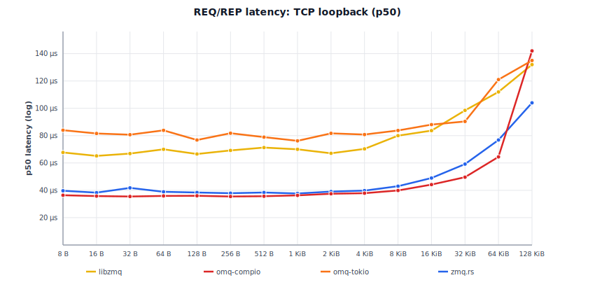

# Benchmarks

Linux 6.12 (Debian 13) VM on an Intel Mac Mini 2018 (i7-8700B, 3.2 GHz
base, turbo disabled, governor=performance, 6 vCPU), Rust 1.95.0,
default features.

Each cell is the **min wall time** across multiple runs with warmup.
Sources: `omq-compio/benches/` and `omq-tokio/benches/`.

> **Compio bench topology.** `inproc`: single runtime, single thread
> (sender + receiver cooperatively scheduled). `inproc-mt`:
> multi-runtime inproc: PULL on its own thread/runtime, PUSHes on
> another. Wire transports (TCP/IPC): same multi-runtime shape as
> inproc-mt. omq-tokio uses a multi-thread runtime across all
> available cores throughout.

## PUSH/PULL throughput, single peer

Cells show `msgs/s / MB/s`.

**omq-compio:**

<!-- BEGIN push_pull_1peer_compio -->
| Size | inproc | inproc-mt | ipc | tcp | ws |
|---|---|---|---|---|---|
| 8 B | 4.88M / 39.0 MB/s | 14.99M / 120 MB/s | — | — | 6.22M / 49.8 MB/s |
| 32 B | 3.83M / 122 MB/s | 16.51M / 528 MB/s | 7.42M / 238 MB/s | 7.39M / 236 MB/s | 5.56M / 178 MB/s |
| 64 B | — | — | — | — | 4.48M / 287 MB/s |
| 128 B | 3.66M / 468 MB/s | 15.02M / 1.92 GB/s | 5.24M / 671 MB/s | 5.75M / 736 MB/s | 3.84M / 492 MB/s |
| 256 B | — | — | — | — | 3.45M / 882 MB/s |
| 512 B | 3.80M / 1.95 GB/s | 12.67M / 6.49 GB/s | 3.47M / 1.78 GB/s | 3.58M / 1.83 GB/s | 2.97M / 1.52 GB/s |
| 1 KiB | — | — | — | — | 1.96M / 2.01 GB/s |
| 2 KiB | 3.54M / 7.26 GB/s | 11.76M / 24.1 GB/s | 2.01M / 4.12 GB/s | 1.84M / 3.77 GB/s | 1.38M / 2.82 GB/s |
| 4 KiB | — | — | — | — | 801k / 3.28 GB/s |
| 8 KiB | 3.70M / 30.3 GB/s | 15.29M / 125.2 GB/s | 705k / 5.78 GB/s | 641k / 5.25 GB/s | 495k / 4.05 GB/s |
| 32 KiB | 3.79M / 124.1 GB/s | 14.75M / 483.4 GB/s | 179k / 5.87 GB/s | 174k / 5.69 GB/s | 129k / 4.24 GB/s |
| 128 KiB | 3.79M / 496.2 GB/s | 11.19M / 1466.2 GB/s | 57.3k / 7.51 GB/s | 58.3k / 7.64 GB/s | 29.5k / 3.87 GB/s |
| 512 KiB | — | — | — | 16.7k / 8.76 GB/s | — |

<!-- END push_pull_1peer_compio -->

**omq-tokio:**

<!-- BEGIN push_pull_1peer_tokio -->
| Size | inproc | ipc | tcp | ws |
|---|---|---|---|---|
| 32 B | 4.56M / 146 MB/s | 3.78M / 121 MB/s | 4.38M / 140 MB/s | — |
| 128 B | 4.08M / 522 MB/s | 736k / 94.2 MB/s | 4.18M / 535 MB/s | 2.33M / 298 MB/s |
| 512 B | 3.84M / 1.96 GB/s | 2.44M / 1.25 GB/s | 3.76M / 1.93 GB/s | — |
| 2 KiB | 3.85M / 7.88 GB/s | 235k / 482 MB/s | 1.67M / 3.43 GB/s | 1.31M / 2.68 GB/s |
| 8 KiB | 4.34M / 35.6 GB/s | 75.0k / 614 MB/s | 553k / 4.53 GB/s | 457k / 3.74 GB/s |
| 32 KiB | 4.28M / 140.3 GB/s | 125k / 4.09 GB/s | 170k / 5.56 GB/s | — |
| 128 KiB | 4.15M / 543.9 GB/s | 32.4k / 4.25 GB/s | 35.0k / 4.58 GB/s | — |

<!-- END push_pull_1peer_tokio -->

Inproc "GB/s" at large payloads reflects zero-copy Arc-clone: no kernel
traversal.

## PUSH/PULL throughput, 8 peers

8 PUSH peers -> 1 PULL. Cells show `msgs/s / MB/s`.

**omq-compio:**

<!-- BEGIN push_pull_8peer_compio -->
| Size | inproc | ipc | tcp | ws |
|---|---|---|---|---|
| 8 B | — | — | — | 3.85M / 30.8 MB/s |
| 32 B | 3.82M / 122 MB/s | 5.51M / 176 MB/s | 5.56M / 178 MB/s | 4.50M / 144 MB/s |
| 64 B | — | — | — | 2.55M / 163 MB/s |
| 128 B | 3.66M / 469 MB/s | 3.91M / 500 MB/s | 4.02M / 515 MB/s | 2.44M / 312 MB/s |
| 256 B | — | — | — | 2.25M / 576 MB/s |
| 512 B | 3.59M / 1.84 GB/s | 2.94M / 1.51 GB/s | 2.29M / 1.17 GB/s | 1.94M / 993 MB/s |
| 1 KiB | — | — | — | 1.45M / 1.49 GB/s |
| 2 KiB | 3.69M / 7.55 GB/s | 1.37M / 2.81 GB/s | 1.33M / 2.73 GB/s | 978k / 2.00 GB/s |
| 4 KiB | — | — | — | 568k / 2.33 GB/s |
| 8 KiB | 3.68M / 30.2 GB/s | 444k / 3.64 GB/s | 396k / 3.24 GB/s | 309k / 2.53 GB/s |
| 32 KiB | 3.78M / 123.8 GB/s | 153k / 5.03 GB/s | 114k / 3.73 GB/s | 85.8k / 2.81 GB/s |
| 128 KiB | 3.77M / 494.4 GB/s | 39.3k / 5.15 GB/s | 30.8k / 4.03 GB/s | 21.1k / 2.76 GB/s |

<!-- END push_pull_8peer_compio -->

**omq-tokio:**

<!-- BEGIN push_pull_8peer_tokio -->
| Size | inproc | ipc | tcp | ws |
|---|---|---|---|---|
| 32 B | 3.43M / 110 MB/s | 3.83M / 123 MB/s | 4.13M / 132 MB/s | — |
| 128 B | 3.39M / 435 MB/s | 6.65M / 851 MB/s | 3.80M / 487 MB/s | 2.57M / 330 MB/s |
| 512 B | 3.46M / 1.77 GB/s | 3.41M / 1.75 GB/s | 3.63M / 1.86 GB/s | — |
| 2 KiB | 3.47M / 7.11 GB/s | 2.21M / 4.53 GB/s | 2.29M / 4.70 GB/s | 1.66M / 3.40 GB/s |
| 8 KiB | 3.44M / 28.2 GB/s | 580k / 4.75 GB/s | 619k / 5.07 GB/s | 614k / 5.03 GB/s |
| 32 KiB | 3.57M / 117.1 GB/s | 162k / 5.32 GB/s | 191k / 6.27 GB/s | — |
| 128 KiB | 3.43M / 449.5 GB/s | 58.9k / 7.72 GB/s | 54.3k / 7.12 GB/s | — |

<!-- END push_pull_8peer_tokio -->

## PUSH/PULL fan-out throughput, 8 peers

1 PUSH -> 8 PULL. Cells show `msgs/s / MB/s`.

**omq-compio:**

<!-- BEGIN push_pull_fanout_8peer_compio -->
| Size | ipc | tcp |
|---|---|---|
| 128 B | 3.55M / 454 MB/s | 3.43M / 439 MB/s |
| 2 KiB | 1.31M / 2.68 GB/s | 1.62M / 3.31 GB/s |
| 8 KiB | 401k / 3.28 GB/s | 371k / 3.04 GB/s |

<!-- END push_pull_fanout_8peer_compio -->

**omq-tokio:**

<!-- BEGIN push_pull_fanout_8peer_tokio -->
| Size | inproc | ipc | tcp |
|---|---|---|---|
| 128 B | 1.89M / 242 MB/s | 5.32M / 681 MB/s | 6.37M / 815 MB/s |
| 2 KiB | 1.66M / 3.39 GB/s | 3.43M / 7.02 GB/s | 2.70M / 5.53 GB/s |
| 8 KiB | 1.76M / 14.4 GB/s | 839k / 6.88 GB/s | 560k / 4.59 GB/s |

<!-- END push_pull_fanout_8peer_tokio -->

## REQ/REP latency (single peer)

Serial ping-pong: 1 000 warmup + 10 000 measured iterations per cell.
All values are wall time.

<!-- BEGIN latency_percentiles -->
| transport | size | compio p50 | compio p99 | tokio p50 | tokio p99 |
|---|---|---|---|---|---|
| inproc | 32 B | 2.61 µs | 2.68 µs | 24.8 µs | 78.7 µs |
| inproc | 64 B | 5.19 µs | 18.4 µs | 28.4 µs | 36.4 µs |
| inproc | 128 B | 2.68 µs | 2.77 µs | 23.7 µs | 79.1 µs |
| inproc | 256 B | 5.28 µs | 6.31 µs | 27.8 µs | 46.5 µs |
| inproc | 512 B | 2.61 µs | 2.68 µs | 25.2 µs | 78.8 µs |
| inproc | 1 KiB | 5.32 µs | 5.50 µs | 27.6 µs | 44.4 µs |
| inproc | 2 KiB | 2.67 µs | 2.75 µs | 24.4 µs | 82.5 µs |
| inproc | 4 KiB | 5.36 µs | 5.62 µs | 29.9 µs | 40.5 µs |
| inproc | 8 KiB | 2.70 µs | 2.77 µs | 27.1 µs | 77.9 µs |
| inproc | 32 KiB | 2.68 µs | 2.76 µs | 26.8 µs | 81.6 µs |
| inproc | 128 KiB | 2.67 µs | 2.80 µs | 24.8 µs | 81.9 µs |
| ipc | 32 B | 15.1 µs | 22.9 µs | 51.5 µs | 111 µs |
| ipc | 64 B | 21.8 µs | 31.0 µs | 62.5 µs | 861 µs |
| ipc | 128 B | 15.0 µs | 21.8 µs | 47.2 µs | 93.8 µs |
| ipc | 256 B | 22.6 µs | 31.7 µs | 63.7 µs | 77.0 µs |
| ipc | 512 B | 15.1 µs | 21.9 µs | 49.2 µs | 82.3 µs |
| ipc | 1 KiB | 22.9 µs | 32.3 µs | 64.4 µs | 861 µs |
| ipc | 2 KiB | 16.1 µs | 29.3 µs | 51.0 µs | 81.9 µs |
| ipc | 4 KiB | 24.9 µs | 44.4 µs | 64.0 µs | 80.0 µs |
| ipc | 8 KiB | 19.5 µs | 38.2 µs | 55.7 µs | 88.7 µs |
| ipc | 32 KiB | 26.1 µs | 35.2 µs | 69.8 µs | 112 µs |
| ipc | 128 KiB | 87.8 µs | 239 µs | 82.7 µs | 107 µs |
| tcp | 32 B | 22.4 µs | 30.8 µs | 62.9 µs | 107 µs |
| tcp | 64 B | 29.8 µs | 45.0 µs | 76.4 µs | 994 µs |
| tcp | 128 B | 21.8 µs | 41.1 µs | 60.7 µs | 80.0 µs |
| tcp | 256 B | 29.7 µs | 44.1 µs | 77.0 µs | 95.5 µs |
| tcp | 512 B | 22.3 µs | 30.0 µs | 63.9 µs | 114 µs |
| tcp | 1 KiB | 29.9 µs | 44.9 µs | 77.9 µs | 97.9 µs |
| tcp | 2 KiB | 23.1 µs | 42.5 µs | 61.4 µs | 809 µs |
| tcp | 4 KiB | 31.8 µs | 47.0 µs | 77.7 µs | 950 µs |
| tcp | 8 KiB | 26.3 µs | 47.2 µs | 63.6 µs | 89.0 µs |
| tcp | 32 KiB | 34.8 µs | 43.8 µs | 78.8 µs | 96.4 µs |
| tcp | 128 KiB | 203 µs | 251 µs | 115 µs | 135 µs |

<!-- END latency_percentiles -->

<p align="center">
  
</p>

## CLIENT/SERVER latency percentiles

Same methodology as above, using CLIENT/SERVER sockets instead of REQ/REP.

<!-- BEGIN client_server_latency_percentiles -->
| transport | size | compio p50 | compio p99 | tokio p50 | tokio p99 |
|---|---|---|---|---|---|
| inproc | 128 B | 2.34 µs | 2.40 µs | 15.4 µs | 25.9 µs |
| inproc | 2 KiB | 2.35 µs | 2.41 µs | 16.3 µs | 24.6 µs |
| inproc | 8 KiB | 2.34 µs | 2.39 µs | 17.8 µs | 27.8 µs |
| ipc | 128 B | 14.9 µs | 19.2 µs | 42.4 µs | 87.6 µs |
| ipc | 2 KiB | 16.0 µs | 31.8 µs | 47.1 µs | 95.5 µs |
| ipc | 8 KiB | 19.4 µs | 34.4 µs | 46.6 µs | 800 µs |
| tcp | 128 B | 21.8 µs | 32.5 µs | 46.9 µs | 60.3 µs |
| tcp | 2 KiB | 23.1 µs | 44.6 µs | 46.9 µs | 64.3 µs |
| tcp | 8 KiB | 25.8 µs | 46.1 µs | 50.7 µs | 68.9 µs |

<!-- END client_server_latency_percentiles -->

## REQ/REP throughput (single peer)

Cells show `msgs/s / MB/s`.

**omq-compio:**

<!-- BEGIN req_rep_compio -->
| Size | inproc | ipc | tcp |
|---|---|---|---|
| 32 B | 410k / 13.1 MB/s | 69.4k / 2.22 MB/s | 46.3k / 1.48 MB/s |
| 128 B | 371k / 47.5 MB/s | 65.0k / 8.33 MB/s | 43.5k / 5.56 MB/s |
| 512 B | 386k / 198 MB/s | 64.4k / 33.0 MB/s | 43.4k / 22.2 MB/s |
| 2 KiB | 376k / 771 MB/s | 59.1k / 121 MB/s | 41.1k / 84.3 MB/s |
| 8 KiB | 374k / 3.07 GB/s | 48.6k / 398 MB/s | 37.8k / 309 MB/s |
| 32 KiB | 409k / 13.4 GB/s | 39.0k / 1.28 GB/s | 28.8k / 943 MB/s |
| 128 KiB | 408k / 53.4 GB/s | 6.1k / 793 MB/s | 8.5k / 1.11 GB/s |

<!-- END req_rep_compio -->

**omq-tokio:**

<!-- BEGIN req_rep_tokio -->
| Size | inproc | ipc | tcp |
|---|---|---|---|
| 32 B | 36.7k / 1.17 MB/s | 15.6k / 0.50 MB/s | 16.3k / 0.52 MB/s |
| 128 B | 37.0k / 4.74 MB/s | 18.1k / 2.32 MB/s | 1.3k / 0.17 MB/s |
| 512 B | 36.8k / 18.9 MB/s | 18.1k / 9.25 MB/s | 15.9k / 8.13 MB/s |
| 2 KiB | 37.4k / 76.7 MB/s | 19.4k / 39.8 MB/s | 15.8k / 32.4 MB/s |
| 8 KiB | 38.1k / 312 MB/s | 18.3k / 150 MB/s | 15.7k / 129 MB/s |
| 32 KiB | 36.5k / 1.20 GB/s | 13.0k / 427 MB/s | 12.7k / 416 MB/s |
| 128 KiB | 37.4k / 4.90 GB/s | 11.1k / 1.46 GB/s | 8.8k / 1.15 GB/s |

<!-- END req_rep_tokio -->

## PUB/SUB throughput (3 peers)

1 PUB -> 3 SUB. Cells show `msgs/s / MB/s`.

**omq-compio:**

<!-- BEGIN pub_sub_compio -->
| Size | inproc | ipc | tcp |
|---|---|---|---|
| 32 B | 1.24M / 39.8 MB/s | 1.43M / 45.8 MB/s | 1.42M / 45.5 MB/s |
| 128 B | 1.09M / 140 MB/s | 1.35M / 173 MB/s | 1.35M / 173 MB/s |
| 512 B | 1.16M / 595 MB/s | 1.01M / 515 MB/s | 995k / 510 MB/s |
| 2 KiB | 1.10M / 2.25 GB/s | 481k / 986 MB/s | 469k / 961 MB/s |
| 8 KiB | 1.11M / 9.12 GB/s | 177k / 1.45 GB/s | 160k / 1.31 GB/s |
| 32 KiB | 1.18M / 38.6 GB/s | 94.6k / 3.10 GB/s | 79.5k / 2.60 GB/s |
| 128 KiB | 1.16M / 151.8 GB/s | 24.7k / 3.24 GB/s | 21.7k / 2.85 GB/s |

<!-- END pub_sub_compio -->

**omq-tokio:**

<!-- BEGIN pub_sub_tokio -->
| Size | inproc | ipc | tcp |
|---|---|---|---|
| 32 B | 1.33M / 42.7 MB/s | 1.73M / 55.3 MB/s | 1.67M / 53.4 MB/s |
| 128 B | 1.23M / 157 MB/s | 1.42M / 182 MB/s | 1.39M / 178 MB/s |
| 512 B | 1.32M / 674 MB/s | 1.30M / 667 MB/s | 1.09M / 556 MB/s |
| 2 KiB | 1.24M / 2.53 GB/s | 733k / 1.50 GB/s | 651k / 1.33 GB/s |
| 8 KiB | 1.19M / 9.78 GB/s | 279k / 2.29 GB/s | 317k / 2.60 GB/s |
| 32 KiB | 1.06M / 34.6 GB/s | 106k / 3.48 GB/s | 114k / 3.72 GB/s |
| 128 KiB | 638k / 83.6 GB/s | 34.8k / 4.57 GB/s | 7.9k / 1.03 GB/s |

<!-- END pub_sub_tokio -->

## ROUTER/DEALER throughput (3 peers)

3 DEALER -> 1 ROUTER. Cells show `msgs/s / MB/s`.

**omq-compio:**

<!-- BEGIN router_dealer_compio -->
| Size | inproc | ipc | tcp |
|---|---|---|---|
| 32 B | 3.65M / 117 MB/s | 3.23M / 103 MB/s | 3.07M / 98.1 MB/s |
| 128 B | 3.64M / 466 MB/s | 2.57M / 329 MB/s | 2.58M / 330 MB/s |
| 512 B | 3.74M / 1.91 GB/s | 2.14M / 1.10 GB/s | 1.83M / 936 MB/s |
| 2 KiB | 3.65M / 7.48 GB/s | 1.25M / 2.55 GB/s | 1.13M / 2.31 GB/s |
| 8 KiB | 3.66M / 30.0 GB/s | 469k / 3.84 GB/s | 447k / 3.66 GB/s |
| 32 KiB | 3.80M / 124.4 GB/s | 164k / 5.38 GB/s | 116k / 3.79 GB/s |
| 128 KiB | 3.79M / 496.3 GB/s | 43.9k / 5.75 GB/s | 27.9k / 3.66 GB/s |

<!-- END router_dealer_compio -->

**omq-tokio:**

<!-- BEGIN router_dealer_tokio -->
| Size | inproc | ipc | tcp |
|---|---|---|---|
| 32 B | 1.24M / 39.7 MB/s | 1.08M / 34.7 MB/s | 1.05M / 33.6 MB/s |
| 128 B | 957k / 122 MB/s | 1.23M / 158 MB/s | 1.19M / 153 MB/s |
| 512 B | 1.29M / 660 MB/s | 1.27M / 648 MB/s | 1.15M / 590 MB/s |
| 2 KiB | 981k / 2.01 GB/s | 1.17M / 2.39 GB/s | 1.08M / 2.20 GB/s |
| 8 KiB | 957k / 7.84 GB/s | 572k / 4.68 GB/s | 497k / 4.07 GB/s |
| 32 KiB | 1.11M / 36.3 GB/s | 160k / 5.24 GB/s | 128k / 4.19 GB/s |
| 128 KiB | 1.01M / 132.1 GB/s | 72.9k / 9.56 GB/s | 39.4k / 5.17 GB/s |

<!-- END router_dealer_tokio -->

## PAIR throughput (single peer)

Cells show `msgs/s / MB/s`.

**omq-compio:**

<!-- BEGIN pair_compio -->
| Size | inproc | ipc | tcp |
|---|---|---|---|
| 32 B | 3.81M / 122 MB/s | 6.79M / 217 MB/s | 6.37M / 204 MB/s |
| 128 B | 3.73M / 477 MB/s | 4.55M / 583 MB/s | 4.66M / 597 MB/s |
| 512 B | 4.00M / 2.05 GB/s | 3.56M / 1.82 GB/s | 3.36M / 1.72 GB/s |
| 2 KiB | 3.77M / 7.72 GB/s | 1.84M / 3.77 GB/s | 1.78M / 3.64 GB/s |
| 8 KiB | 3.79M / 31.0 GB/s | 636k / 5.21 GB/s | 628k / 5.15 GB/s |
| 32 KiB | 3.96M / 129.9 GB/s | 170k / 5.56 GB/s | 171k / 5.61 GB/s |
| 128 KiB | 3.94M / 516.0 GB/s | 59.0k / 7.74 GB/s | 66.0k / 8.65 GB/s |

<!-- END pair_compio -->

**omq-tokio:**

<!-- BEGIN pair_tokio -->
| Size | inproc | ipc | tcp |
|---|---|---|---|
| 32 B | 1.52M / 48.6 MB/s | 3.98M / 127 MB/s | 4.11M / 131 MB/s |
| 128 B | 480k / 61.4 MB/s | 3.45M / 441 MB/s | 4.94M / 632 MB/s |
| 512 B | 1.48M / 759 MB/s | 2.34M / 1.20 GB/s | 3.44M / 1.76 GB/s |
| 2 KiB | 511k / 1.05 GB/s | 1.22M / 2.49 GB/s | 1.55M / 3.17 GB/s |
| 8 KiB | 464k / 3.80 GB/s | 444k / 3.63 GB/s | 572k / 4.69 GB/s |
| 32 KiB | 1.60M / 52.5 GB/s | 115k / 3.77 GB/s | 168k / 5.51 GB/s |
| 128 KiB | 912k / 119.6 GB/s | 34.3k / 4.49 GB/s | 38.9k / 5.10 GB/s |

<!-- END pair_tokio -->

## Cross-library comparisons

See [COMPARISONS.md](COMPARISONS.md) for two-process TCP benchmarks against
libzmq and zmq.rs. Run `./scripts/compare_libzmq.sh --update-benchmarks` or
`./scripts/compare_zmqrs.sh --update-benchmarks` to refresh those tables.

## Compression transport benchmarks

See [BENCHMARKS_COMPRESSION.md](BENCHMARKS_COMPRESSION.md) for bandwidth-limited throughput charts
and compression ratio tables. Those benchmarks use structured JSON payloads
over `tc`-rate-limited loopback and are run separately from the tables above.

## PUSH/PULL throughput, priority routing (single peer)

Same topology as the single-peer table but with `priority` feature (strict
per-pipe queues). Run with `bench_run.rb --with-priority` to update.

**omq-compio:**

<!-- BEGIN push_pull_priority_compio -->
| Size | inproc | ipc | tcp |
|---|---|---|---|
| 32 B | 4.47M | 4.13M | 4.18M |
| 128 B | 4.14M | 3.70M | 3.65M |
| 512 B | 4.19M | 2.99M | 2.95M |
| 2 KiB | 4.08M | 1.74M | 1.58M |
| 8 KiB | 4.17M | 669k | 575k |
| 32 KiB | 4.17M | 176k | 162k |
| 128 KiB | 4.19M | 59.6k | 61.2k |

<!-- END push_pull_priority_compio -->

**omq-tokio:**

<!-- BEGIN push_pull_priority_tokio -->
| Size | inproc | ipc | tcp |
|---|---|---|---|
| 32 B | 3.49M | 4.01M | 3.83M |
| 128 B | 4.30M | 3.26M | 3.17M |
| 512 B | 3.46M | 2.81M | 2.50M |
| 2 KiB | 4.23M | 1.17M | 1.51M |
| 8 KiB | 3.93M | 522k | 461k |
| 32 KiB | 4.16M | 115k | 167k |
| 128 KiB | 3.80M | 35.1k | 43.7k |

<!-- END push_pull_priority_tokio -->

## Mechanism overhead (PUSH/PULL over TCP)

End-to-end throughput with NULL (no crypto), CURVE (XSalsa20-Poly1305), and
BLAKE3ZMQ (ChaCha20-BLAKE3) over loopback TCP. Higher is better. omq-proto
pins a `chacha20-blake3` fork with `#[target_feature(enable = "avx2")]`;
without it BLAKE3ZMQ drops to ~50 MiB/s at bulk sizes. CURVE plateaus at
~557 MB/s (salsa20 has no SIMD path).

> **BLAKE3ZMQ is not independently audited.** Use **CURVE** (RFC 26) for
> production.

<!-- BEGIN mechanism_frame -->
| Size | NULL | CURVE | BLAKE3ZMQ |
|---|---:|---:|---:|
| 8 B | 66.5 MB/s | 4.92 MB/s | 9.28 MB/s |
| 32 B | 231 MB/s | 18.9 MB/s | 36.3 MB/s |
| 64 B | 441 MB/s | 31.5 MB/s | 69.0 MB/s |
| 128 B | 713 MB/s | 57.2 MB/s | 115 MB/s |
| 256 B | 1.23 GB/s | 105 MB/s | 209 MB/s |
| 512 B | 1.89 GB/s | 175 MB/s | 350 MB/s |
| 1 KiB | 2.65 GB/s | 243 MB/s | 461 MB/s |
| 2 KiB | 3.53 GB/s | 331 MB/s | 547 MB/s |
| 4 KiB | 4.07 GB/s | 371 MB/s | 719 MB/s |
| 8 KiB | 4.82 GB/s | 407 MB/s | 826 MB/s |
| 32 KiB | 4.68 GB/s | 449 MB/s | 985 MB/s |
| 128 KiB | 7.35 GB/s | 477 MB/s | 1.11 GB/s |

<!-- END mechanism_frame -->

<p align="center">
  
</p>

## Reproducing

```sh
cargo bench -p omq-compio --bench push_pull
cargo bench -p omq-tokio  --bench push_pull
cargo bench -p omq-compio --bench req_rep

# Convenience:
./scripts/bench_run.rb [--all-features] [--all-sizes]    # adds results to JSONL
./scripts/bench_run.rb --chart-sizes                     # dense ×2 sweep for charts
./scripts/bench_run.rb --with-priority [--all-sizes]     # priority feature only
./scripts/bench_report.rb [--update-benchmarks]          # regenerates tables

# WebSocket transport (requires ws feature):
OMQ_BENCH_TRANSPORTS=ws cargo bench -p omq-compio --features ws --bench push_pull
OMQ_BENCH_TRANSPORTS=ws cargo bench -p omq-tokio  --features ws --bench push_pull

# Override transports / sizes / peer counts via env:
OMQ_BENCH_TRANSPORTS=tcp OMQ_BENCH_PEERS=3 OMQ_BENCH_SIZES=128,2048,32768 cargo bench -p omq-compio --bench push_pull

# Two-process libzmq vs omq comparison (requires libzmq installed):
# build: gcc scripts/libzmq_bench_peer.c -o scripts/libzmq_bench_peer -lzmq
# then run scripts/compare_libzmq.sh [--update-benchmarks]

# Two-process zmq.rs vs omq comparison (pure Rust, no system packages):
# ./scripts/compare_zmqrs.sh [--update-benchmarks]

# Charts (SVG, generated from COMPARISONS.md or JSONL data):
python3 scripts/gen_comparison_chart.py          # doc/charts/throughput.svg (from COMPARISONS.md)
python3 scripts/gen_mechanism_chart.py            # doc/charts/mechanism.svg (from BENCHMARKS.md)

# Compression charts require a bench run first (writes JSONL):
#   1. Rate-limit loopback:
#      sudo tc qdisc replace dev lo root tbf rate 1gbit burst 512kb latency 50ms
#   2. Run bench:
#      cargo bench -p omq-compio --features lz4,zstd --bench compression
#   3. Generate chart:
python3 scripts/gen_compression_chart.py --link 1g    # doc/charts/compression_1g.svg
python3 scripts/gen_compression_chart.py --link 100m  # doc/charts/compression_100m.svg
#   Use --run-prefix ts-NNNNN to select a specific bench run from the JSONL.
#   Use --tput-max N (MB/s) to override the right-axis scale.
#   4. Remove rate limit: sudo tc qdisc del dev lo root
```
