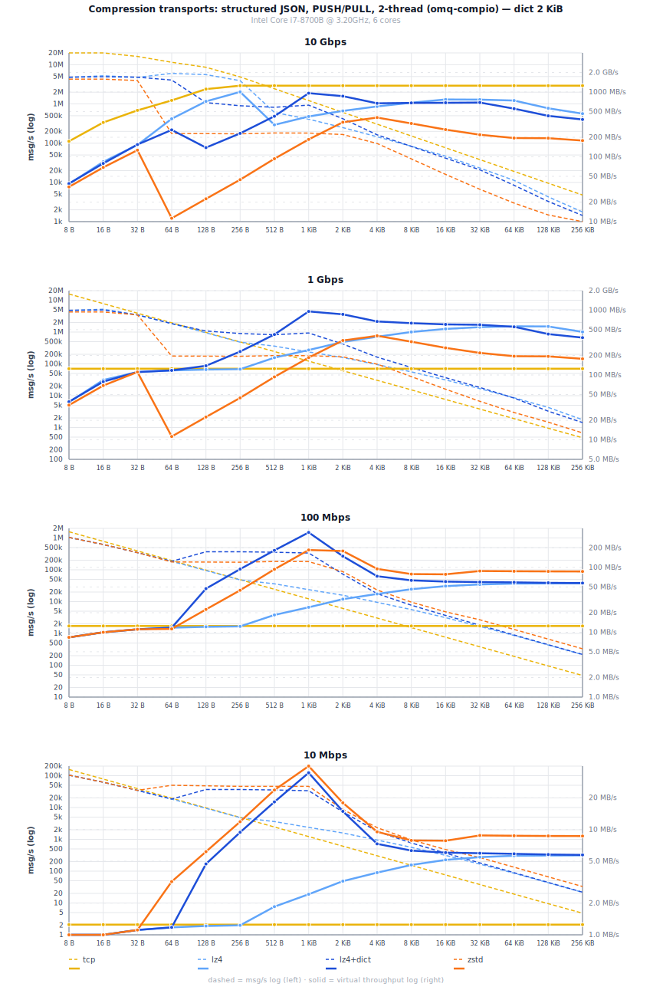
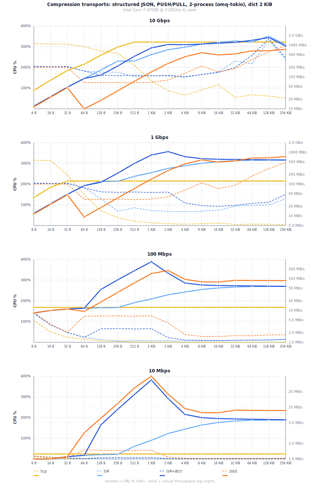

# Compression Transport Benchmarks

Realistic JSON event-log payloads over TCP loopback. Zstd level -3
(fast strategy), LZ4 default. Zstd auto-trains a dictionary for messages <= 2 KiB;
lz4+dict reuses the same zstd-trained dictionary.

Virtual throughput = msg/s x uncompressed size (effective app data rate
on a constrained link). Three panels show 1 Gbps, 100 Mbps, and 10 Mbps.

- **Slow links:** zstd with auto-dict dominates at small messages.
- **Fast links:** lz4 wins where CPU is the bottleneck.
- **Why zstd level -3:** level 3 (zstd default) compresses ~2% better
  but costs 14-20% more CPU at larger sizes. At dict-assisted sizes
  (<= 2 KiB), the receiver is the bottleneck, so neither level matters.

### Compression thresholds

Messages below a minimum size skip compression entirely and pass
through as plaintext. The defaults reflect extensive benchmarking
across link speeds and dict sizes:

| Transport | No dict | With dict |
|-----------|---------|-----------|
| lz4+tcp   | 512 B   | 128 B     |
| zstd+tcp  | 512 B   | 64 B      |

lz4's with-dict threshold is higher than zstd's because lz4 achieves
lower compression ratios on tiny messages (< 4x below 128 B with a
2 KiB dict) while costing 5-7x more CPU per message than passthrough.
zstd reaches useful ratios earlier (2.6x at 64 B) and targets slower
links where wire savings matter more than CPU.

Operators on high-bandwidth links who send many small messages can
raise the threshold further via `Options::compression_threshold()` to
avoid the CPU overhead of compressing messages that already fit in a
single packet.

### Dict size

Auto-trained dict capacity defaults to 2 KiB. Benchmarks across dict
sizes (256 B to 8 KiB) show that a 2 KiB dict captures most of the
compressible structure in typical JSON payloads. Larger dicts (4-8 KiB)
produce marginally better wire ratios at 2 KiB+ message sizes but hurt
throughput at smaller sizes due to L1/L2 cache pressure during
compression. The default max accepted dict size from a peer is 8 KiB
for both transports.

<details><summary>Test environment</summary>

Linux 6.12 (Debian 13) VM, Intel i7-8700B 3.2 GHz (turbo off,
governor=performance, 6 vCPU), Rust 1.95.0. Min wall time across
multiple runs with warmup. Link-speed projections computed from
measured compression ratio and CPU-limited throughput.

</details>

<p align="center">
  
</p>
<p align="center">
  
</p>

## Throughput tables

### 100 Mbps

<!-- BEGIN compression_100m -->
| Size | tcp msg/s | lz4+tcp msg/s | zstd+tcp msg/s | tcp virt | lz4+tcp virt | zstd+tcp virt |
|---|---:|---:|---:|---:|---:|---:|
| 8 B | 1.56M | 1.04M | 1.04M | 12.5 MB/s | 8.33 MB/s | 8.33 MB/s |
| 16 B | 781k | 625k | 625k | 12.5 MB/s | 10.0 MB/s | 10.0 MB/s |
| 32 B | 391k | 347k | 347k | 12.5 MB/s | 11.1 MB/s | 11.1 MB/s |
| 64 B | 195k | 184k | 187k | 12.5 MB/s | 11.8 MB/s | 11.9 MB/s |
| 128 B | 97.7k | 94.7k | 186k | 12.5 MB/s | 12.1 MB/s | 23.8 MB/s |
| 256 B | 48.8k | 48.1k | 187k | 12.5 MB/s | 12.3 MB/s | 47.7 MB/s |
| 512 B | 24.4k | 36.1k | 186k | 12.5 MB/s | 18.5 MB/s | 95.0 MB/s |
| 1 KiB | 12.2k | 23.7k | 183k | 12.5 MB/s | 24.3 MB/s | 188 MB/s |
| 2 KiB | 6.1k | 15.8k | 85.6k | 12.5 MB/s | 32.4 MB/s | 175 MB/s |
| 4 KiB | 3.1k | 9.5k | 20.4k | 12.5 MB/s | 39.0 MB/s | 83.7 MB/s |
| 8 KiB | 1.5k | 5.6k | 8.9k | 12.5 MB/s | 46.1 MB/s | 73.1 MB/s |
| 16 KiB | 763 | 3.1k | 4.3k | 12.5 MB/s | 51.4 MB/s | 71.3 MB/s |
| 32 KiB | 381 | 1.7k | 2.7k | 12.5 MB/s | 54.6 MB/s | 87.6 MB/s |
| 64 KiB | 191 | 859 | 1.3k | 12.5 MB/s | 56.3 MB/s | 87.1 MB/s |
| 128 KiB | 95 | 432 | 662 | 12.5 MB/s | 56.6 MB/s | 86.8 MB/s |
| 256 KiB | 48 | 217 | 330 | 12.5 MB/s | 56.8 MB/s | 86.6 MB/s |

<!-- END compression_100m -->

### 100 Mbps, lz4 with pre-trained dict

<!-- BEGIN compression_100m_dict -->
| Size | lz4+tcp msg/s | lz4+tcp virt |
|---|---:|---:|
| 8 B | 1.04M | 8.33 MB/s |
| 16 B | 625k | 10.0 MB/s |
| 32 B | 470k | 15.1 MB/s |
| 64 B | 431k | 27.6 MB/s |
| 128 B | 431k | 55.2 MB/s |
| 256 B | 431k | 110 MB/s |
| 512 B | 417k | 213 MB/s |
| 1 KiB | 321k | 328 MB/s |
| 2 KiB | 82.2k | 168 MB/s |
| 4 KiB | 18.4k | 75.4 MB/s |
| 8 KiB | 7.8k | 63.8 MB/s |
| 16 KiB | 3.7k | 60.6 MB/s |
| 32 KiB | 1.8k | 59.6 MB/s |
| 64 KiB | 898 | 58.9 MB/s |
| 128 KiB | 442 | 57.9 MB/s |
| 256 KiB | 219 | 57.4 MB/s |

<!-- END compression_100m_dict -->

### 1 Gbps

<!-- BEGIN compression_1g -->
| Size | tcp msg/s | lz4+tcp msg/s | zstd+tcp msg/s | tcp virt | lz4+tcp virt | zstd+tcp virt |
|---|---:|---:|---:|---:|---:|---:|
| 8 B | 15.62M | 4.73M | 4.19M | 125 MB/s | 37.8 MB/s | 33.5 MB/s |
| 16 B | 7.81M | 4.64M | 4.09M | 125 MB/s | 74.3 MB/s | 65.5 MB/s |
| 32 B | 3.91M | 3.47M | 3.47M | 125 MB/s | 111 MB/s | 111 MB/s |
| 64 B | 1.95M | 1.84M | 187k | 125 MB/s | 118 MB/s | 11.9 MB/s |
| 128 B | 977k | 947k | 186k | 125 MB/s | 121 MB/s | 23.8 MB/s |
| 256 B | 488k | 481k | 187k | 125 MB/s | 123 MB/s | 47.7 MB/s |
| 512 B | 244k | 361k | 186k | 125 MB/s | 185 MB/s | 95.0 MB/s |
| 1 KiB | 122k | 237k | 183k | 125 MB/s | 243 MB/s | 188 MB/s |
| 2 KiB | 61.0k | 158k | 177k | 125 MB/s | 324 MB/s | 362 MB/s |
| 4 KiB | 30.5k | 95.1k | 95.5k | 125 MB/s | 390 MB/s | 391 MB/s |
| 8 KiB | 15.3k | 56.3k | 41.6k | 125 MB/s | 461 MB/s | 341 MB/s |
| 16 KiB | 7.6k | 31.4k | 16.0k | 125 MB/s | 514 MB/s | 261 MB/s |
| 32 KiB | 3.8k | 16.7k | 7.4k | 125 MB/s | 546 MB/s | 242 MB/s |
| 64 KiB | 1.9k | 8.6k | 3.0k | 125 MB/s | 563 MB/s | 200 MB/s |
| 128 KiB | 954 | 4.3k | 1.5k | 125 MB/s | 566 MB/s | 195 MB/s |
| 256 KiB | 477 | 1.8k | 753 | 125 MB/s | 469 MB/s | 197 MB/s |

<!-- END compression_1g -->

### 1 Gbps, lz4 with pre-trained dict

<!-- BEGIN compression_1g_dict -->
| Size | lz4+tcp msg/s | lz4+tcp virt |
|---|---:|---:|
| 8 B | 4.68M | 37.5 MB/s |
| 16 B | 4.95M | 79.2 MB/s |
| 32 B | 470k | 15.1 MB/s |
| 64 B | 507k | 32.5 MB/s |
| 128 B | 485k | 62.1 MB/s |
| 256 B | 482k | 123 MB/s |
| 512 B | 456k | 233 MB/s |
| 1 KiB | 472k | 483 MB/s |
| 2 KiB | 293k | 601 MB/s |
| 4 KiB | 129k | 526 MB/s |
| 8 KiB | 73.2k | 600 MB/s |
| 16 KiB | 37.0k | 606 MB/s |
| 32 KiB | 18.2k | 596 MB/s |
| 64 KiB | 8.4k | 550 MB/s |
| 128 KiB | 3.3k | 435 MB/s |
| 256 KiB | 1.6k | 407 MB/s |

<!-- END compression_1g_dict -->

### 10 Mbps

<!-- BEGIN compression_10m -->
| Size | tcp msg/s | lz4+tcp msg/s | zstd+tcp msg/s | tcp virt | lz4+tcp virt | zstd+tcp virt |
|---|---:|---:|---:|---:|---:|---:|
| 8 B | 156k | 104k | 104k | 1.25 MB/s | 0.83 MB/s | 0.83 MB/s |
| 16 B | 78.1k | 62.5k | 62.5k | 1.25 MB/s | 1.00 MB/s | 1.00 MB/s |
| 32 B | 39.1k | 34.7k | 34.7k | 1.25 MB/s | 1.11 MB/s | 1.11 MB/s |
| 64 B | 19.5k | 18.4k | 50.0k | 1.25 MB/s | 1.18 MB/s | 3.20 MB/s |
| 128 B | 9.8k | 9.5k | 50.0k | 1.25 MB/s | 1.21 MB/s | 6.40 MB/s |
| 256 B | 4.9k | 4.8k | 46.3k | 1.25 MB/s | 1.23 MB/s | 11.9 MB/s |
| 512 B | 2.4k | 3.6k | 46.3k | 1.25 MB/s | 1.85 MB/s | 23.7 MB/s |
| 1 KiB | 1.2k | 2.4k | 39.1k | 1.25 MB/s | 2.43 MB/s | 40.0 MB/s |
| 2 KiB | 610 | 1.6k | 8.6k | 1.25 MB/s | 3.24 MB/s | 17.5 MB/s |
| 4 KiB | 305 | 951 | 2.0k | 1.25 MB/s | 3.90 MB/s | 8.37 MB/s |
| 8 KiB | 153 | 563 | 892 | 1.25 MB/s | 4.61 MB/s | 7.31 MB/s |
| 16 KiB | 76 | 314 | 435 | 1.25 MB/s | 5.14 MB/s | 7.13 MB/s |
| 32 KiB | 38 | 167 | 267 | 1.25 MB/s | 5.46 MB/s | 8.76 MB/s |
| 64 KiB | 19 | 86 | 133 | 1.25 MB/s | 5.63 MB/s | 8.71 MB/s |
| 128 KiB | 10 | 43 | 66 | 1.25 MB/s | 5.66 MB/s | 8.68 MB/s |
| 256 KiB | 5 | 22 | 33 | 1.25 MB/s | 5.68 MB/s | 8.66 MB/s |

<!-- END compression_10m -->

### 10 Mbps, lz4 with pre-trained dict

<!-- BEGIN compression_10m_dict -->
| Size | lz4+tcp msg/s | lz4+tcp virt |
|---|---:|---:|
| 8 B | 104k | 0.83 MB/s |
| 16 B | 62.5k | 1.00 MB/s |
| 32 B | 56.8k | 1.82 MB/s |
| 64 B | 43.1k | 2.76 MB/s |
| 128 B | 43.1k | 5.52 MB/s |
| 256 B | 43.1k | 11.0 MB/s |
| 512 B | 41.7k | 21.3 MB/s |
| 1 KiB | 32.1k | 32.8 MB/s |
| 2 KiB | 8.2k | 16.8 MB/s |
| 4 KiB | 1.8k | 7.54 MB/s |
| 8 KiB | 778 | 6.38 MB/s |
| 16 KiB | 370 | 6.06 MB/s |
| 32 KiB | 182 | 5.96 MB/s |
| 64 KiB | 90 | 5.89 MB/s |
| 128 KiB | 44 | 5.79 MB/s |
| 256 KiB | 22 | 5.74 MB/s |

<!-- END compression_10m_dict -->

## Running the benchmarks

One bench run at full loopback speed measures CPU-limited msg/s and
wire bytes per message. The chart and report scripts then project
throughput at each link speed: `effective_msgs_s = min(cpu_msgs_s,
link_bytes_s / wire_bytes)`. This avoids `tc tbf`, which
under-throttles small packets on loopback (they fit inside the token
bucket burst and loop back before the qdisc can shape them).

```sh
cargo bench -p omq-compio --features lz4,zstd --bench compression
cargo bench -p omq-tokio  --features lz4,zstd --bench compression

# Generate charts and tables
python3 scripts/gen_compression_chart.py --backend compio
python3 scripts/gen_compression_chart.py --backend tokio
ruby scripts/compression_report.rb --link 1g
ruby scripts/compression_report.rb --link 100m
ruby scripts/compression_report.rb --link 10m
```

Environment variables:

- `OMQ_BENCH_SIZES` -- override payload sizes (default: chart sizes, 8 B to 256 KiB)
- `OMQ_BENCH_ZSTD_LEVEL` -- override zstd compression level (default: -3)
- `OMQ_BENCH_ROUNDS` / `OMQ_BENCH_ROUND_MS` -- tune measurement duration
- `OMQ_BENCH_COMPRESSION_THRESHOLD` -- override minimum payload size for compression
- `OMQ_BENCH_DICT_SIZES` -- override dict sizes to bench (default: 2048; e.g. `256,512,1024,2048,4096,8192`)
