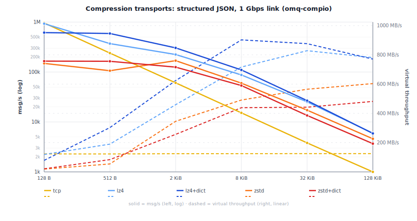
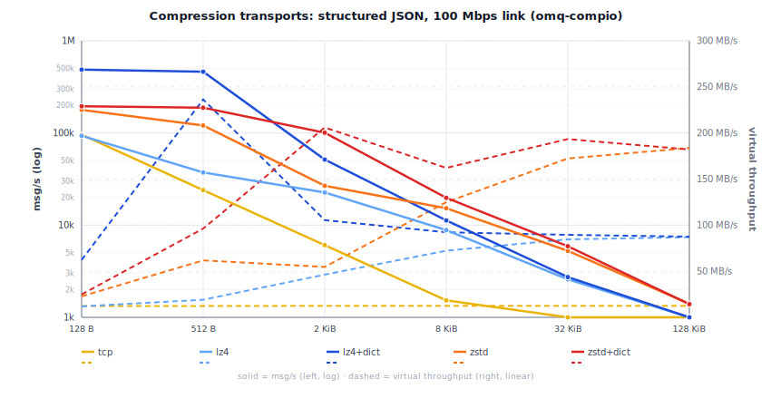

# Compression Transport Benchmarks

Linux 6.12 (Debian 13) VM on an Intel Mac Mini 2018 (i7-8700B, 3.2 GHz
base, turbo disabled, governor=performance, 6 vCPU), Rust 1.95.0,
default features.

Each cell is the **min wall time** across multiple runs with warmup.
Sources: `omq-compio/benches/`.

Structured JSON payloads (event-log records with timestamps, trace IDs,
repeated field names) over TCP loopback rate-limited with Linux `tc tbf`.
Sender and receiver run on separate threads so compression and
decompression overlap.

Zstd compression uses OMQ's default level -3 (fast strategy). Configurable via socket options.

Virtual throughput = msg/s x uncompressed message size: the effective
application data rate the compression ratio buys on a constrained link.

At 1 Gbps, LZ4 wins on raw speed; zstd catches up only at larger payloads where
its higher ratio compensates for slower compression.

<p align="center">
  
</p>

At 100 Mbps, the wire is the bottleneck and zstd's superior ratio dominates: zstd outperforms LZ4 at every payload size.

<p align="center">
  
</p>

## Throughput tables

### 100 Mbps

<!-- BEGIN compression_100m -->
| Size | tcp msg/s | lz4+tcp msg/s | zstd+tcp msg/s | tcp virt | lz4+tcp virt | zstd+tcp virt |
|---|---:|---:|---:|---:|---:|---:|
| 128 B | 96.1k | 93.3k | 182k | 12.3 MB/s | 11.9 MB/s | 23.3 MB/s |
| 512 B | 24.0k | 37.3k | 126k | 12.3 MB/s | 19.1 MB/s | 64.5 MB/s |
| 2 KiB | 6.1k | 22.6k | 26.7k | 12.4 MB/s | 46.2 MB/s | 54.8 MB/s |
| 8 KiB | 1.5k | 8.8k | 15.3k | 12.5 MB/s | 72.4 MB/s | 125 MB/s |
| 32 KiB | 381 | 2.6k | 5.3k | 12.5 MB/s | 84.6 MB/s | 173 MB/s |
| 128 KiB | 95 | 664 | 1.4k | 12.5 MB/s | 87.0 MB/s | 183 MB/s |

<!-- END compression_100m -->

### 100 Mbps, with pre-trained dict

<!-- BEGIN compression_100m_dict -->
| Size | lz4+tcp msg/s | zstd+tcp msg/s | lz4+tcp virt | zstd+tcp virt |
|---|---:|---:|---:|---:|
| 128 B | 500k | 194k | 64.0 MB/s | 24.9 MB/s |
| 512 B | 477k | 189k | 244 MB/s | 96.9 MB/s |
| 2 KiB | 51.4k | 101k | 105 MB/s | 206 MB/s |
| 8 KiB | 11.3k | 19.8k | 92.6 MB/s | 162 MB/s |
| 32 KiB | 2.7k | 5.9k | 89.6 MB/s | 194 MB/s |
| 128 KiB | 669 | 1.4k | 87.7 MB/s | 183 MB/s |

<!-- END compression_100m_dict -->

### 1 Gbps

<!-- BEGIN compression_1g -->
| Size | tcp msg/s | lz4+tcp msg/s | zstd+tcp msg/s | tcp virt | lz4+tcp virt | zstd+tcp virt |
|---|---:|---:|---:|---:|---:|---:|
| 128 B | 959k | 930k | 182k | 123 MB/s | 119 MB/s | 23.3 MB/s |
| 512 B | 240k | 371k | 121k | 123 MB/s | 190 MB/s | 61.9 MB/s |
| 2 KiB | 60.7k | 224k | 216k | 124 MB/s | 459 MB/s | 442 MB/s |
| 8 KiB | 15.2k | 87.5k | 80.8k | 125 MB/s | 717 MB/s | 662 MB/s |
| 32 KiB | 3.8k | 25.3k | 23.4k | 125 MB/s | 829 MB/s | 768 MB/s |
| 128 KiB | 954 | 6.0k | 5.8k | 125 MB/s | 783 MB/s | 754 MB/s |

<!-- END compression_1g -->

### 1 Gbps, with pre-trained dict

<!-- BEGIN compression_1g_dict -->
| Size | lz4+tcp msg/s | zstd+tcp msg/s | lz4+tcp virt | zstd+tcp virt |
|---|---:|---:|---:|---:|
| 128 B | 643k | 190k | 82.3 MB/s | 24.4 MB/s |
| 512 B | 623k | 190k | 319 MB/s | 97.2 MB/s |
| 2 KiB | 343k | 169k | 703 MB/s | 346 MB/s |
| 8 KiB | 111k | 96.2k | 907 MB/s | 788 MB/s |
| 32 KiB | 26.7k | 18.8k | 876 MB/s | 616 MB/s |
| 128 KiB | 5.9k | 4.9k | 769 MB/s | 639 MB/s |

<!-- END compression_1g_dict -->

## Running the benchmarks

Rate-limit loopback, run the compression bench, generate charts and
tables, then remove the limit:

```sh
# 100 Mbps
sudo tc qdisc replace dev lo root tbf rate 100mbit burst 128kb latency 1ms
OMQ_BENCH_SIZES=128,512,2048,8192,32768,131072 cargo bench -p omq-compio --features lz4,zstd --bench compression
python3 scripts/gen_compression_chart.py --link 100m --tput-max 300
ruby scripts/compression_report.rb --link 100m
sudo tc qdisc del dev lo root

# 1 Gbps
sudo tc qdisc replace dev lo root tbf rate 1gbit burst 128kb latency 1ms
OMQ_BENCH_SIZES=128,512,2048,8192,32768,131072 cargo bench -p omq-compio --features lz4,zstd --bench compression
python3 scripts/gen_compression_chart.py --link 1g --tput-max 1000
ruby scripts/compression_report.rb --link 1g
sudo tc qdisc del dev lo root
```

Environment variables:

- `OMQ_BENCH_SIZES` -- override payload sizes (default: 128,2048,8192)
- `OMQ_BENCH_ZSTD_LEVEL` -- override zstd compression level (default: -3)
- `OMQ_BENCH_ROUNDS` / `OMQ_BENCH_ROUND_MS` -- tune measurement duration
