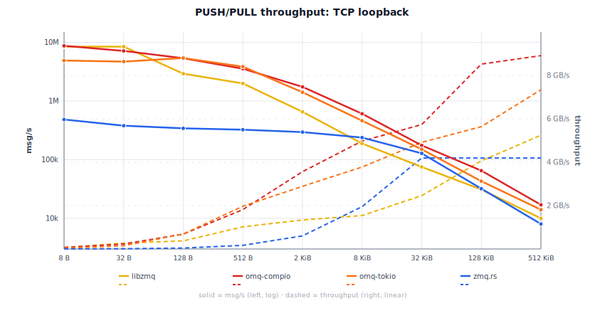

# Comparisons

Two-process benchmarks (inproc: single-process). 3 s timed window after 500 ms warmup.
Hardware: Linux 6.12 (Debian 13) VM, Intel i7-8700B 3.2 GHz 6-core, Rust 1.95.0.

  

## libzmq vs omq — inproc

Same process, no kernel socket overhead. libzmq 5.2.5 (C binary) vs omq-compio (io_uring, single thread) and omq-tokio (multi-thread).

omq inproc is true zero-copy: payloads are `Arc`-cloned, not memcpy'd. libzmq copies every message through its internal queues, so its throughput drops with size. omq stays flat.

Refresh: `ruby scripts/compare_libzmq.rb --inproc --update-benchmarks`

**omq-compio:**

<!-- BEGIN libzmq_comparison_inproc_compio -->
| Size | libzmq msg/s | libzmq MB/s | compio-mt msg/s | compio-mt MB/s | mt × | compio-st msg/s | compio-st MB/s | st × |
|-------|-------------|------------|----------------|---------------|------|----------------|---------------|------|
| 8 B | 10.78M | 86 MB/s | 15.88M | 127 MB/s | **1.5×** | 4.35M | 35 MB/s | 0.40× |
| 32 B | 10.50M | 336 MB/s | 14.51M | 464 MB/s | **1.4×** | 4.26M | 136 MB/s | 0.41× |
| 128 B | 3.10M | 397 MB/s | 12.26M | 1.6 GB/s | **4.0×** | 4.20M | 538 MB/s | **1.4×** |
| 512 B | 2.90M | 1.5 GB/s | 11.88M | 6.1 GB/s | **4.1×** | 4.26M | 2.2 GB/s | **1.5×** |
| 2 KiB | 1.90M | 3.9 GB/s | 12.02M | 24.6 GB/s | **6.3×** | 4.41M | 9.0 GB/s | **2.3×** |
| 8 KiB | 1.78M | 14.5 GB/s | 12.17M | 99.7 GB/s | **6.9×** | 4.40M | 36.1 GB/s | **2.5×** |
| 32 KiB | 397k | 13.0 GB/s | 11.24M | 368.2 GB/s | **28.3×** | 4.45M | 145.7 GB/s | **11.2×** |
| 128 KiB | 236k | 30.9 GB/s | 12.10M | 1586.3 GB/s | **51.3×** | 4.19M | 549.8 GB/s | **17.8×** |
| 512 KiB | 55k | 28.6 GB/s | 11.79M | 6183.8 GB/s | **216.4×** | 4.21M | 2206.7 GB/s | **77.2×** |
| 2 MiB | 13k | 28.2 GB/s | 11.88M | 24908.3 GB/s | **883.3×** | 4.39M | 9203.6 GB/s | **326.4×** |

<!-- END libzmq_comparison_inproc_compio -->

**omq-tokio:**

<!-- BEGIN libzmq_comparison_inproc_tokio -->
| Size | libzmq msg/s | libzmq MB/s | tokio msg/s | tokio MB/s | tokio × |
|-------|-------------|------------|------------|-----------|---------|
| 8 B | 10.78M | 86 MB/s | 4.14M | 33 MB/s | 0.38× |
| 32 B | 10.50M | 336 MB/s | 3.43M | 110 MB/s | 0.33× |
| 128 B | 3.10M | 397 MB/s | 4.14M | 530 MB/s | **1.3×** |
| 512 B | 2.90M | 1.5 GB/s | 4.18M | 2.1 GB/s | **1.4×** |
| 2 KiB | 1.90M | 3.9 GB/s | 4.11M | 8.4 GB/s | **2.2×** |
| 8 KiB | 1.78M | 14.5 GB/s | 4.15M | 34.0 GB/s | **2.3×** |
| 32 KiB | 397k | 13.0 GB/s | 4.23M | 138.7 GB/s | **10.7×** |
| 128 KiB | 236k | 30.9 GB/s | 3.93M | 515.7 GB/s | **16.7×** |
| 512 KiB | 55k | 28.6 GB/s | 3.95M | 2070.6 GB/s | **72.5×** |
| 2 MiB | 13k | 28.2 GB/s | 3.66M | 7677.1 GB/s | **272.2×** |

<!-- END libzmq_comparison_inproc_tokio -->

## libzmq vs omq — IPC

Abstract-namespace Unix socket. Push binds, pull connects. libzmq 5.2.5 (C binary) vs omq-compio (io_uring, single thread) and omq-tokio (multi-thread).

Refresh: `ruby scripts/compare_libzmq.rb --ipc --update-benchmarks`

**omq-compio:**

<!-- BEGIN libzmq_comparison_ipc_compio -->
| Size | libzmq msg/s | libzmq MB/s | omq-compio msg/s | omq-compio MB/s | compio × |
|-------|-------------|------------|-----------------|----------------|---------|
| 8 B | 8.75M | 70 MB/s | 8.65M | 69 MB/s | 0.99× |
| 32 B | 8.22M | 263 MB/s | 7.38M | 236 MB/s | 0.90× |
| 128 B | 2.97M | 380 MB/s | 4.94M | 632 MB/s | **1.7×** |
| 512 B | 2.33M | 1.2 GB/s | 3.44M | 1.8 GB/s | **1.5×** |
| 2 KiB | 826k | 1.7 GB/s | 1.96M | 4.0 GB/s | **2.4×** |
| 8 KiB | 253k | 2.1 GB/s | 674k | 5.5 GB/s | **2.7×** |
| 32 KiB | 103k | 3.4 GB/s | 176k | 5.8 GB/s | **1.7×** |
| 128 KiB | 35k | 4.5 GB/s | 63k | 8.3 GB/s | **1.8×** |
| 512 KiB | 11k | 6.0 GB/s | 22k | 11.5 GB/s | **1.9×** |
| 2 MiB | 2.9k | 6.1 GB/s | 5.2k | 10.9 GB/s | **1.8×** |

<!-- END libzmq_comparison_ipc_compio -->

**omq-tokio:**

<!-- BEGIN libzmq_comparison_ipc_tokio -->
| Size | libzmq msg/s | libzmq MB/s | omq-tokio msg/s | omq-tokio MB/s | tokio × |
|-------|-------------|------------|----------------|---------------|---------|
| 8 B | 8.75M | 70 MB/s | 4.00M | 32 MB/s | 0.46× |
| 32 B | 8.22M | 263 MB/s | 4.40M | 141 MB/s | 0.54× |
| 128 B | 2.97M | 380 MB/s | 5.32M | 681 MB/s | **1.8×** |
| 512 B | 2.33M | 1.2 GB/s | 4.69M | 2.4 GB/s | **2.0×** |
| 2 KiB | 826k | 1.7 GB/s | 1.69M | 3.5 GB/s | **2.0×** |
| 8 KiB | 253k | 2.1 GB/s | 417k | 3.4 GB/s | **1.6×** |
| 32 KiB | 103k | 3.4 GB/s | 156k | 5.1 GB/s | **1.5×** |
| 128 KiB | 35k | 4.5 GB/s | 52k | 6.8 GB/s | **1.5×** |
| 512 KiB | 11k | 6.0 GB/s | 6.2k | 3.3 GB/s | 0.54× |
| 2 MiB | 2.9k | 6.1 GB/s | 3.5k | 7.3 GB/s | **1.2×** |

<!-- END libzmq_comparison_ipc_tokio -->

## libzmq vs omq — TCP

TCP loopback, each process pinned to one core. Push binds, pull connects. libzmq 5.2.5 (C binary) vs omq-compio (io_uring, single thread) and omq-tokio (multi-thread).

Refresh: `ruby scripts/compare_libzmq.rb --tcp --update-benchmarks`

**omq-compio:**

<!-- BEGIN libzmq_comparison_tcp_compio -->
| Size | libzmq msg/s | libzmq MB/s | omq-compio msg/s | omq-compio MB/s | compio × |
|-------|-------------|------------|-----------------|----------------|----------|
| 8 B | 8.42M | 67 MB/s | 8.16M | 65 MB/s | 0.97× |
| 32 B | 8.25M | 264 MB/s | 7.14M | 228 MB/s | 0.87× |
| 128 B | 2.85M | 365 MB/s | 5.45M | 698 MB/s | **1.9×** |
| 512 B | 1.91M | 980 MB/s | 3.51M | 1.8 GB/s | **1.8×** |
| 2 KiB | 653k | 1.3 GB/s | 1.70M | 3.5 GB/s | **2.6×** |
| 8 KiB | 107k | 876 MB/s | 590k | 4.8 GB/s | **5.5×** |
| 32 KiB | 69.9k | 2.3 GB/s | 104k | 3.4 GB/s | **1.5×** |
| 128 KiB | 30.6k | 4.0 GB/s | 63.9k | 8.4 GB/s | **2.1×** |
| 512 KiB | 9.2k | 4.8 GB/s | 16.1k | 8.5 GB/s | **1.7×** |
| 2 MiB | 2.4k | 5.0 GB/s | 3.3k | 7.0 GB/s | **1.4×** |

<!-- END libzmq_comparison_tcp_compio -->

**omq-tokio:**

<!-- BEGIN libzmq_comparison_tcp_tokio -->
| Size | libzmq msg/s | libzmq MB/s | omq-tokio msg/s | omq-tokio MB/s | tokio × |
|-------|-------------|------------|----------------|---------------|----------|
| 8 B | 8.42M | 67 MB/s | 7.52M | 60 MB/s | 0.89× |
| 32 B | 8.25M | 264 MB/s | 6.49M | 208 MB/s | 0.79× |
| 128 B | 2.85M | 365 MB/s | 5.37M | 687 MB/s | **1.9×** |
| 512 B | 1.91M | 980 MB/s | 4.27M | 2.2 GB/s | **2.2×** |
| 2 KiB | 653k | 1.3 GB/s | 2.22M | 4.5 GB/s | **3.4×** |
| 8 KiB | 107k | 876 MB/s | 285k | 2.3 GB/s | **2.7×** |
| 32 KiB | 69.9k | 2.3 GB/s | 144k | 4.7 GB/s | **2.1×** |
| 128 KiB | 30.6k | 4.0 GB/s | 35.4k | 4.6 GB/s | **1.2×** |
| 512 KiB | 9.2k | 4.8 GB/s | 13.0k | 6.8 GB/s | **1.4×** |
| 2 MiB | 2.4k | 5.0 GB/s | 2.9k | 6.1 GB/s | **1.2×** |

<!-- END libzmq_comparison_tcp_tokio -->

> **zmq.rs inproc:** zeromq 0.6 does not implement the inproc transport, so no zmq.rs vs omq inproc comparison is available. See the libzmq vs omq — inproc table above for omq's inproc numbers against a reference implementation.

## zmq.rs vs omq — IPC

Push binds, pull connects. zmq.rs uses a socket file; omq uses abstract-namespace sockets. zmq.rs peer: `scripts/zmqrs_bench_peer/` (zeromq crate, tokio multi-thread). omq-compio: single io_uring thread. omq-tokio: multi-thread.

Refresh: `ruby scripts/compare_zmqrs.rb --ipc --update-benchmarks`

**omq-compio:**

<!-- BEGIN zmqrs_comparison_ipc_compio -->
| Size | zmq.rs msg/s | zmq.rs MB/s | omq-compio msg/s | omq-compio MB/s | compio × |
|-------|-------------|------------|-----------------|----------------|---------|
| 8 B | 718k | 6 MB/s | 8.47M | 68 MB/s | **11.8×** |
| 32 B | 724k | 23 MB/s | 7.34M | 235 MB/s | **10.1×** |
| 128 B | 716k | 92 MB/s | 4.93M | 631 MB/s | **6.9×** |
| 512 B | 701k | 359 MB/s | 3.36M | 1.7 GB/s | **4.8×** |
| 2 KiB | 602k | 1.2 GB/s | 1.94M | 4.0 GB/s | **3.2×** |
| 8 KiB | 374k | 3.1 GB/s | 725k | 5.9 GB/s | **1.9×** |
| 32 KiB | 134k | 4.4 GB/s | 176k | 5.8 GB/s | **1.3×** |
| 128 KiB | 31k | 4.0 GB/s | 56k | 7.3 GB/s | **1.8×** |
| 512 KiB | 7.6k | 4.0 GB/s | 21k | 11.0 GB/s | **2.7×** |
| 2 MiB | 1.7k | 3.6 GB/s | 5.8k | 12.1 GB/s | **3.4×** |

<!-- END zmqrs_comparison_ipc_compio -->

**omq-tokio:**

<!-- BEGIN zmqrs_comparison_ipc_tokio -->
| Size | zmq.rs msg/s | zmq.rs MB/s | omq-tokio msg/s | omq-tokio MB/s | tokio × | omq-zeromq msg/s | omq-zeromq MB/s | zeromq × |
|-------|-------------|------------|----------------|---------------|---------|-----------------|----------------|---------|
| 8 B | 718k | 6 MB/s | 4.46M | 36 MB/s | **6.2×** | 3.30M | 26 MB/s | **4.6×** |
| 32 B | 724k | 23 MB/s | 4.23M | 135 MB/s | **5.8×** | 3.01M | 96 MB/s | **4.2×** |
| 128 B | 716k | 92 MB/s | 5.21M | 667 MB/s | **7.3×** | 4.35M | 557 MB/s | **6.1×** |
| 512 B | 701k | 359 MB/s | 3.93M | 2.0 GB/s | **5.6×** | 3.76M | 1.9 GB/s | **5.4×** |
| 2 KiB | 602k | 1.2 GB/s | 1.66M | 3.4 GB/s | **2.8×** | 1.63M | 3.3 GB/s | **2.7×** |
| 8 KiB | 374k | 3.1 GB/s | 431k | 3.5 GB/s | **1.2×** | 446k | 3.7 GB/s | **1.2×** |
| 32 KiB | 134k | 4.4 GB/s | 156k | 5.1 GB/s | **1.2×** | 157k | 5.1 GB/s | **1.2×** |
| 128 KiB | 31k | 4.0 GB/s | 53k | 6.9 GB/s | **1.7×** | 52k | 6.9 GB/s | **1.7×** |
| 512 KiB | 7.6k | 4.0 GB/s | 9.0k | 4.7 GB/s | **1.2×** | 6.2k | 3.2 GB/s | 0.81× |
| 2 MiB | 1.7k | 3.6 GB/s | 3.1k | 6.4 GB/s | **1.8×** | 3.6k | 7.6 GB/s | **2.1×** |

<!-- END zmqrs_comparison_ipc_tokio -->

## zmq.rs vs omq — TCP

TCP loopback, push binds, pull connects. zmq.rs <-> omq-tokio is apples-to-apples (both tokio multi-thread). omq-compio is intentionally CPU-constrained (single io_uring thread).

Refresh: `ruby scripts/compare_zmqrs.rb --tcp --update-benchmarks`

**omq-compio:**

<!-- BEGIN zmqrs_comparison_tcp_compio -->
| Size | zmq.rs msg/s | zmq.rs MB/s | omq-compio msg/s | omq-compio MB/s | compio × |
|-------|-------------|------------|-----------------|----------------|---------|
| 8 B | 481k | 4 MB/s | 8.70M | 70 MB/s | **18.1×** |
| 32 B | 379k | 12 MB/s | 7.30M | 234 MB/s | **19.3×** |
| 128 B | 339k | 43 MB/s | 5.04M | 645 MB/s | **14.9×** |
| 512 B | 294k | 150 MB/s | 3.53M | 1.8 GB/s | **12.0×** |
| 2 KiB | 284k | 581 MB/s | 1.75M | 3.6 GB/s | **6.2×** |
| 8 KiB | 231k | 1.9 GB/s | 615k | 5.0 GB/s | **2.7×** |
| 32 KiB | 132k | 4.3 GB/s | 173k | 5.7 GB/s | **1.3×** |
| 128 KiB | 32k | 4.2 GB/s | 58k | 7.5 GB/s | **1.8×** |
| 512 KiB | 7.7k | 4.0 GB/s | 16k | 8.6 GB/s | **2.1×** |
| 2 MiB | 1.5k | 3.1 GB/s | 3.8k | 7.9 GB/s | **2.5×** |

<!-- END zmqrs_comparison_tcp_compio -->

**omq-tokio:**

<!-- BEGIN zmqrs_comparison_tcp_tokio -->
| Size | zmq.rs msg/s | zmq.rs MB/s | omq-tokio msg/s | omq-tokio MB/s | tokio × | omq-zeromq msg/s | omq-zeromq MB/s | zeromq × |
|-------|-------------|------------|----------------|---------------|---------|-----------------|----------------|---------|
| 8 B | 481k | 4 MB/s | 3.94M | 32 MB/s | **8.2×** | 3.63M | 29 MB/s | **7.5×** |
| 32 B | 379k | 12 MB/s | 4.47M | 143 MB/s | **11.8×** | 3.64M | 116 MB/s | **9.6×** |
| 128 B | 339k | 43 MB/s | 5.29M | 677 MB/s | **15.6×** | 4.46M | 571 MB/s | **13.2×** |
| 512 B | 294k | 150 MB/s | 4.45M | 2.3 GB/s | **15.1×** | 3.81M | 2.0 GB/s | **13.0×** |
| 2 KiB | 284k | 581 MB/s | 1.91M | 3.9 GB/s | **6.7×** | 1.80M | 3.7 GB/s | **6.3×** |
| 8 KiB | 231k | 1.9 GB/s | 446k | 3.7 GB/s | **1.9×** | 496k | 4.1 GB/s | **2.1×** |
| 32 KiB | 132k | 4.3 GB/s | 155k | 5.1 GB/s | **1.2×** | 157k | 5.1 GB/s | **1.2×** |
| 128 KiB | 32k | 4.2 GB/s | 44k | 5.8 GB/s | **1.4×** | 43k | 5.6 GB/s | **1.4×** |
| 512 KiB | 7.7k | 4.0 GB/s | 14k | 7.4 GB/s | **1.8×** | 13k | 6.9 GB/s | **1.7×** |
| 2 MiB | 1.5k | 3.1 GB/s | 3.1k | 6.5 GB/s | **2.1×** | 2.4k | 5.1 GB/s | **1.6×** |

<!-- END zmqrs_comparison_tcp_tokio -->

## REQ/REP latency — libzmq vs omq

Serial ping-pong: one REQ/REP round-trip at a time, p50 and p99 in microseconds.
Lower is better; speedup = libzmq / omq.

### IPC

Refresh: `ruby scripts/compare_libzmq.rb --ipc --latency --update-benchmarks`

<!-- BEGIN libzmq_latency_ipc -->
(run `ruby scripts/compare_libzmq.rb --ipc --latency --update-benchmarks` to populate)
<!-- END libzmq_latency_ipc -->

### TCP

Refresh: `ruby scripts/compare_libzmq.rb --tcp --latency --update-benchmarks`

<!-- BEGIN libzmq_latency_tcp -->
| Size | libzmq p50 | libzmq p99 | omq-compio p50 | omq-compio p99 | compio × | omq-tokio p50 | omq-tokio p99 | tokio × |
|-------|-----------|-----------|---------------|---------------|---------|--------------|--------------|--------|
| 8 B | 67.2 µs | 113 µs | 37.7 µs | 65.1 µs | **1.8×** | 86.7 µs | 141 µs | 0.77× |
| 32 B | 71.5 µs | 119 µs | 35.8 µs | 65.4 µs | **2.0×** | 84.9 µs | 177 µs | 0.84× |
| 128 B | 67.9 µs | 177 µs | 37.8 µs | 58.0 µs | **1.8×** | 94.7 µs | 1.3 ms | 0.72× |
| 512 B | 68.9 µs | 172 µs | 35.4 µs | 66.4 µs | **1.9×** | 79.8 µs | 131 µs | 0.86× |
| 2 KiB | 68.8 µs | 109 µs | 37.3 µs | 64.7 µs | **1.8×** | 81.5 µs | 213 µs | 0.84× |
| 8 KiB | 81.9 µs | 216 µs | 39.5 µs | 65.7 µs | **2.1×** | 86.0 µs | 182 µs | 0.95× |
| 32 KiB | 99.1 µs | 178 µs | 48.0 µs | 82.8 µs | **2.1×** | 99.6 µs | 161 µs | 0.99× |
| 128 KiB | 137 µs | 197 µs | 94.1 µs | 157 µs | **1.5×** | 133 µs | 285 µs | 1.03× |

<!-- END libzmq_latency_tcp -->

## REQ/REP latency — zmq.rs vs omq

### IPC

Refresh: `ruby scripts/compare_zmqrs.rb --ipc --latency --update-benchmarks`

<!-- BEGIN zmqrs_latency_ipc -->
(run `ruby scripts/compare_zmqrs.rb --ipc --latency --update-benchmarks` to populate)
<!-- END zmqrs_latency_ipc -->

### TCP

Refresh: `ruby scripts/compare_zmqrs.rb --tcp --latency --update-benchmarks`

<!-- BEGIN zmqrs_latency_tcp -->
(run `ruby scripts/compare_zmqrs.rb --tcp --latency --update-benchmarks` to populate)
<!-- END zmqrs_latency_tcp -->

## ZMQ_STREAM: omq-compio vs libzmq 4.3.5

Ping-pong throughput: one raw TCP client connected to a STREAM socket.
Each iteration sends one message and waits for the response before
sending the next (latency-bound, not pipelined). Single-threaded, TCP
loopback, release builds. 200K iterations at 8/128 B, 100K at 1K/8K B,
preceded by a 2K-iteration warmup.

The omq side uses omq-compio with io_uring and the default buffer pool.
The libzmq side uses its internal I/O thread. Both have `TCP_NODELAY`
on the raw client socket.

Measured 2026-05-21 on Linux 6.12, Rust 1.93 nightly, `gcc -O2` for the
libzmq harness. Two consecutive runs showed <5% variance.

### recv (raw TCP client writes, STREAM socket reads)

| Size | libzmq (msg/s) | omq (msg/s) | Ratio |
|------|---------------|------------|-------|
| 8 B | 42,000 | 134,000 | 3.2x |
| 128 B | 42,000 | 136,000 | 3.2x |
| 1,024 B | 43,000 | 135,000 | 3.1x |
| 8,192 B | 40,000 | 119,000 | 3.0x |

### send (STREAM socket writes, raw TCP client reads)

| Size | libzmq (msg/s) | omq (msg/s) | Ratio |
|------|---------------|------------|-------|
| 8 B | 42,000 | 151,000 | 3.6x |
| 128 B | 41,000 | 148,000 | 3.6x |
| 1,024 B | 39,000 | 149,000 | 3.8x |
| 8,192 B | 39,000 | 132,000 | 3.4x |

omq send at 8 KiB: 1.08 GB/s vs libzmq's 316 MB/s. Ping-pong
latency ~7 µs (omq) vs ~24 µs (libzmq)
