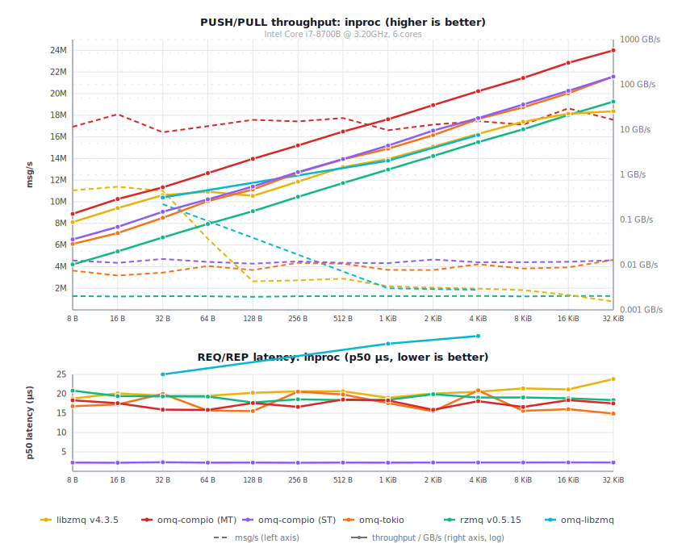

# Comparisons

Two-process benchmarks (inproc: single-process). 3 s timed window after 500 ms warmup.
Hardware: Linux 6.12 (Debian 13) VM, Intel i7-8700B 3.2 GHz 6-core, Rust 1.95.0.
Compared against libzmq v4.3.5 and zmq.rs (zeromq crate v0.6.0).

  

  

## libzmq vs omq — inproc

Same process, no kernel socket overhead. libzmq v4.3.5 (C binary) vs omq-compio (io_uring, single thread) and omq-tokio (multi-thread).

omq inproc is true zero-copy: payloads are `Arc`-cloned, not memcpy'd. libzmq copies every message through its internal queues, so its throughput drops with size. omq stays flat.

Refresh: `python3 scripts/run_comparisons.py --transport inproc --latency --update-markdown`

**omq-compio:**

<!-- BEGIN libzmq_comparison_inproc_compio -->
| Size | libzmq msg/s | libzmq MB/s | compio-mt msg/s | compio-mt MB/s | compio-mt × | compio-st msg/s | compio-st MB/s | compio-st × |
|---|---|---|---|---|---|---|---|---|
| 32 B | 11.21M | 359 MB/s | 15.82M | 506 MB/s | **1.4×** | 4.24M | 136 MB/s | 0.38× |
| 1 KiB | 2.12M | 2.2 GB/s | 11.46M | 11.7 GB/s | **5.4×** | 4.20M | 4.3 GB/s | **2.0×** |
| 4 KiB | 2.02M | 8.3 GB/s | 11.91M | 48.8 GB/s | **5.9×** | 4.25M | 17.4 GB/s | **2.1×** |

<!-- END libzmq_comparison_inproc_compio -->

**omq-tokio:**

<!-- BEGIN libzmq_comparison_inproc_tokio -->
| Size | libzmq msg/s | libzmq MB/s | omq-tokio msg/s | omq-tokio MB/s | omq-tokio × |
|---|---|---|---|---|---|
| 32 B | 11.21M | 359 MB/s | 3.34M | 107 MB/s | 0.30× |
| 1 KiB | 2.12M | 2.2 GB/s | 3.60M | 3.7 GB/s | **1.7×** |
| 4 KiB | 2.02M | 8.3 GB/s | 4.12M | 16.9 GB/s | **2.0×** |

<!-- END libzmq_comparison_inproc_tokio -->

## libzmq vs omq — IPC

Abstract-namespace Unix socket. Push binds, pull connects. libzmq v4.3.5 (C binary) vs omq-compio (io_uring, single thread) and omq-tokio (multi-thread).

Refresh: `python3 scripts/run_comparisons.py --transport ipc --update-markdown`

**omq-compio:**

<!-- BEGIN libzmq_comparison_ipc_compio -->
| Size | libzmq msg/s | libzmq MB/s | omq-compio msg/s | omq-compio MB/s | omq-compio × |
|---|---|---|---|---|---|
| 32 B | 8.46M | 271 MB/s | 12.09M | 387 MB/s | **1.4×** |
| 1 KiB | 1.36M | 1.4 GB/s | 2.98M | 3.0 GB/s | **2.2×** |
| 4 KiB | 439k | 1.8 GB/s | 1.26M | 5.2 GB/s | **2.9×** |

<!-- END libzmq_comparison_ipc_compio -->

**omq-tokio:**

<!-- BEGIN libzmq_comparison_ipc_tokio -->
| Size | libzmq msg/s | libzmq MB/s | omq-tokio msg/s | omq-tokio MB/s | omq-tokio × |
|---|---|---|---|---|---|
| 32 B | 8.46M | 271 MB/s | 6.55M | 210 MB/s | 0.77× |
| 1 KiB | 1.36M | 1.4 GB/s | 3.44M | 3.5 GB/s | **2.5×** |
| 4 KiB | 439k | 1.8 GB/s | 1.07M | 4.4 GB/s | **2.4×** |

<!-- END libzmq_comparison_ipc_tokio -->

## libzmq vs omq — TCP

TCP loopback, each process pinned to one core. Push binds, pull connects. libzmq v4.3.5 (C binary) vs omq-compio (io_uring, single thread) and omq-tokio (multi-thread).

Refresh: `python3 scripts/run_comparisons.py --transport tcp --update-markdown`

**omq-compio:**

<!-- BEGIN libzmq_comparison_tcp_compio -->
| Size | libzmq msg/s | libzmq MB/s | omq-compio msg/s | omq-compio MB/s | omq-compio × |
|---|---|---|---|---|---|
| 32 B | 8.73M | 280 MB/s | 11.21M | 359 MB/s | **1.3×** |
| 1 KiB | 1.16M | 1.2 GB/s | 2.62M | 2.7 GB/s | **2.3×** |
| 4 KiB | 357k | 1.5 GB/s | 1.08M | 4.4 GB/s | **3.0×** |

<!-- END libzmq_comparison_tcp_compio -->

**omq-tokio:**

<!-- BEGIN libzmq_comparison_tcp_tokio -->
| Size | libzmq msg/s | libzmq MB/s | omq-tokio msg/s | omq-tokio MB/s | omq-tokio × |
|---|---|---|---|---|---|
| 32 B | 8.73M | 280 MB/s | 6.19M | 198 MB/s | 0.71× |
| 1 KiB | 1.16M | 1.2 GB/s | 3.30M | 3.4 GB/s | **2.8×** |
| 4 KiB | 357k | 1.5 GB/s | 1.24M | 5.1 GB/s | **3.5×** |

<!-- END libzmq_comparison_tcp_tokio -->

## libzmq vs omq — WebSocket

ZWS/2.0 (RFC 45) over TCP loopback. Push binds, pull connects. Requires libzmq built with WebSocket support (4.3.5+) and omq built with the `ws` feature.

Refresh: `python3 scripts/run_comparisons.py --transport ws --update-markdown`

**omq-compio:**

<!-- BEGIN libzmq_comparison_ws_compio -->
| Size | libzmq msg/s | libzmq MB/s | omq-compio msg/s | omq-compio MB/s | compio × |
|-------|-------------|------------|-----------------|----------------|----------|
| 32 B | 7.68M | 246 MB/s | 2.36M | 76 MB/s | 0.31× |
| 512 B | 1.95M | 1.0 GB/s | 2.02M | 1.0 GB/s | 1.03× |
| 8 KiB | 196k | 1.6 GB/s | 536k | 4.4 GB/s | **2.7×** |

<!-- END libzmq_comparison_ws_compio -->

**omq-tokio:**

<!-- BEGIN libzmq_comparison_ws_tokio -->
| Size | libzmq msg/s | libzmq MB/s | omq-tokio msg/s | omq-tokio MB/s | tokio × |
|-------|-------------|------------|----------------|---------------|----------|
| 32 B | 7.68M | 246 MB/s | 3.91M | 125 MB/s | 0.51× |
| 512 B | 1.95M | 1.0 GB/s | 2.85M | 1.5 GB/s | **1.5×** |
| 8 KiB | 196k | 1.6 GB/s | 588k | 4.8 GB/s | **3.0×** |

<!-- END libzmq_comparison_ws_tokio -->

> **zmq.rs inproc:** zeromq 0.6 does not implement the inproc transport, so no zmq.rs vs omq inproc comparison is available. See the libzmq vs omq — inproc table above for omq's inproc numbers against a reference implementation.

## zmq.rs vs omq — IPC

Push binds, pull connects. zmq.rs uses a socket file; omq uses abstract-namespace sockets. zmq.rs peer: `scripts/zmqrs_bench_peer/` (zeromq crate, tokio multi-thread). omq-compio: single io_uring thread. omq-tokio: multi-thread.

Refresh: `python3 scripts/run_comparisons.py --transport ipc --update-markdown`

**omq-compio:**

<!-- BEGIN zmqrs_comparison_ipc_compio -->
| Size | zmq.rs msg/s | zmq.rs MB/s | omq-compio msg/s | omq-compio MB/s | omq-compio × |
|---|---|---|---|---|---|
| 32 B | 694k | 22 MB/s | 12.09M | 387 MB/s | **17.4×** |
| 1 KiB | 657k | 673 MB/s | 2.98M | 3.0 GB/s | **4.5×** |
| 4 KiB | 466k | 1.9 GB/s | 1.26M | 5.2 GB/s | **2.7×** |

<!-- END zmqrs_comparison_ipc_compio -->

**omq-tokio:**

<!-- BEGIN zmqrs_comparison_ipc_tokio -->
| Size | zmq.rs msg/s | zmq.rs MB/s | omq-tokio msg/s | omq-tokio MB/s | omq-tokio × |
|---|---|---|---|---|---|
| 32 B | 694k | 22 MB/s | 6.55M | 210 MB/s | **9.4×** |
| 1 KiB | 657k | 673 MB/s | 3.44M | 3.5 GB/s | **5.2×** |
| 4 KiB | 466k | 1.9 GB/s | 1.07M | 4.4 GB/s | **2.3×** |

<!-- END zmqrs_comparison_ipc_tokio -->

## zmq.rs vs omq — TCP

TCP loopback, push binds, pull connects. zmq.rs <-> omq-tokio is apples-to-apples (both tokio multi-thread). omq-compio is intentionally CPU-constrained (single io_uring thread).

Refresh: `python3 scripts/run_comparisons.py --transport tcp --update-markdown`

**omq-compio:**

<!-- BEGIN zmqrs_comparison_tcp_compio -->
| Size | zmq.rs msg/s | zmq.rs MB/s | omq-compio msg/s | omq-compio MB/s | omq-compio × |
|---|---|---|---|---|---|
| 32 B | 384k | 12 MB/s | 11.21M | 359 MB/s | **29.2×** |
| 1 KiB | 293k | 300 MB/s | 2.62M | 2.7 GB/s | **8.9×** |
| 4 KiB | 254k | 1.0 GB/s | 1.08M | 4.4 GB/s | **4.3×** |

<!-- END zmqrs_comparison_tcp_compio -->

**omq-tokio:**

<!-- BEGIN zmqrs_comparison_tcp_tokio -->
| Size | zmq.rs msg/s | zmq.rs MB/s | omq-tokio msg/s | omq-tokio MB/s | omq-tokio × |
|---|---|---|---|---|---|
| 32 B | 384k | 12 MB/s | 6.19M | 198 MB/s | **16.1×** |
| 1 KiB | 293k | 300 MB/s | 3.30M | 3.4 GB/s | **11.3×** |
| 4 KiB | 254k | 1.0 GB/s | 1.24M | 5.1 GB/s | **4.9×** |

<!-- END zmqrs_comparison_tcp_tokio -->

## REQ/REP latency — libzmq vs omq

Serial ping-pong: one REQ/REP round-trip at a time, p50 and p99 in microseconds.
Lower is better; speedup = libzmq / omq.

### inproc

Refresh: `python3 scripts/run_comparisons.py --transport inproc --update-markdown`

<!-- BEGIN libzmq_latency_inproc -->
| Size | libzmq p50 | libzmq p99 | omq-compio p50 | omq-compio p99 | omq-compio × | omq-tokio p50 | omq-tokio p99 | omq-tokio × |
|---|---|---|---|---|---|---|---|---|
| 32 B | 18.4 µs | 32.2 µs | 15.7 µs | 34.9 µs | **1.2×** | 18.1 µs | 39.2 µs | 1.02× |
| 1 KiB | 19.1 µs | 38.3 µs | 15.7 µs | 34.3 µs | **1.2×** | 16.0 µs | 30.1 µs | **1.2×** |
| 4 KiB | 19.3 µs | 38.5 µs | 16.6 µs | 36.2 µs | **1.2×** | 15.3 µs | 34.6 µs | **1.3×** |

<!-- END libzmq_latency_inproc -->

### IPC

Refresh: `python3 scripts/run_comparisons.py --transport ipc --update-markdown`

<!-- BEGIN libzmq_latency_ipc -->
| Size | libzmq p50 | libzmq p99 | omq-compio p50 | omq-compio p99 | omq-compio × | omq-tokio p50 | omq-tokio p99 | omq-tokio × |
|---|---|---|---|---|---|---|---|---|
| 32 B | 62.6 µs | 98.5 µs | 29.0 µs | 52.0 µs | **2.2×** | 28.8 µs | 50.6 µs | **2.2×** |
| 1 KiB | 60.9 µs | 79.5 µs | 28.9 µs | 58.9 µs | **2.1×** | 31.2 µs | 47.5 µs | **2.0×** |
| 4 KiB | 67.9 µs | 96.2 µs | 31.8 µs | 57.2 µs | **2.1×** | 28.9 µs | 40.4 µs | **2.4×** |

<!-- END libzmq_latency_ipc -->

### TCP

Refresh: `python3 scripts/run_comparisons.py --transport tcp --update-markdown`

<!-- BEGIN libzmq_latency_tcp -->
| Size | libzmq p50 | libzmq p99 | omq-compio p50 | omq-compio p99 | omq-compio × | omq-tokio p50 | omq-tokio p99 | omq-tokio × |
|---|---|---|---|---|---|---|---|---|
| 32 B | 65.8 µs | 107 µs | 34.9 µs | 61.4 µs | **1.9×** | 40.3 µs | 65.2 µs | **1.6×** |
| 1 KiB | 70.7 µs | 90.7 µs | 36.7 µs | 56.9 µs | **1.9×** | 39.1 µs | 58.4 µs | **1.8×** |
| 4 KiB | 73.2 µs | 113 µs | 39.9 µs | 66.1 µs | **1.8×** | 39.7 µs | 49.6 µs | **1.8×** |

<!-- END libzmq_latency_tcp -->

### WebSocket

Refresh: `python3 scripts/run_comparisons.py --transport ws --update-markdown`

<!-- BEGIN libzmq_latency_ws -->
(run `python3 scripts/run_comparisons.py --transport ws --update-markdown` to populate)
<!-- END libzmq_latency_ws -->

## REQ/REP latency — zmq.rs vs omq

### IPC

Refresh: `python3 scripts/run_comparisons.py --transport ipc --update-markdown`

<!-- BEGIN zmqrs_latency_ipc -->
| Size | zmq.rs p50 | zmq.rs p99 | omq-compio p50 | omq-compio p99 | omq-compio × | omq-tokio p50 | omq-tokio p99 | omq-tokio × |
|---|---|---|---|---|---|---|---|---|
| 32 B | 24.8 µs | 51.0 µs | 29.0 µs | 52.0 µs | 0.85× | 28.8 µs | 50.6 µs | 0.86× |
| 1 KiB | 29.5 µs | 48.0 µs | 28.9 µs | 58.9 µs | 1.02× | 31.2 µs | 47.5 µs | 0.95× |
| 4 KiB | 32.1 µs | 54.0 µs | 31.8 µs | 57.2 µs | 1.01× | 28.9 µs | 40.4 µs | **1.1×** |

<!-- END zmqrs_latency_ipc -->

### TCP

Refresh: `python3 scripts/run_comparisons.py --transport tcp --update-markdown`

<!-- BEGIN zmqrs_latency_tcp -->
| Size | zmq.rs p50 | zmq.rs p99 | omq-compio p50 | omq-compio p99 | omq-compio × | omq-tokio p50 | omq-tokio p99 | omq-tokio × |
|---|---|---|---|---|---|---|---|---|
| 32 B | 38.7 µs | 52.2 µs | 34.9 µs | 61.4 µs | **1.1×** | 40.3 µs | 65.2 µs | 0.96× |
| 1 KiB | 40.7 µs | 63.3 µs | 36.7 µs | 56.9 µs | **1.1×** | 39.1 µs | 58.4 µs | 1.04× |
| 4 KiB | 39.9 µs | 59.0 µs | 39.9 µs | 66.1 µs | 1.00× | 39.7 µs | 49.6 µs | 1.00× |

<!-- END zmqrs_latency_tcp -->

## ZMQ_STREAM: omq-compio vs libzmq v4.3.5

Ping-pong throughput: one raw TCP client connected to a STREAM socket.
Each iteration sends one message and waits for the response before
sending the next (latency-bound, not pipelined). Single-threaded, TCP
loopback, release builds. 200K iterations at 8/128 B, 100K at 1K/8K B,
preceded by a 2K-iteration warmup.

The omq side uses omq-compio with io_uring and the default buffer pool.
The libzmq side uses its internal I/O thread. Both have `TCP_NODELAY`
on the raw client socket.

Measured 2026-05-21 on Linux 6.12, Rust 1.93 nightly, `gcc -O2` for the
libzmq harness. Two consecutive runs showed <5% variance.

### recv (raw TCP client writes, STREAM socket reads)

| Size | libzmq (msg/s) | omq (msg/s) | Ratio |
|------|---------------|------------|-------|
| 8 B | 42,000 | 134,000 | 3.2x |
| 128 B | 42,000 | 136,000 | 3.2x |
| 1,024 B | 43,000 | 135,000 | 3.1x |
| 8,192 B | 40,000 | 119,000 | 3.0x |

### send (STREAM socket writes, raw TCP client reads)

| Size | libzmq (msg/s) | omq (msg/s) | Ratio |
|------|---------------|------------|-------|
| 8 B | 42,000 | 151,000 | 3.6x |
| 128 B | 41,000 | 148,000 | 3.6x |
| 1,024 B | 39,000 | 149,000 | 3.8x |
| 8,192 B | 39,000 | 132,000 | 3.4x |

omq send at 8 KiB: 1.08 GB/s vs libzmq's 316 MB/s. Ping-pong
latency ~7 µs (omq) vs ~24 µs (libzmq)
