# Comparisons

These charts compare OMQ with `libzmq`, `zmq.rs`, and `rzmq`. The benchmark runner records throughput, latency, CPU time, and peer fairness where the pattern has multiple peers.

The charts are split by I/O backend:

- **Classic**: `libzmq`, `omq-tokio`, `zmq.rs`, and `rzmq` on their normal epoll/mio paths.
- **io_uring**: `omq-compio` and `rzmq` on io_uring.

## Setup

- `libzmq v4.3.5`
- `zeromq v0.6.0`
- `rzmq v0.5.22`
- OMQ from this repository

## Methodology

TCP and IPC charts use one benchmark process per peer, not multiple
threads inside one process.

- Two-peer charts use two processes.
- PUB/SUB and PUSH/PULL fan-in/fan-out charts use one process for each
  publisher, subscriber, pusher, or puller.
- `inproc` charts stay inside one process by definition.

Multi-peer charts report total throughput. PUSH fan-out charts also show
peer fairness: whiskers mark the slowest and fastest puller in a measured
round.

Transport coverage differs by implementation. Missing lines mean that implementation does not expose a usable peer for that transport and pattern in this benchmark suite.

## Main TCP Charts

  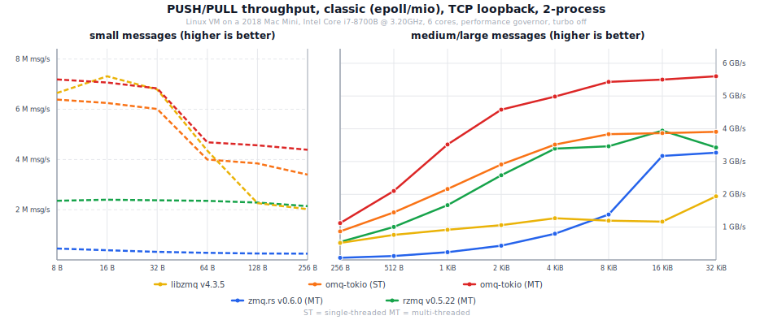

  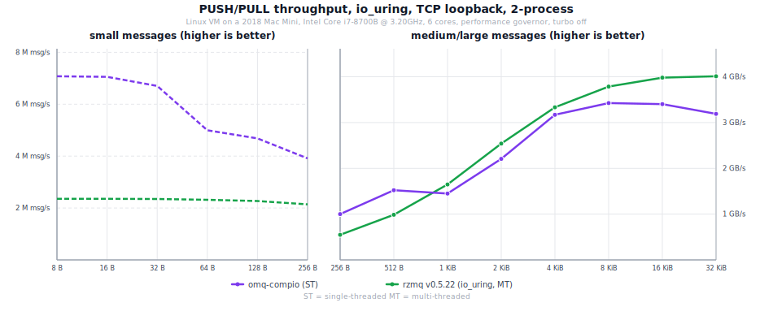

## PUSH/PULL Throughput

### Classic

  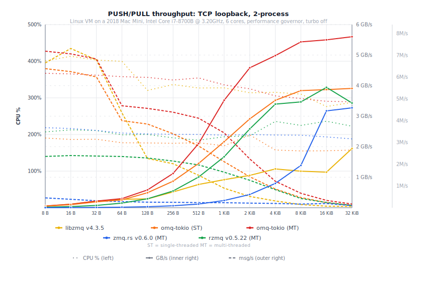

  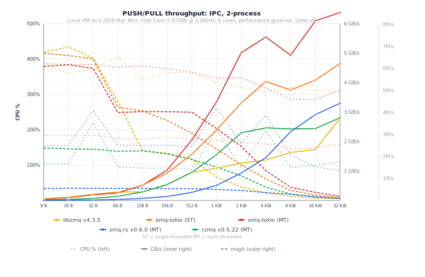

  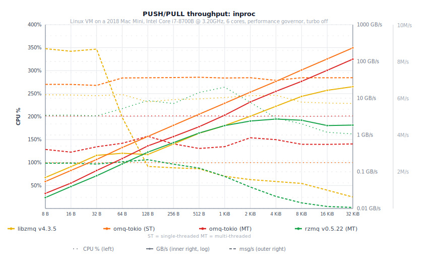

### io_uring

  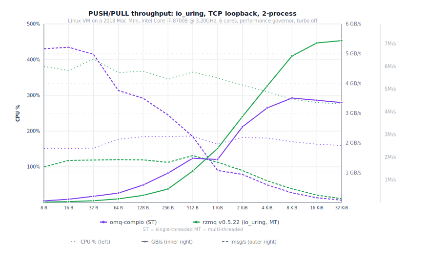

  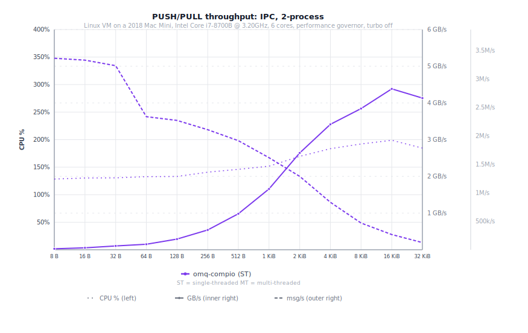

  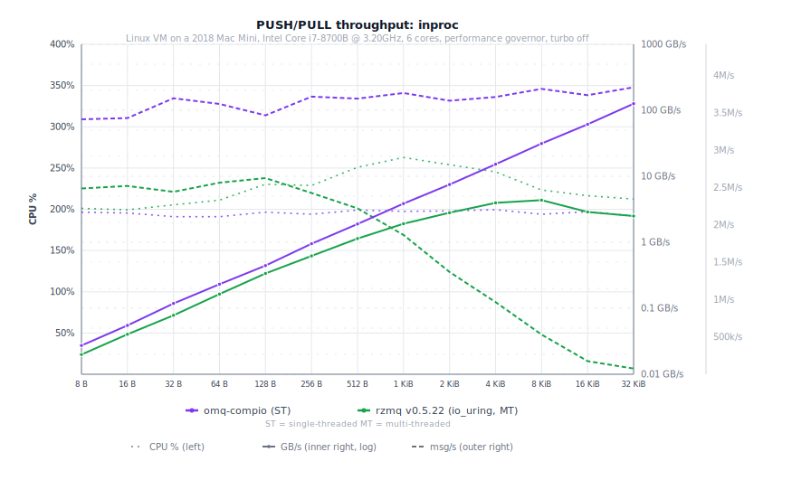

## REQ/REP Latency

### Classic

  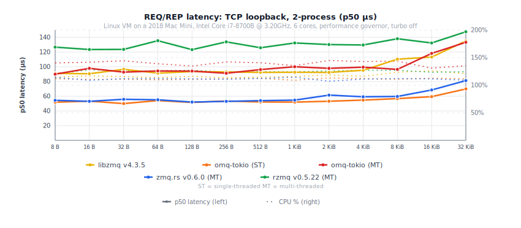

  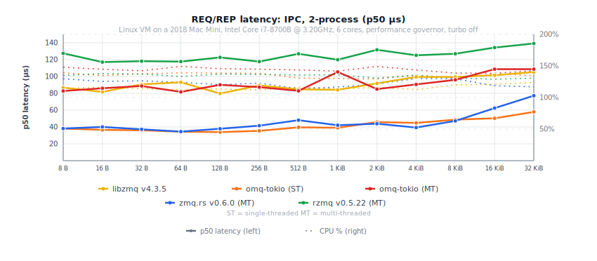

  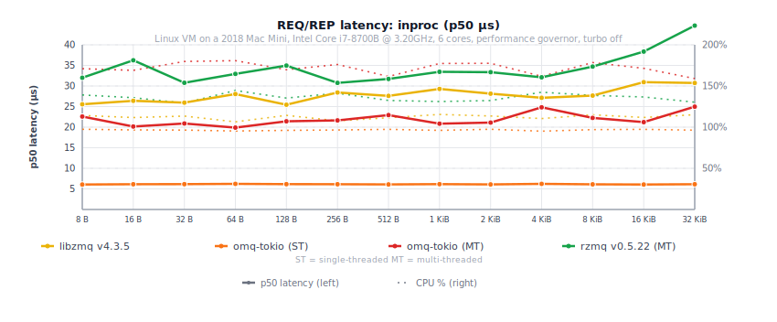

### io_uring

  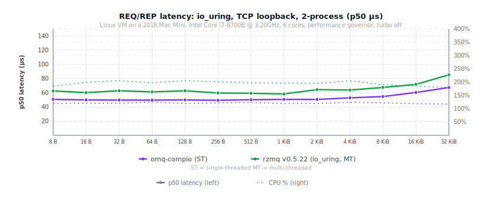

  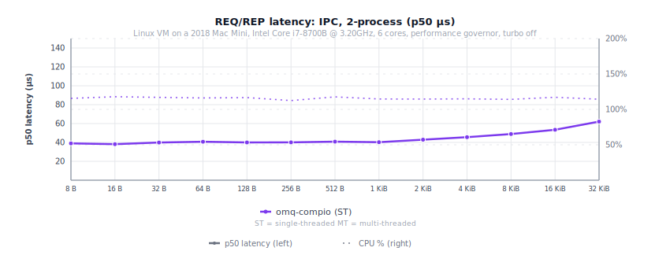

  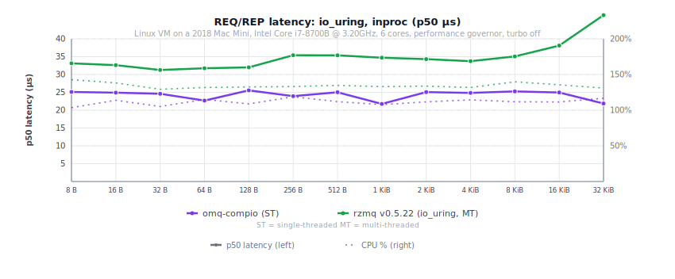

## PUB/SUB Throughput

  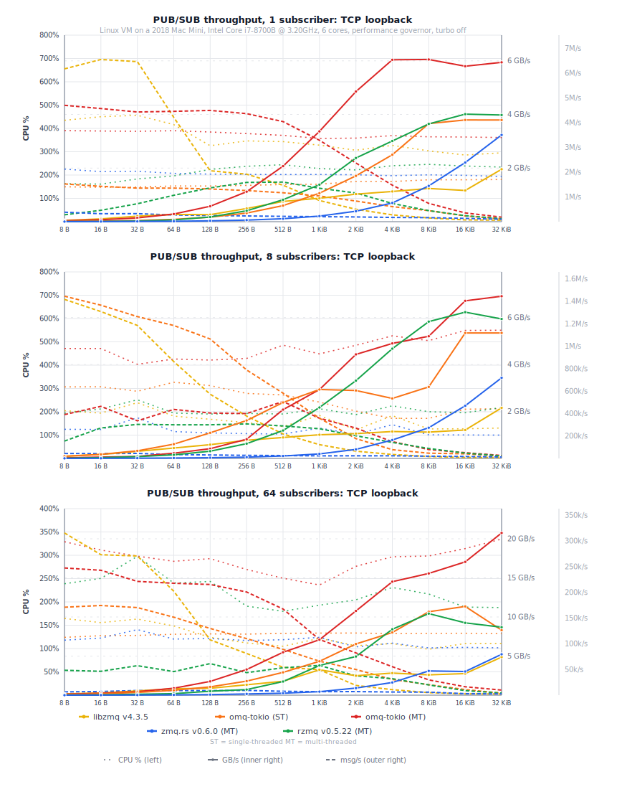

  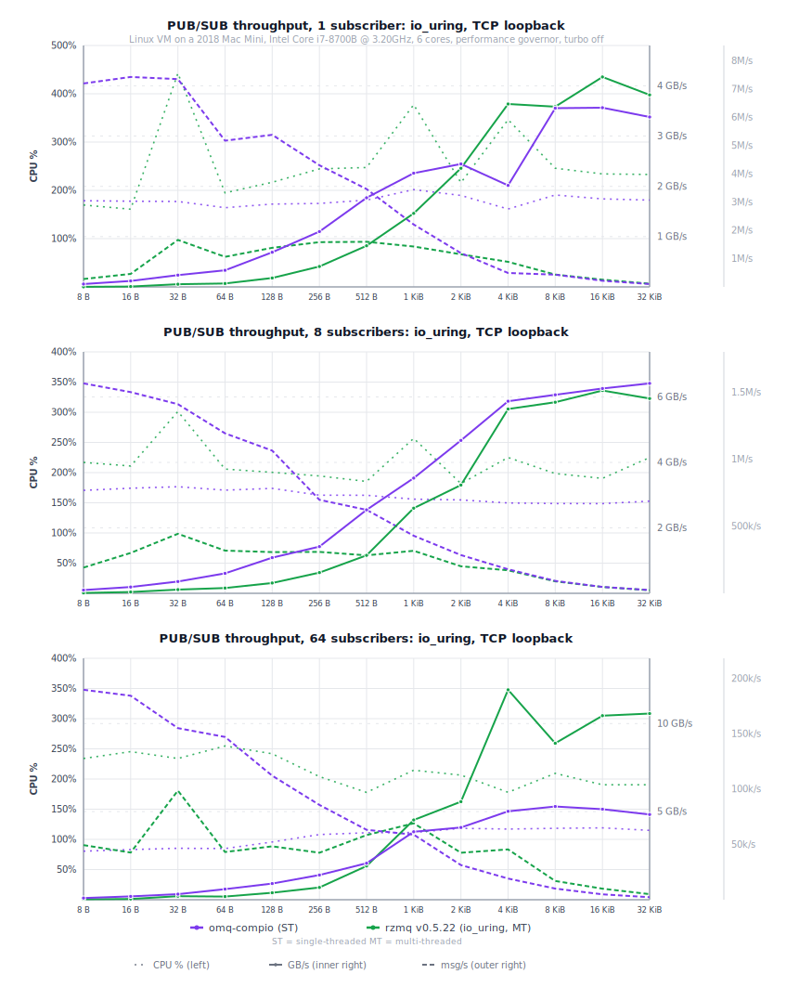

## Fan-Out And Fan-In

These charts show 1-to-N and N-to-1 PUSH/PULL over TCP. Fan-out whiskers
show the slowest and fastest puller in a measured round.

  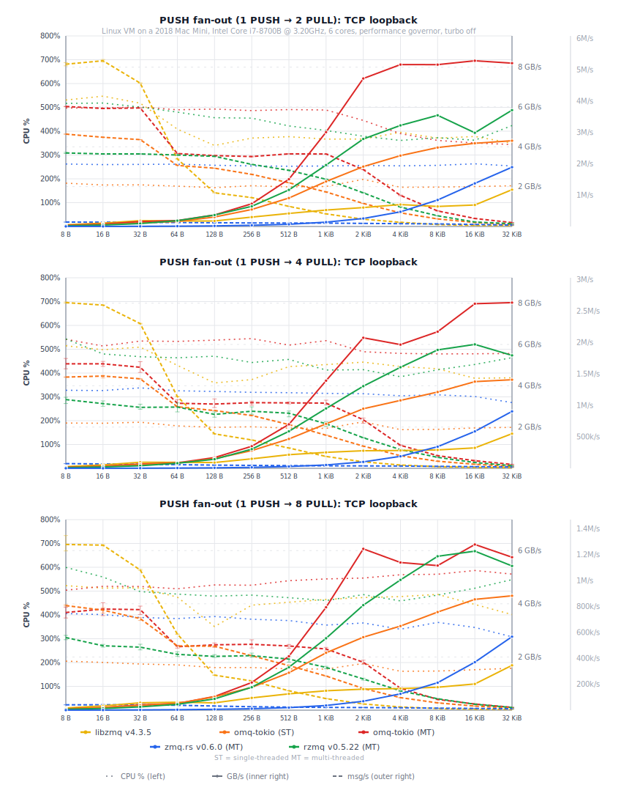

  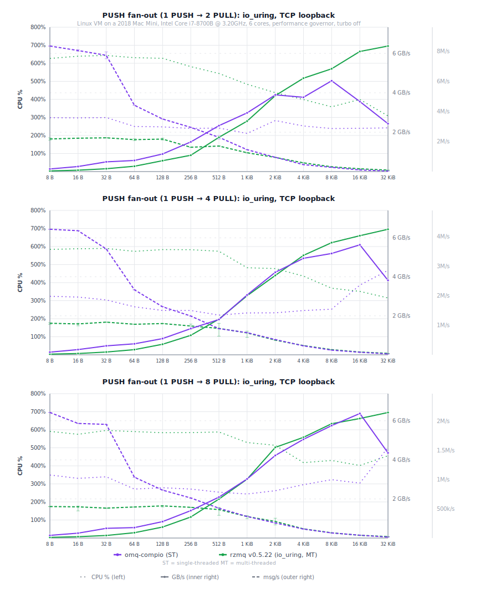

  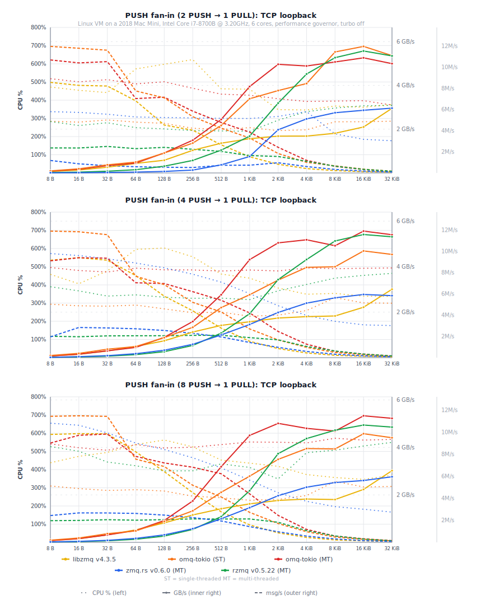

  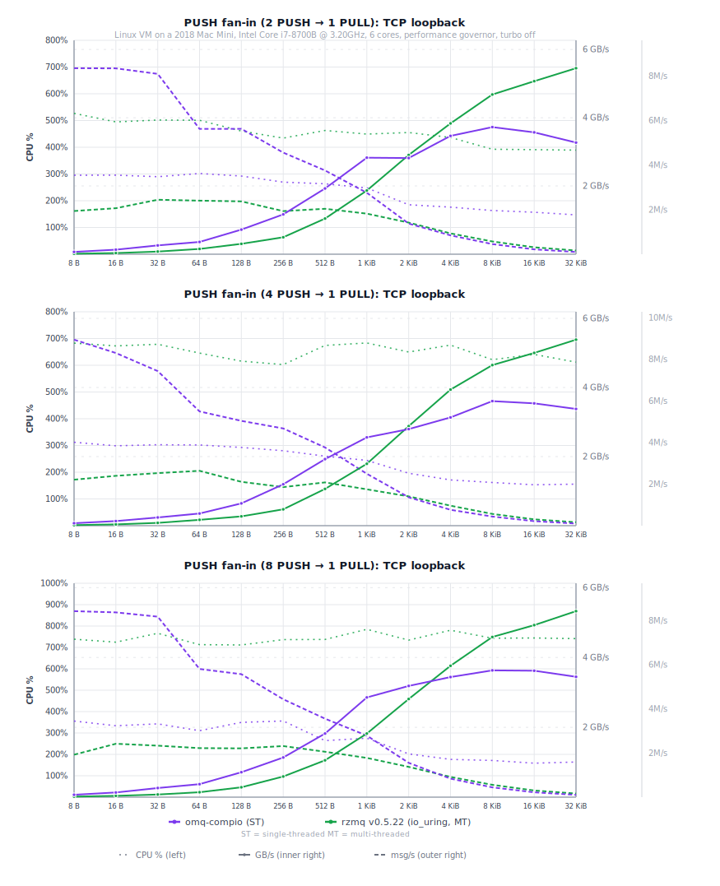

