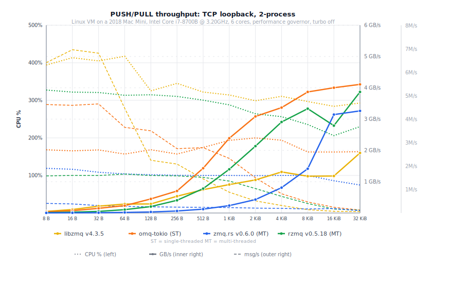
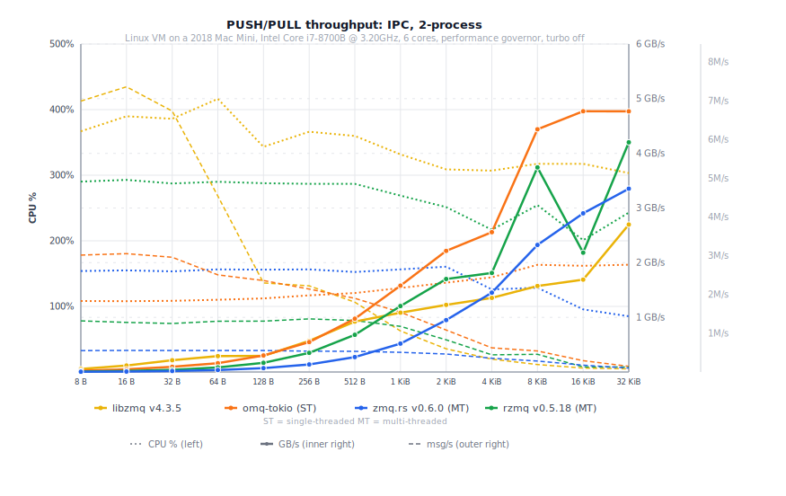
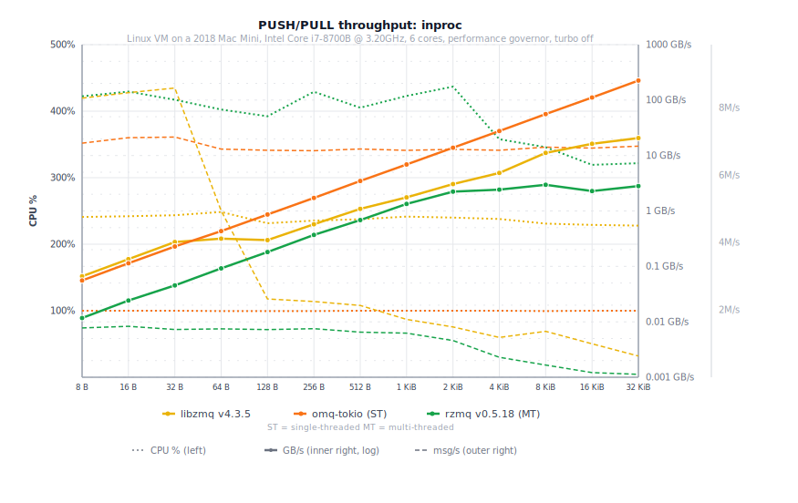
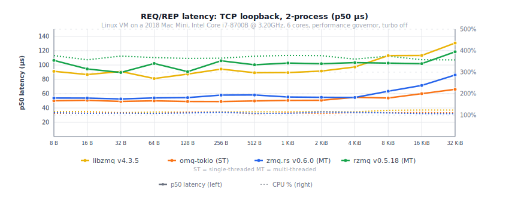
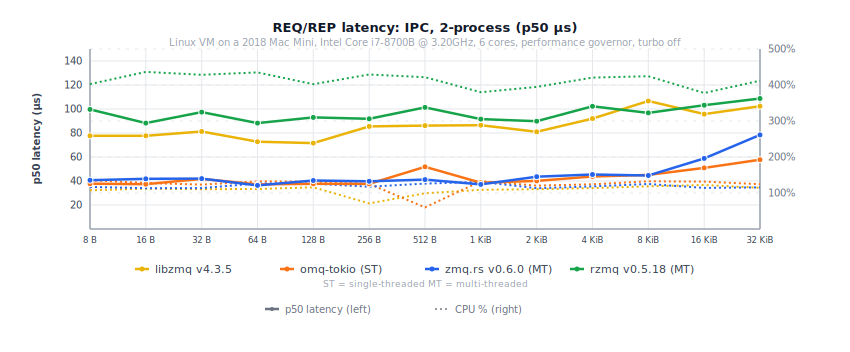
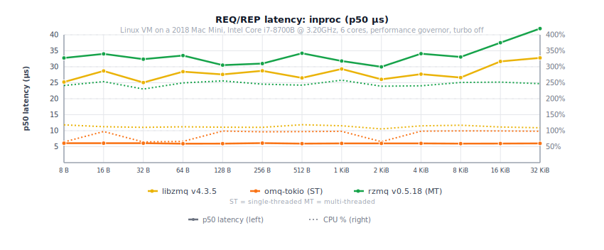
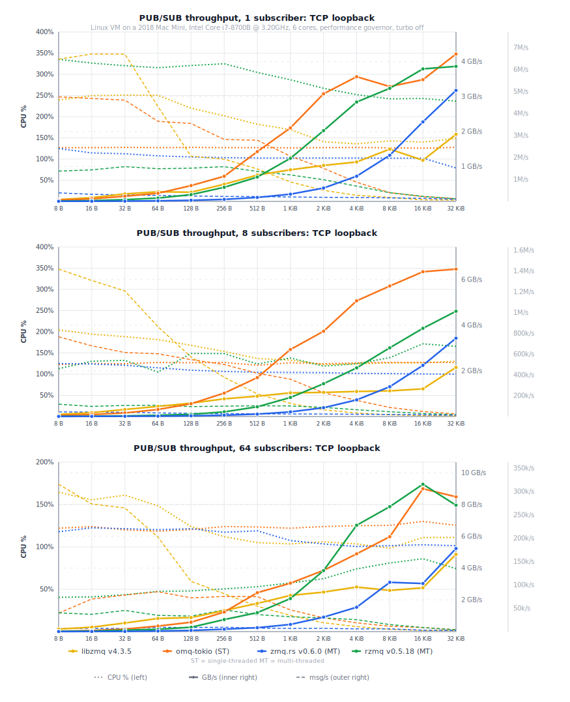

# Comparisons

PUSH/PULL throughput and REQ/REP latency across Rust ZMQ implementations. Two-process benchmarks (inproc: single-process), 3 s timed window after 500 ms warmup, median of recent runs.

Implementations tested:
- **libzmq** v4.3.5 (C, `scripts/libzmq_bench_peer.c`)
- **omq-tokio** (this project, single-threaded tokio runtime)
- **zmq.rs** (zeromq crate v0.6.0, `scripts/zmqrs_bench_peer/`)
- **rzmq** v0.5.18 (`scripts/rzmq_bench_peer/`)

For omq backend comparisons (compio vs tokio vs tokio-mt), see the collapsed sections in [README.md](README.md).

## PUSH/PULL throughput

### TCP

  

### IPC

  

### inproc

  

zmq.rs (zeromq v0.6.0) does not implement inproc.

## REQ/REP latency

### TCP

  

### IPC

  

### inproc

  

## PUB/SUB throughput

### TCP

  

## Fan-out and fan-in

1-to-N and N-to-1 PUSH/PULL over TCP. These charts show only libzmq and omq backends (compio, tokio, tokio-mt).

  

  

