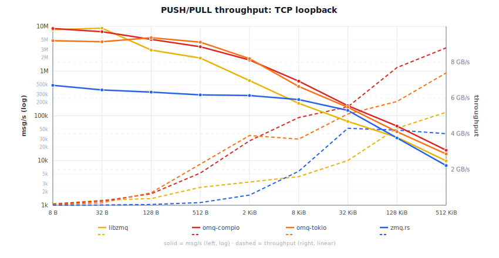

# Comparisons

Two-process benchmarks (inproc: single-process). 3 s timed window after 500 ms warmup.
Hardware: Linux 6.12 (Debian 13) VM, Intel i7-8700B 3.2 GHz 6-core, Rust 1.95.0.

  

## libzmq vs omq — inproc

Same process, no kernel socket overhead. libzmq 5.2.5 (C binary) vs omq-compio (io_uring, single thread) and omq-tokio (multi-thread).

omq inproc is true zero-copy: payloads are `Arc`-cloned, not memcpy'd. libzmq copies every message through its internal queues, so its throughput drops with size. omq stays flat.

Refresh: `ruby scripts/compare_libzmq.rb --inproc --update-benchmarks`

**omq-compio:**

<!-- BEGIN libzmq_comparison_inproc_compio -->
| Size | libzmq msg/s | libzmq MB/s | compio-mt msg/s | compio-mt MB/s | mt × | compio-st msg/s | compio-st MB/s | st × |
|-------|-------------|------------|----------------|---------------|------|----------------|---------------|------|
| 8 B | 10.78M | 86 MB/s | 15.88M | 127 MB/s | **1.5×** | 4.35M | 35 MB/s | 0.40× |
| 32 B | 10.50M | 336 MB/s | 14.51M | 464 MB/s | **1.4×** | 4.26M | 136 MB/s | 0.41× |
| 128 B | 3.10M | 397 MB/s | 12.26M | 1.6 GB/s | **4.0×** | 4.20M | 538 MB/s | **1.4×** |
| 512 B | 2.90M | 1.5 GB/s | 11.88M | 6.1 GB/s | **4.1×** | 4.26M | 2.2 GB/s | **1.5×** |
| 2 KiB | 1.90M | 3.9 GB/s | 12.02M | 24.6 GB/s | **6.3×** | 4.41M | 9.0 GB/s | **2.3×** |
| 8 KiB | 1.78M | 14.5 GB/s | 12.17M | 99.7 GB/s | **6.9×** | 4.40M | 36.1 GB/s | **2.5×** |
| 32 KiB | 397k | 13.0 GB/s | 11.24M | 368.2 GB/s | **28.3×** | 4.45M | 145.7 GB/s | **11.2×** |
| 128 KiB | 236k | 30.9 GB/s | 12.10M | 1586.3 GB/s | **51.3×** | 4.19M | 549.8 GB/s | **17.8×** |
| 512 KiB | 55k | 28.6 GB/s | 11.79M | 6183.8 GB/s | **216.4×** | 4.21M | 2206.7 GB/s | **77.2×** |
| 2 MiB | 13k | 28.2 GB/s | 11.88M | 24908.3 GB/s | **883.3×** | 4.39M | 9203.6 GB/s | **326.4×** |

<!-- END libzmq_comparison_inproc_compio -->

**omq-tokio:**

<!-- BEGIN libzmq_comparison_inproc_tokio -->
| Size | libzmq msg/s | libzmq MB/s | tokio msg/s | tokio MB/s | tokio × |
|-------|-------------|------------|------------|-----------|---------|
| 8 B | 10.78M | 86 MB/s | 4.14M | 33 MB/s | 0.38× |
| 32 B | 10.50M | 336 MB/s | 3.43M | 110 MB/s | 0.33× |
| 128 B | 3.10M | 397 MB/s | 4.14M | 530 MB/s | **1.3×** |
| 512 B | 2.90M | 1.5 GB/s | 4.18M | 2.1 GB/s | **1.4×** |
| 2 KiB | 1.90M | 3.9 GB/s | 4.11M | 8.4 GB/s | **2.2×** |
| 8 KiB | 1.78M | 14.5 GB/s | 4.15M | 34.0 GB/s | **2.3×** |
| 32 KiB | 397k | 13.0 GB/s | 4.23M | 138.7 GB/s | **10.7×** |
| 128 KiB | 236k | 30.9 GB/s | 3.93M | 515.7 GB/s | **16.7×** |
| 512 KiB | 55k | 28.6 GB/s | 3.95M | 2070.6 GB/s | **72.5×** |
| 2 MiB | 13k | 28.2 GB/s | 3.66M | 7677.1 GB/s | **272.2×** |

<!-- END libzmq_comparison_inproc_tokio -->

## libzmq vs omq — IPC

Abstract-namespace Unix socket. Push binds, pull connects. libzmq 5.2.5 (C binary) vs omq-compio (io_uring, single thread) and omq-tokio (multi-thread).

Refresh: `ruby scripts/compare_libzmq.rb --ipc --update-benchmarks`

**omq-compio:**

<!-- BEGIN libzmq_comparison_ipc_compio -->
| Size | libzmq msg/s | libzmq MB/s | omq-compio msg/s | omq-compio MB/s | compio × |
|-------|-------------|------------|-----------------|----------------|---------|
| 8 B | 8.75M | 70 MB/s | 8.65M | 69 MB/s | 0.99× |
| 32 B | 8.22M | 263 MB/s | 7.38M | 236 MB/s | 0.90× |
| 128 B | 2.97M | 380 MB/s | 4.94M | 632 MB/s | **1.7×** |
| 512 B | 2.33M | 1.2 GB/s | 3.44M | 1.8 GB/s | **1.5×** |
| 2 KiB | 826k | 1.7 GB/s | 1.96M | 4.0 GB/s | **2.4×** |
| 8 KiB | 253k | 2.1 GB/s | 674k | 5.5 GB/s | **2.7×** |
| 32 KiB | 103k | 3.4 GB/s | 176k | 5.8 GB/s | **1.7×** |
| 128 KiB | 35k | 4.5 GB/s | 63k | 8.3 GB/s | **1.8×** |
| 512 KiB | 11k | 6.0 GB/s | 22k | 11.5 GB/s | **1.9×** |
| 2 MiB | 2.9k | 6.1 GB/s | 5.2k | 10.9 GB/s | **1.8×** |

<!-- END libzmq_comparison_ipc_compio -->

**omq-tokio:**

<!-- BEGIN libzmq_comparison_ipc_tokio -->
| Size | libzmq msg/s | libzmq MB/s | omq-tokio msg/s | omq-tokio MB/s | tokio × |
|-------|-------------|------------|----------------|---------------|---------|
| 8 B | 8.75M | 70 MB/s | 4.00M | 32 MB/s | 0.46× |
| 32 B | 8.22M | 263 MB/s | 4.40M | 141 MB/s | 0.54× |
| 128 B | 2.97M | 380 MB/s | 5.32M | 681 MB/s | **1.8×** |
| 512 B | 2.33M | 1.2 GB/s | 4.69M | 2.4 GB/s | **2.0×** |
| 2 KiB | 826k | 1.7 GB/s | 1.69M | 3.5 GB/s | **2.0×** |
| 8 KiB | 253k | 2.1 GB/s | 417k | 3.4 GB/s | **1.6×** |
| 32 KiB | 103k | 3.4 GB/s | 156k | 5.1 GB/s | **1.5×** |
| 128 KiB | 35k | 4.5 GB/s | 52k | 6.8 GB/s | **1.5×** |
| 512 KiB | 11k | 6.0 GB/s | 6.2k | 3.3 GB/s | 0.54× |
| 2 MiB | 2.9k | 6.1 GB/s | 3.5k | 7.3 GB/s | **1.2×** |

<!-- END libzmq_comparison_ipc_tokio -->

## libzmq vs omq — TCP

TCP loopback, each process pinned to one core. Push binds, pull connects. libzmq 5.2.5 (C binary) vs omq-compio (io_uring, single thread) and omq-tokio (multi-thread).

Refresh: `ruby scripts/compare_libzmq.rb --tcp --update-benchmarks`

**omq-compio:**

<!-- BEGIN libzmq_comparison_tcp_compio -->
| Size | libzmq msg/s | libzmq MB/s | omq-compio msg/s | omq-compio MB/s | compio × |
|-------|-------------|------------|-----------------|----------------|----------|
| 8 B | 8.36M | 67 MB/s | 8.00M | 64 MB/s | 0.96× |
| 16 B | 9.19M | 147 MB/s | 7.94M | 127 MB/s | 0.86× |
| 32 B | 8.61M | 275 MB/s | 7.38M | 236 MB/s | 0.86× |
| 64 B | 5.67M | 363 MB/s | 7.01M | 449 MB/s | **1.2×** |
| 128 B | 2.90M | 371 MB/s | 5.56M | 712 MB/s | **1.9×** |
| 256 B | 2.61M | 667 MB/s | 4.38M | 1.1 GB/s | **1.7×** |
| 512 B | 1.99M | 1.0 GB/s | 3.61M | 1.9 GB/s | **1.8×** |
| 1 KiB | 1.18M | 1.2 GB/s | 2.58M | 2.6 GB/s | **2.2×** |
| 2 KiB | 669k | 1.4 GB/s | 1.77M | 3.6 GB/s | **2.7×** |
| 4 KiB | 364k | 1.5 GB/s | 1.06M | 4.4 GB/s | **2.9×** |
| 8 KiB | 187k | 1.5 GB/s | 593k | 4.9 GB/s | **3.2×** |
| 16 KiB | 84.6k | 1.4 GB/s | 303k | 5.0 GB/s | **3.6×** |
| 32 KiB | 75.9k | 2.5 GB/s | 176k | 5.8 GB/s | **2.3×** |
| 64 KiB | 53.8k | 3.5 GB/s | 70.5k | 4.6 GB/s | **1.3×** |
| 128 KiB | 33.2k | 4.3 GB/s | 63.0k | 8.3 GB/s | **1.9×** |
| 256 KiB | 18.7k | 4.9 GB/s | 33.6k | 8.8 GB/s | **1.8×** |

<!-- END libzmq_comparison_tcp_compio -->

**omq-tokio:**

<!-- BEGIN libzmq_comparison_tcp_tokio -->
| Size | libzmq msg/s | libzmq MB/s | omq-tokio msg/s | omq-tokio MB/s | tokio × |
|-------|-------------|------------|----------------|---------------|----------|
| 8 B | 8.36M | 67 MB/s | 5.72M | 46 MB/s | 0.69× |
| 16 B | 9.19M | 147 MB/s | 6.75M | 108 MB/s | 0.73× |
| 32 B | 8.61M | 275 MB/s | 6.98M | 223 MB/s | 0.81× |
| 64 B | 5.67M | 363 MB/s | 5.50M | 352 MB/s | 0.97× |
| 128 B | 2.90M | 371 MB/s | 5.58M | 715 MB/s | **1.9×** |
| 256 B | 2.61M | 667 MB/s | 4.67M | 1.2 GB/s | **1.8×** |
| 512 B | 1.99M | 1.0 GB/s | 4.33M | 2.2 GB/s | **2.2×** |
| 1 KiB | 1.18M | 1.2 GB/s | 3.25M | 3.3 GB/s | **2.7×** |
| 2 KiB | 669k | 1.4 GB/s | 2.18M | 4.5 GB/s | **3.3×** |
| 4 KiB | 364k | 1.5 GB/s | 1.22M | 5.0 GB/s | **3.4×** |
| 8 KiB | 187k | 1.5 GB/s | 642k | 5.3 GB/s | **3.4×** |
| 16 KiB | 84.6k | 1.4 GB/s | 331k | 5.4 GB/s | **3.9×** |
| 32 KiB | 75.9k | 2.5 GB/s | 166k | 5.4 GB/s | **2.2×** |
| 64 KiB | 53.8k | 3.5 GB/s | 67.3k | 4.4 GB/s | **1.3×** |
| 128 KiB | 33.2k | 4.3 GB/s | 37.1k | 4.9 GB/s | **1.1×** |
| 256 KiB | 18.7k | 4.9 GB/s | 25.9k | 6.8 GB/s | **1.4×** |

<!-- END libzmq_comparison_tcp_tokio -->

## libzmq vs omq — WebSocket

ZWS/2.0 (RFC 45) over TCP loopback. Push binds, pull connects. Requires libzmq built with WebSocket support (4.3.5+) and omq built with the `ws` feature.

Refresh: `ruby scripts/compare_libzmq.rb --ws --update-benchmarks`

**omq-compio:**

<!-- BEGIN libzmq_comparison_ws_compio -->
| Size | libzmq msg/s | libzmq MB/s | omq-compio msg/s | omq-compio MB/s | compio × |
|-------|-------------|------------|-----------------|----------------|----------|
| 8 B | 7.90M | 63 MB/s | 2.41M | 19 MB/s | 0.30× |
| 32 B | 7.68M | 246 MB/s | 2.36M | 76 MB/s | 0.31× |
| 128 B | 2.79M | 357 MB/s | 2.24M | 286 MB/s | 0.80× |
| 512 B | 1.95M | 1.0 GB/s | 2.02M | 1.0 GB/s | 1.03× |
| 2 KiB | 659k | 1.4 GB/s | 1.58M | 3.2 GB/s | **2.4×** |
| 8 KiB | 196k | 1.6 GB/s | 536k | 4.4 GB/s | **2.7×** |
| 32 KiB | 68.4k | 2.2 GB/s | 161k | 5.3 GB/s | **2.3×** |
| 128 KiB | 31.8k | 4.2 GB/s | 38.0k | 5.0 GB/s | **1.2×** |
| 512 KiB | 9.3k | 4.9 GB/s | 3.4k | 1.8 GB/s | 0.36× |

<!-- END libzmq_comparison_ws_compio -->

**omq-tokio:**

<!-- BEGIN libzmq_comparison_ws_tokio -->
| Size | libzmq msg/s | libzmq MB/s | omq-tokio msg/s | omq-tokio MB/s | tokio × |
|-------|-------------|------------|----------------|---------------|----------|
| 8 B | 7.90M | 63 MB/s | 3.50M | 28 MB/s | 0.44× |
| 32 B | 7.68M | 246 MB/s | 3.91M | 125 MB/s | 0.51× |
| 128 B | 2.79M | 357 MB/s | 3.10M | 397 MB/s | **1.1×** |
| 512 B | 1.95M | 1.0 GB/s | 2.85M | 1.5 GB/s | **1.5×** |
| 2 KiB | 659k | 1.4 GB/s | 1.41M | 2.9 GB/s | **2.1×** |
| 8 KiB | 196k | 1.6 GB/s | 588k | 4.8 GB/s | **3.0×** |
| 32 KiB | 68.4k | 2.2 GB/s | 150k | 4.9 GB/s | **2.2×** |
| 128 KiB | 31.8k | 4.2 GB/s | 35.5k | 4.6 GB/s | **1.1×** |
| 512 KiB | 9.3k | 4.9 GB/s | 3.1k | 1.6 GB/s | 0.33× |

<!-- END libzmq_comparison_ws_tokio -->

> **zmq.rs inproc:** zeromq 0.6 does not implement the inproc transport, so no zmq.rs vs omq inproc comparison is available. See the libzmq vs omq — inproc table above for omq's inproc numbers against a reference implementation.

## zmq.rs vs omq — IPC

Push binds, pull connects. zmq.rs uses a socket file; omq uses abstract-namespace sockets. zmq.rs peer: `scripts/zmqrs_bench_peer/` (zeromq crate, tokio multi-thread). omq-compio: single io_uring thread. omq-tokio: multi-thread.

Refresh: `ruby scripts/compare_zmqrs.rb --ipc --update-benchmarks`

**omq-compio:**

<!-- BEGIN zmqrs_comparison_ipc_compio -->
| Size | zmq.rs msg/s | zmq.rs MB/s | omq-compio msg/s | omq-compio MB/s | compio × |
|-------|-------------|------------|-----------------|----------------|---------|
| 8 B | 718k | 6 MB/s | 8.47M | 68 MB/s | **11.8×** |
| 32 B | 724k | 23 MB/s | 7.34M | 235 MB/s | **10.1×** |
| 128 B | 716k | 92 MB/s | 4.93M | 631 MB/s | **6.9×** |
| 512 B | 701k | 359 MB/s | 3.36M | 1.7 GB/s | **4.8×** |
| 2 KiB | 602k | 1.2 GB/s | 1.94M | 4.0 GB/s | **3.2×** |
| 8 KiB | 374k | 3.1 GB/s | 725k | 5.9 GB/s | **1.9×** |
| 32 KiB | 134k | 4.4 GB/s | 176k | 5.8 GB/s | **1.3×** |
| 128 KiB | 31k | 4.0 GB/s | 56k | 7.3 GB/s | **1.8×** |
| 512 KiB | 7.6k | 4.0 GB/s | 21k | 11.0 GB/s | **2.7×** |
| 2 MiB | 1.7k | 3.6 GB/s | 5.8k | 12.1 GB/s | **3.4×** |

<!-- END zmqrs_comparison_ipc_compio -->

**omq-tokio:**

<!-- BEGIN zmqrs_comparison_ipc_tokio -->
| Size | zmq.rs msg/s | zmq.rs MB/s | omq-tokio msg/s | omq-tokio MB/s | tokio × | omq-zeromq msg/s | omq-zeromq MB/s | zeromq × |
|-------|-------------|------------|----------------|---------------|---------|-----------------|----------------|---------|
| 8 B | 718k | 6 MB/s | 4.46M | 36 MB/s | **6.2×** | 3.30M | 26 MB/s | **4.6×** |
| 32 B | 724k | 23 MB/s | 4.23M | 135 MB/s | **5.8×** | 3.01M | 96 MB/s | **4.2×** |
| 128 B | 716k | 92 MB/s | 5.21M | 667 MB/s | **7.3×** | 4.35M | 557 MB/s | **6.1×** |
| 512 B | 701k | 359 MB/s | 3.93M | 2.0 GB/s | **5.6×** | 3.76M | 1.9 GB/s | **5.4×** |
| 2 KiB | 602k | 1.2 GB/s | 1.66M | 3.4 GB/s | **2.8×** | 1.63M | 3.3 GB/s | **2.7×** |
| 8 KiB | 374k | 3.1 GB/s | 431k | 3.5 GB/s | **1.2×** | 446k | 3.7 GB/s | **1.2×** |
| 32 KiB | 134k | 4.4 GB/s | 156k | 5.1 GB/s | **1.2×** | 157k | 5.1 GB/s | **1.2×** |
| 128 KiB | 31k | 4.0 GB/s | 53k | 6.9 GB/s | **1.7×** | 52k | 6.9 GB/s | **1.7×** |
| 512 KiB | 7.6k | 4.0 GB/s | 9.0k | 4.7 GB/s | **1.2×** | 6.2k | 3.2 GB/s | 0.81× |
| 2 MiB | 1.7k | 3.6 GB/s | 3.1k | 6.4 GB/s | **1.8×** | 3.6k | 7.6 GB/s | **2.1×** |

<!-- END zmqrs_comparison_ipc_tokio -->

## zmq.rs vs omq — TCP

TCP loopback, push binds, pull connects. zmq.rs <-> omq-tokio is apples-to-apples (both tokio multi-thread). omq-compio is intentionally CPU-constrained (single io_uring thread).

Refresh: `ruby scripts/compare_zmqrs.rb --tcp --update-benchmarks`

**omq-compio:**

<!-- BEGIN zmqrs_comparison_tcp_compio -->
| Size | zmq.rs msg/s | zmq.rs MB/s | omq-compio msg/s | omq-compio MB/s | compio × |
|-------|-------------|------------|-----------------|----------------|---------|
| 8 B | 447k | 4 MB/s | 8.71M | 70 MB/s | **19.5×** |
| 16 B | 412k | 7 MB/s | 7.73M | 124 MB/s | **18.8×** |
| 32 B | 385k | 12 MB/s | 7.01M | 224 MB/s | **18.2×** |
| 64 B | 352k | 22 MB/s | 7.12M | 456 MB/s | **20.2×** |
| 128 B | 341k | 44 MB/s | 5.53M | 708 MB/s | **16.2×** |
| 256 B | 338k | 86 MB/s | 4.53M | 1.2 GB/s | **13.4×** |
| 512 B | 320k | 164 MB/s | 3.66M | 1.9 GB/s | **11.5×** |
| 1 KiB | 308k | 316 MB/s | 2.63M | 2.7 GB/s | **8.5×** |
| 2 KiB | 300k | 615 MB/s | 1.85M | 3.8 GB/s | **6.2×** |
| 4 KiB | 269k | 1.1 GB/s | 1.13M | 4.6 GB/s | **4.2×** |
| 8 KiB | 226k | 1.8 GB/s | 601k | 4.9 GB/s | **2.7×** |
| 16 KiB | 192k | 3.1 GB/s | 313k | 5.1 GB/s | **1.6×** |
| 32 KiB | 132k | 4.3 GB/s | 182k | 6.0 GB/s | **1.4×** |
| 64 KiB | 64.6k | 4.2 GB/s | 71.3k | 4.7 GB/s | **1.1×** |
| 128 KiB | 31.3k | 4.1 GB/s | 63.2k | 8.3 GB/s | **2.0×** |
| 256 KiB | 15.8k | 4.2 GB/s | 31.9k | 8.4 GB/s | **2.0×** |

<!-- END zmqrs_comparison_tcp_compio -->

**omq-tokio:**

<!-- BEGIN zmqrs_comparison_tcp_tokio -->
| Size | zmq.rs msg/s | zmq.rs MB/s | omq-tokio msg/s | omq-tokio MB/s | tokio × | omq-zeromq msg/s | omq-zeromq MB/s | zeromq × |
|-------|-------------|------------|----------------|---------------|---------|-----------------|----------------|---------|
| 8 B | 447k | 4 MB/s | 7.01M | 56 MB/s | **15.7×** | 3.67M | 29 MB/s | **8.2×** |
| 16 B | 412k | 7 MB/s | 7.38M | 118 MB/s | **17.9×** | 4.55M | 73 MB/s | **11.1×** |
| 32 B | 385k | 12 MB/s | 5.07M | 162 MB/s | **13.2×** | 3.98M | 128 MB/s | **10.4×** |
| 64 B | 352k | 22 MB/s | 5.76M | 369 MB/s | **16.4×** | 5.04M | 323 MB/s | **14.3×** |
| 128 B | 341k | 44 MB/s | 5.62M | 719 MB/s | **16.5×** | 4.75M | 608 MB/s | **13.9×** |
| 256 B | 338k | 86 MB/s | 4.85M | 1.2 GB/s | **14.4×** | 5.08M | 1.3 GB/s | **15.0×** |
| 512 B | 320k | 164 MB/s | 4.33M | 2.2 GB/s | **13.6×** | 4.26M | 2.2 GB/s | **13.3×** |
| 1 KiB | 308k | 316 MB/s | 3.25M | 3.3 GB/s | **10.5×** | 3.21M | 3.3 GB/s | **10.4×** |
| 2 KiB | 300k | 615 MB/s | 2.24M | 4.6 GB/s | **7.5×** | 2.24M | 4.6 GB/s | **7.5×** |
| 4 KiB | 269k | 1.1 GB/s | 1.22M | 5.0 GB/s | **4.5×** | 1.20M | 4.9 GB/s | **4.4×** |
| 8 KiB | 226k | 1.8 GB/s | 632k | 5.2 GB/s | **2.8×** | 622k | 5.1 GB/s | **2.8×** |
| 16 KiB | 192k | 3.1 GB/s | 330k | 5.4 GB/s | **1.7×** | 195k | 3.2 GB/s | 1.02× |
| 32 KiB | 132k | 4.3 GB/s | 164k | 5.4 GB/s | **1.2×** | 162k | 5.3 GB/s | **1.2×** |
| 64 KiB | 64.6k | 4.2 GB/s | 66.2k | 4.3 GB/s | 1.02× | 65.6k | 4.3 GB/s | 1.01× |
| 128 KiB | 31.3k | 4.1 GB/s | 31.8k | 4.2 GB/s | 1.02× | 27.5k | 3.6 GB/s | 0.88× |
| 256 KiB | 15.8k | 4.2 GB/s | 25.6k | 6.7 GB/s | **1.6×** | 25.9k | 6.8 GB/s | **1.6×** |

<!-- END zmqrs_comparison_tcp_tokio -->

## REQ/REP latency — libzmq vs omq

Serial ping-pong: one REQ/REP round-trip at a time, p50 and p99 in microseconds.
Lower is better; speedup = libzmq / omq.

### IPC

Refresh: `ruby scripts/compare_libzmq.rb --ipc --latency --update-benchmarks`

<!-- BEGIN libzmq_latency_ipc -->
(run `ruby scripts/compare_libzmq.rb --ipc --latency --update-benchmarks` to populate)
<!-- END libzmq_latency_ipc -->

### TCP

Refresh: `ruby scripts/compare_libzmq.rb --tcp --latency --update-benchmarks`

<!-- BEGIN libzmq_latency_tcp -->
| Size | libzmq p50 | libzmq p99 | omq-compio p50 | omq-compio p99 | compio × | omq-tokio p50 | omq-tokio p99 | tokio × |
|-------|-----------|-----------|---------------|---------------|---------|--------------|--------------|--------|
| 8 B | 67.7 µs | 83.4 µs | 35.6 µs | 60.4 µs | **1.9×** | 86.8 µs | 107 µs | 0.78× |
| 16 B | 65.2 µs | 87.0 µs | 34.8 µs | 58.3 µs | **1.9×** | 76.9 µs | 95.0 µs | 0.85× |
| 32 B | 66.9 µs | 83.7 µs | 35.4 µs | 60.6 µs | **1.9×** | 82.3 µs | 100 µs | 0.81× |
| 64 B | 70.0 µs | 99.1 µs | 35.9 µs | 57.1 µs | **1.9×** | 79.3 µs | 103 µs | 0.88× |
| 128 B | 66.6 µs | 81.7 µs | 35.7 µs | 60.2 µs | **1.9×** | 78.1 µs | 103 µs | 0.85× |
| 256 B | 69.2 µs | 83.8 µs | 37.5 µs | 62.6 µs | **1.8×** | 80.0 µs | 98.7 µs | 0.86× |
| 512 B | 71.3 µs | 86.0 µs | 35.9 µs | 56.4 µs | **2.0×** | 75.5 µs | 117 µs | 0.94× |
| 1 KiB | 70.0 µs | 84.9 µs | 35.6 µs | 62.9 µs | **2.0×** | 78.5 µs | 96.3 µs | 0.89× |
| 2 KiB | 67.1 µs | 83.4 µs | 37.3 µs | 63.1 µs | **1.8×** | 77.9 µs | 97.9 µs | 0.86× |
| 4 KiB | 70.3 µs | 85.4 µs | 39.2 µs | 66.3 µs | **1.8×** | 81.7 µs | 108 µs | 0.86× |
| 8 KiB | 80.0 µs | 96.3 µs | 41.3 µs | 72.8 µs | **1.9×** | 82.2 µs | 112 µs | 0.97× |
| 16 KiB | 83.7 µs | 102 µs | 43.5 µs | 71.3 µs | **1.9×** | 86.7 µs | 114 µs | 0.97× |
| 32 KiB | 98.5 µs | 115 µs | 47.1 µs | 76.7 µs | **2.1×** | 92.5 µs | 124 µs | 1.07× |
| 64 KiB | 112 µs | 176 µs | 65.6 µs | 107 µs | **1.7×** | 122 µs | 141 µs | 0.92× |
| 128 KiB | 132 µs | 153 µs | 141 µs | 204 µs | 0.94× | 134 µs | 160 µs | 0.99× |

<!-- END libzmq_latency_tcp -->

### WebSocket

Refresh: `ruby scripts/compare_libzmq.rb --ws --latency --update-benchmarks`

<!-- BEGIN libzmq_latency_ws -->
(run `ruby scripts/compare_libzmq.rb --ws --latency --update-benchmarks` to populate)
<!-- END libzmq_latency_ws -->

## REQ/REP latency — zmq.rs vs omq

### IPC

Refresh: `ruby scripts/compare_zmqrs.rb --ipc --latency --update-benchmarks`

<!-- BEGIN zmqrs_latency_ipc -->
(run `ruby scripts/compare_zmqrs.rb --ipc --latency --update-benchmarks` to populate)
<!-- END zmqrs_latency_ipc -->

### TCP

Refresh: `ruby scripts/compare_zmqrs.rb --tcp --latency --update-benchmarks`

<!-- BEGIN zmqrs_latency_tcp -->
| Size | zmq.rs p50 | zmq.rs p99 | omq-compio p50 | omq-compio p99 | compio × | omq-tokio p50 | omq-tokio p99 | tokio × |
|-------|-----------|-----------|---------------|---------------|---------|--------------|--------------|--------|
| 8 B | 39.7 µs | 60.0 µs | 36.4 µs | 60.2 µs | 1.09× | 84.0 µs | 115 µs | 0.47× |
| 16 B | 38.3 µs | 48.9 µs | 35.8 µs | 60.4 µs | 1.07× | 81.6 µs | 96.7 µs | 0.47× |
| 32 B | 41.8 µs | 63.6 µs | 35.5 µs | 56.8 µs | **1.2×** | 80.7 µs | 97.9 µs | 0.52× |
| 64 B | 38.9 µs | 50.2 µs | 35.9 µs | 56.0 µs | 1.08× | 83.9 µs | 104 µs | 0.46× |
| 128 B | 38.4 µs | 58.6 µs | 36.0 µs | 58.8 µs | 1.07× | 76.8 µs | 98.9 µs | 0.50× |
| 256 B | 37.9 µs | 62.7 µs | 35.5 µs | 54.9 µs | 1.07× | 81.8 µs | 106 µs | 0.46× |
| 512 B | 38.4 µs | 57.1 µs | 35.7 µs | 57.6 µs | 1.08× | 78.9 µs | 95.8 µs | 0.49× |
| 1 KiB | 37.7 µs | 67.3 µs | 36.3 µs | 63.9 µs | 1.04× | 76.2 µs | 100 µs | 0.49× |
| 2 KiB | 39.1 µs | 50.2 µs | 37.5 µs | 64.9 µs | 1.04× | 81.7 µs | 100 µs | 0.48× |
| 4 KiB | 39.8 µs | 61.1 µs | 37.9 µs | 60.7 µs | 1.05× | 80.8 µs | 101 µs | 0.49× |
| 8 KiB | 43.0 µs | 62.2 µs | 39.9 µs | 63.1 µs | 1.08× | 83.8 µs | 101 µs | 0.51× |
| 16 KiB | 49.0 µs | 59.3 µs | 44.2 µs | 67.9 µs | **1.1×** | 88.1 µs | 113 µs | 0.56× |
| 32 KiB | 59.2 µs | 82.0 µs | 49.6 µs | 75.3 µs | **1.2×** | 90.4 µs | 127 µs | 0.66× |
| 64 KiB | 76.8 µs | 116 µs | 64.5 µs | 106 µs | **1.2×** | 121 µs | 144 µs | 0.63× |
| 128 KiB | 104 µs | 121 µs | 142 µs | 952 µs | 0.73× | 135 µs | 176 µs | 0.77× |

<!-- END zmqrs_latency_tcp -->

## ZMQ_STREAM: omq-compio vs libzmq 4.3.5

Ping-pong throughput: one raw TCP client connected to a STREAM socket.
Each iteration sends one message and waits for the response before
sending the next (latency-bound, not pipelined). Single-threaded, TCP
loopback, release builds. 200K iterations at 8/128 B, 100K at 1K/8K B,
preceded by a 2K-iteration warmup.

The omq side uses omq-compio with io_uring and the default buffer pool.
The libzmq side uses its internal I/O thread. Both have `TCP_NODELAY`
on the raw client socket.

Measured 2026-05-21 on Linux 6.12, Rust 1.93 nightly, `gcc -O2` for the
libzmq harness. Two consecutive runs showed <5% variance.

### recv (raw TCP client writes, STREAM socket reads)

| Size | libzmq (msg/s) | omq (msg/s) | Ratio |
|------|---------------|------------|-------|
| 8 B | 42,000 | 134,000 | 3.2x |
| 128 B | 42,000 | 136,000 | 3.2x |
| 1,024 B | 43,000 | 135,000 | 3.1x |
| 8,192 B | 40,000 | 119,000 | 3.0x |

### send (STREAM socket writes, raw TCP client reads)

| Size | libzmq (msg/s) | omq (msg/s) | Ratio |
|------|---------------|------------|-------|
| 8 B | 42,000 | 151,000 | 3.6x |
| 128 B | 41,000 | 148,000 | 3.6x |
| 1,024 B | 39,000 | 149,000 | 3.8x |
| 8,192 B | 39,000 | 132,000 | 3.4x |

omq send at 8 KiB: 1.08 GB/s vs libzmq's 316 MB/s. Ping-pong
latency ~7 µs (omq) vs ~24 µs (libzmq)
