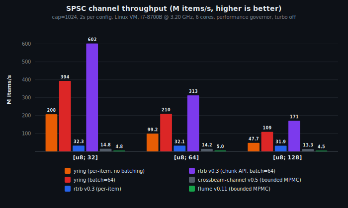

# yring

Bounded SPSC ring buffer with ypipe-style batched flush/prefetch.

## The problem

Existing Rust SPSC ring buffers (`rtrb`, `ringbuf`, `crossbeam`) do 1-2
atomic operations per item. At millions of items per second, those
atomics become the bottleneck.

## The solution

Three pointers instead of two:

- `head`: consumer read position (AtomicUsize, consumer-owned)
- `tail`: producer write position (plain usize, producer-private, no atomic)
- `flush`: last flushed position (AtomicUsize, producer writes / consumer reads)

`push()` writes to the ring with zero atomics. `flush()` makes all
pending writes visible with a single Release store. `pop()` reads with
zero atomics. `prefetch()` loads all available items with a single
Acquire load. Result: 2 atomic ops per batch, not per item.

This is the core ypipe innovation from ZeroMQ, applied to a fixed-capacity
ring buffer instead of a linked list.

## Usage

```rust
let (mut producer, mut consumer) = yring::spsc(1024);

// Producer: push with zero atomics, flush once per batch
for i in 0..100 {
    producer.push(i).unwrap();
}
producer.flush(); // one Release store makes all 100 items visible

// Consumer: prefetch with one Acquire load, pop with zero atomics
consumer.prefetch(); // one Acquire load
while let Some(val) = consumer.pop() {
    // process val
}
consumer.release(); // one Release store frees slots for producer
```

The key advantage over chunk-based batching APIs (like `rtrb`'s
`write_chunk_uninit`): you keep the simple per-item `push()`/`pop()`
API. No upfront batch size, no slice management, no restructuring your
code. Push items one at a time, flush when you're ready.

## Backpressure

`push()` returns `Err(val)` when the ring is full. `pop()` returns
`None` when the prefetched window is exhausted. Neither side blocks or
spins internally.

The `async` feature (opt-in) adds `AsyncProducer`/`AsyncConsumer` with
waker integration: the producer wakes the consumer on flush, the
consumer wakes the producer on release.

## Benchmarks

Cross-thread throughput (M items/s), 2 seconds per configuration,
cap=1024, batch=64:

| Channel | API | u64 (8 B) | [u8; 32] | [u8; 64] | [u8; 128] |
|---------|-----|----------:|----------:|----------:|----------:|
| **yring** | per-item, batch=1 | 427 | 208 | 99 | 48 |
| **yring** | per-item, batch=64 | 569 | 394 | 210 | 109 |
| rtrb | per-item | 32 | 32 | 32 | 32 |
| rtrb | chunk, batch=64 | **1937** | **603** | **313** | **171** |
| crossbeam | bounded | 15 | 15 | 14 | 13 |
| flume | bounded | 4 | 5 | 5 | 5 |

yring vs rtrb per-item (the natural API comparison): **3x** at 64
bytes, **6x** at 32 bytes. rtrb's chunk API is faster in raw
throughput because it copies contiguous slices in bulk, but requires
restructuring code around upfront chunk sizes.

<p align="center">
  
</p>

Measured on Linux VM, i7-8700B @ 3.20 GHz (6 cores), performance
governor, turbo off. Reproduce with `cargo bench -p yring --bench
comparison`.

## License

ISC
